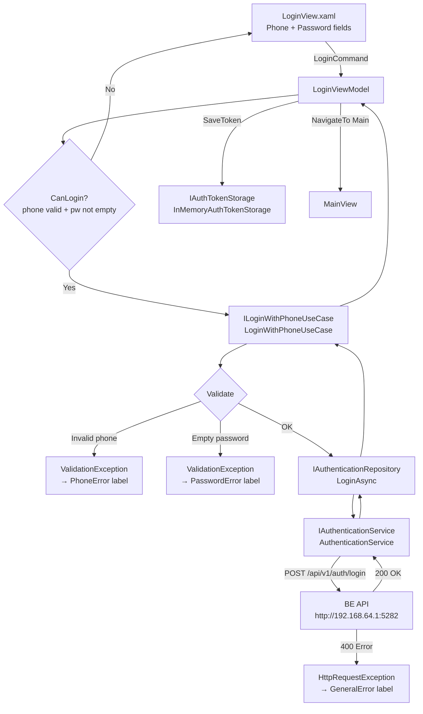

# Login Feature — Feature Document (WPF Desktop)

> **Jira:** — | **Branch:** `dev` | **Generated:** 2026-04-25

---

## PRD Summary

> Màn hình đăng nhập WPF cho phép nhân viên nhập số điện thoại và mật khẩu, gọi BE API, lưu JWT token vào `IAuthTokenStorage`, và điều hướng vào màn hình chính.

- **Goal:** Hiển thị màn hình Login khi khởi động app, xác thực nhân viên qua BE API, lưu token để dùng cho tất cả API call tiếp theo
- **User story:** As a nhân viên Lamour, I want to đăng nhập bằng số điện thoại và mật khẩu so that tôi có thể truy cập vào hệ thống quản lý từ máy tính Windows
- **Acceptance criteria:**
  - [x] App khởi động hiển thị `LoginView` (không phải RegisterView nữa)
  - [x] Validate phone format real-time (regex `^(03|05|07|08|09)\d{8}$`)
  - [x] `LoginCommand.CanExecute` trả về `false` khi phone/password trống hoặc đang loading
  - [x] Đăng nhập thành công → lưu `access_token` vào `IAuthTokenStorage` → navigate to `NavigationRoutes.Main`
  - [x] Sai credentials → hiện `GeneralError` message
  - [x] Phone format sai → hiện inline `PhoneError` dưới field
  - [x] Có link "Create Account" → navigate to `NavigationRoutes.Register`
  - [x] Loading overlay hiển thị trong khi gọi API

---

## Example Account

> Dùng account này để test Login ngay lập tức.

| Field    | Value          |
|----------|----------------|
| Phone    | `0901234567`   |
| Password | `Admin@123`    |
| Role     | `Admin`        |

**BE phải đang chạy tại:** `http://192.168.64.1:5282` (MacBook IP từ UTM)

---

## Business Rules

| Rule | Description |
|------|-------------|
| Phone validation | Regex `^(03|05|07|08|09)\d{8}$` — Vietnamese 10-digit phone only |
| Password not empty | Password không được để trống (validated trong UseCase) |
| Token storage | Token lưu vào `InMemoryAuthTokenStorage` (Singleton) — mất khi app restart |
| Generic error | Lỗi từ BE (sai thông tin, tài khoản bị khoá) → hiển thị `GeneralError` |
| Navigation after login | Luôn navigate to `NavigationRoutes.Main` = `"MainView"` |
| Startup route | App khởi động tại `NavigationRoutes.Login` = `"LoginView"` |
| Register link | `NavigateToRegisterCommand` → `NavigationRoutes.Register` = `"RegisterView"` |

---

## Architecture Overview

> WPF MVVM + Clean Architecture — Community Toolkit.

### Key Components

| Layer | File | Role |
|-------|------|------|
| Presentation | [`Views/LoginView.xaml`](../src/DesktopLamour/Features/Authentication/Views/LoginView.xaml) | WPF UserControl — form fields, loading overlay, error labels |
| Presentation | [`Views/LoginView.xaml.cs`](../src/DesktopLamour/Features/Authentication/Views/LoginView.xaml.cs) | Code-behind — injects `LoginViewModel` as DataContext |
| Presentation | [`ViewModels/LoginViewModel.cs`](../src/DesktopLamour/Features/Authentication/ViewModels/LoginViewModel.cs) | Community Toolkit ViewModel — commands, observables, validation |
| Domain | [`Domain/UseCases/ILoginWithPhoneUseCase.cs`](../src/DesktopLamour/Features/Authentication/Domain/UseCases/ILoginWithPhoneUseCase.cs) | UseCase interface: `IUseCase<LoginInput, UserInfo>` |
| Domain | [`Domain/UseCases/LoginWithPhoneUseCase.cs`](../src/DesktopLamour/Features/Authentication/Domain/UseCases/LoginWithPhoneUseCase.cs) | Validates phone + password, delegates to repository |
| Domain | [`Domain/Models/LoginInput.cs`](../src/DesktopLamour/Features/Authentication/Domain/Models/LoginInput.cs) | Record: `PhoneNumber`, `Password` |
| Data | [`Data/Repositories/IAuthenticationRepository.cs`](../src/DesktopLamour/Features/Authentication/Data/Repositories/IAuthenticationRepository.cs) | Adds `LoginAsync(LoginInput, ct)` |
| Data | [`Data/Services/IAuthenticationService.cs`](../src/DesktopLamour/Features/Authentication/Data/Services/IAuthenticationService.cs) | Adds `LoginAsync(LoginInput, ct)` |
| Data | [`Data/Services/AuthenticationService.cs`](../src/DesktopLamour/Features/Authentication/Data/Services/AuthenticationService.cs) | Typed HttpClient: `POST /api/v1/auth/login` |
| Data | [`Data/Services/Dtos/LoginRequestDto.cs`](../src/DesktopLamour/Features/Authentication/Data/Services/Dtos/LoginRequestDto.cs) | Internal record: `phone`, `password` |
| Data | [`Data/Services/Dtos/LoginResponseDto.cs`](../src/DesktopLamour/Features/Authentication/Data/Services/Dtos/LoginResponseDto.cs) | Internal record: `user_id`, `phone`, `name`, `role`, `access_token` |
| Core | [`Core/Storage/IAuthTokenStorage.cs`](../src/DesktopLamour/Core/Storage/IAuthTokenStorage.cs) | `SaveToken`, `GetToken`, `Clear`, `HasToken` |
| Core | [`Core/Navigation/NavigationRoutes.cs`](../src/DesktopLamour/Core/Navigation/NavigationRoutes.cs) | `Login = "LoginView"`, `Main = "MainView"`, `Register = "RegisterView"` |

### Data Flow

```
User clicks "Sign In"
  → LoginViewModel.LoginCommand (CanExecute: phone valid + password not empty + not loading)
  → IsLoading = true, clear errors
  → ILoginWithPhoneUseCase.ExecuteAsync(LoginInput { PhoneNumber, Password }, ct)
  → Validate phone regex + password not empty (throws ValidationException if fails)
  → IAuthenticationRepository.LoginAsync(input, ct)
  → IAuthenticationService.LoginAsync(input, ct)
  → HttpClient.PostAsync("/api/v1/auth/login", LoginRequestDto { phone, password })
  ← BE returns LoginResponseDto { user_id, phone, name, role, access_token }
  ← Map to UserInfo
  → IAuthTokenStorage.SaveToken(user.AccessToken)
  → INavigationService.NavigateTo(NavigationRoutes.Main)
```



---

## Key Files & Symbols

### Presentation
- [`LoginView.xaml`](../src/DesktopLamour/Features/Authentication/Views/LoginView.xaml) — `AppTextField` (phone), `AppPasswordField` (password), loading overlay, `AppLabel` error bindings, `LoginCommand` button, `NavigateToRegisterCommand` link
- [`LoginView.xaml.cs`](../src/DesktopLamour/Features/Authentication/Views/LoginView.xaml.cs) — sets `DataContext = LoginViewModel` (injected)
- [`LoginViewModel.cs`](../src/DesktopLamour/Features/Authentication/ViewModels/LoginViewModel.cs):
  - Observables: `PhoneNumber`, `Password`, `IsLoading`, `PhoneError`, `PasswordError`, `GeneralError`
  - `[RelayCommand(CanExecute = nameof(CanLogin))]` → `LoginAsync(CancellationToken)`
  - `[RelayCommand]` → `NavigateToRegister()`
  - `CanLogin()`: phone regex match + password not empty + not loading

### Domain
- [`ILoginWithPhoneUseCase.cs`](../src/DesktopLamour/Features/Authentication/Domain/UseCases/ILoginWithPhoneUseCase.cs) — `IUseCase<LoginInput, UserInfo>`
- [`LoginWithPhoneUseCase.cs`](../src/DesktopLamour/Features/Authentication/Domain/UseCases/LoginWithPhoneUseCase.cs) — phone regex + password non-empty → `ValidationException`
- [`LoginInput.cs`](../src/DesktopLamour/Features/Authentication/Domain/Models/LoginInput.cs) — `record LoginInput(string PhoneNumber, string Password)`

### Data
- [`AuthenticationService.cs`](../src/DesktopLamour/Features/Authentication/Data/Services/AuthenticationService.cs) — `LoginAsync`: POST to `/api/v1/auth/login`, map `LoginResponseDto` → `UserInfo`
- [`LoginRequestDto.cs`](../src/DesktopLamour/Features/Authentication/Data/Services/Dtos/LoginRequestDto.cs) — `record (phone, password)`
- [`LoginResponseDto.cs`](../src/DesktopLamour/Features/Authentication/Data/Services/Dtos/LoginResponseDto.cs) — `record (user_id, phone, name, role, access_token)`

### DI Registration
- [`AuthenticationServiceCollectionExtensions.cs`](../src/DesktopLamour/Features/Authentication/AuthenticationServiceCollectionExtensions.cs):
  ```csharp
  services.AddTransient<LoginView>();
  services.AddTransient<LoginViewModel>();
  services.AddTransient<ILoginWithPhoneUseCase, LoginWithPhoneUseCase>();
  services.AddHttpClient<IAuthenticationService, AuthenticationService>(client => {
      client.BaseAddress = new Uri("http://192.168.64.1:5282");
      client.Timeout = TimeSpan.FromSeconds(30);
  });
  ```

---

## API Contracts

| Method | Endpoint | BE Host | Input | Output |
|--------|----------|---------|-------|--------|
| `POST` | `/api/v1/auth/login` | `http://192.168.64.1:5282` | `LoginRequestDto` | `LoginResponseDto` → `UserInfo` |

### Request (sent by `AuthenticationService`)

```json
{
  "phone": "0901234567",
  "password": "Admin@123"
}
```

### Response `200 OK` (mapped to `UserInfo`)

```json
{
  "user_id": 3,
  "phone": "0901234567",
  "name": "Admin",
  "role": "Admin",
  "access_token": "eyJhbGciOiJIUzI1NiIsInR5cCI6IkpXVCJ9..."
}
```

### `UserInfo` model (Domain)

| Property | Source |
|----------|--------|
| `UserId` | `LoginResponseDto.UserId` |
| `Phone` | `LoginResponseDto.Phone` |
| `Name` | `LoginResponseDto.Name` |
| `AccessToken` | `LoginResponseDto.AccessToken` |

---

## Edge Cases & Error Handling

| Scenario | Expected Behavior | Handled? |
|----------|------------------|----------|
| Phone format sai (real-time) | `PhoneError` label hiển thị dưới field | ✅ |
| Password để trống khi submit | `ValidationException` → `PasswordError` label | ✅ |
| BE trả về 400 (sai thông tin/bị khoá) | `GeneralError` "Login failed. Please check your credentials..." | ✅ |
| `OperationCanceledException` | Log info, không hiện lỗi (request bị cancel) | ✅ |
| Network offline / BE không chạy | `HttpRequestException` → `GeneralError` | ✅ |
| Loading state | `IsLoading = true` → overlay + `LoginCommand` disabled | ✅ |
| Token null sau login thành công | Token không được lưu nếu `AccessToken` null/empty | ✅ |
| Token hết hạn (8h) sau khi đã login | API trả 401 → hiện tại WPF không tự redirect | ❌ Chưa handle |
| App restart → token mất | `InMemoryAuthTokenStorage` — user phải login lại | ⚠️ By design |
| Nhiều account cùng lúc | Không support — `InMemoryAuthTokenStorage` lưu 1 token | ⚠️ By design |

---

## Test Coverage Notes

| Component | Test File | Coverage |
|-----------|-----------|----------|
| `LoginViewModel` | Not created (skipped per user request) | ❌ Missing |
| `LoginWithPhoneUseCase` | Not created | ❌ Missing |
| `AuthenticationService.LoginAsync` | Not created | ❌ Missing |

**Suggested test cases (nếu cần thêm sau):**
- [ ] `LoginWithPhoneUseCase`: phone format sai → `ValidationException(nameof(PhoneNumber), ...)`
- [ ] `LoginWithPhoneUseCase`: password rỗng → `ValidationException(nameof(Password), ...)`
- [ ] `LoginWithPhoneUseCase`: input hợp lệ → gọi `repository.LoginAsync`
- [ ] `LoginViewModel`: credentials hợp lệ → `SaveToken` được gọi, navigate to Main
- [ ] `LoginViewModel`: `ValidationException` → đúng error field được set
- [ ] `LoginViewModel`: generic exception → `GeneralError` được set
- [ ] `LoginViewModel`: `CanLogin` → false khi IsLoading = true

---

## Notes

- `InMemoryAuthTokenStorage` là **Singleton** — token tồn tại suốt session. Nếu cần persistent login giữa các lần mở app, đổi sang encrypted local storage
- **UTM workflow**: BE chạy trên MacBook (`http://0.0.0.0:5282`), WPF truy cập qua `http://192.168.64.1:5282`. Sau khi sửa code WPF: chạy `.\sync.ps1` trên UTM Terminal 2
- **Token propagation**: Sau khi login thành công, tất cả service khác gọi `_tokenStorage.GetToken()` và set `Authorization: Bearer <token>` header trước mỗi request
- `RegisterViewModel.NavigateToLoginCommand` đã được wired sẵn tới `NavigationRoutes.Login` — link từ Register → Login hoạt động ngay

---

*Generated by `/ct-ai-document` on 2026-04-25*
