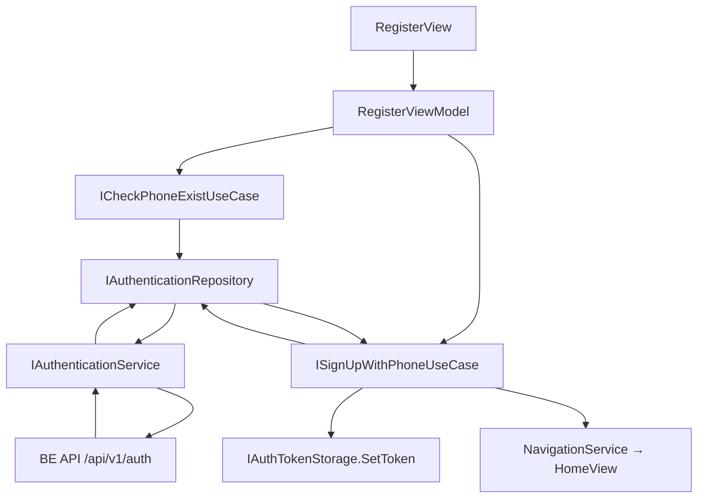

# Authentication — Feature Document (App)

> **Jira:** — | **Branch:** `dev` | **Generated:** 2026-04-25

---

## PRD Summary

> Luồng đăng ký tài khoản qua số điện thoại cho WPF Desktop Lamour.

- **Goal:** Cho phép nhân viên đăng ký và đăng nhập hệ thống qua số điện thoại.
- **User story:** As a Lamour employee, I want to register and log in with my phone number so that I can access the management system.
- **Acceptance criteria:**
  - [x] `CheckPhoneExist` — kiểm tra số điện thoại đã được đăng ký chưa
  - [x] `SignUpWithPhone` — đăng ký tài khoản mới
  - [x] Token JWT được lưu vào `IAuthTokenStorage` sau khi đăng nhập
  - [x] Navigate về Home sau khi đăng ký thành công

---

## Business Rules

| Rule | Description |
|------|-------------|
| Phone check | Kiểm tra phone trước khi cho phép điền form đăng ký |
| JWT storage | Token lưu `InMemoryAuthTokenStorage` — mất khi restart app |
| Validation | Phone/Name validate tại ViewModel trước khi gọi UseCase |
| Navigation | Sau đăng ký thành công → navigate to `HomeView` |

---

## Architecture Overview

### Key Components

| Layer | File | Role |
|-------|------|------|
| View | `Views/RegisterView.xaml` | Form đăng ký UI |
| ViewModel | `ViewModels/RegisterViewModel.cs` | Form state, validation, commands |
| UseCase | `Domain/UseCases/CheckPhoneExistUseCase.cs` | Gọi API check phone |
| UseCase | `Domain/UseCases/SignUpWithPhoneUseCase.cs` | Gọi API đăng ký |
| Repository | `Data/Repositories/AuthenticationRepository.cs` | Bridge UseCase → Service |
| Service | `Data/Services/AuthenticationService.cs` | HTTP calls đến BE API |
| DTOs | `Data/Services/Dtos/` | `CheckPhoneRequestDto`, `RegisterRequestDto`, `RegisterResponseDto` |
| Model | `Domain/Models/RegisterInput.cs` | Input domain model |
| Model | `Domain/Models/UserInfo.cs` | Response domain model |
| Storage | `Core/Storage/InMemoryAuthTokenStorage.cs` | JWT token in-memory |

### Data Flow

```
RegisterView (TextBox input)
  → RegisterViewModel (RelayCommand)
  → ICheckPhoneExistUseCase / ISignUpWithPhoneUseCase
  → IAuthenticationRepository
  → IAuthenticationService (HttpClient → BE API)
  ← RegisterResponseDto → UserInfo
  ← IAuthTokenStorage.SetToken(jwt)
  ← NavigationService.NavigateTo(HomeView)
```



---

## Key Files & Symbols

### Presentation
- [`ViewModels/RegisterViewModel.cs`](../ViewModels/RegisterViewModel.cs) — `[ObservableProperty]` fields: `phone`, `name`, `password`; Commands: `CheckPhoneCommand`, `RegisterCommand`
- [`Views/RegisterView.xaml.cs`](../Views/RegisterView.xaml.cs) — Code-behind, DataContext = `RegisterViewModel`

### Domain
- [`Domain/UseCases/ICheckPhoneExistUseCase.cs`](../Domain/UseCases/ICheckPhoneExistUseCase.cs) — `ExecuteAsync(phone)`
- [`Domain/UseCases/CheckPhoneExistUseCase.cs`](../Domain/UseCases/CheckPhoneExistUseCase.cs) — Delegates to `IAuthenticationRepository`
- [`Domain/UseCases/ISignUpWithPhoneUseCase.cs`](../Domain/UseCases/ISignUpWithPhoneUseCase.cs) — `ExecuteAsync(RegisterInput)`
- [`Domain/UseCases/SignUpWithPhoneUseCase.cs`](../Domain/UseCases/SignUpWithPhoneUseCase.cs) — Delegates to `IAuthenticationRepository`
- [`Domain/Models/RegisterInput.cs`](../Domain/Models/RegisterInput.cs) — Input record
- [`Domain/Models/UserInfo.cs`](../Domain/Models/UserInfo.cs) — Response model

### Data
- [`Data/Repositories/IAuthenticationRepository.cs`](../Data/Repositories/IAuthenticationRepository.cs) — Repository interface
- [`Data/Repositories/AuthenticationRepository.cs`](../Data/Repositories/AuthenticationRepository.cs) — Maps Input → RequestDto, calls Service
- [`Data/Services/IAuthenticationService.cs`](../Data/Services/IAuthenticationService.cs) — HTTP service interface
- [`Data/Services/AuthenticationService.cs`](../Data/Services/AuthenticationService.cs) — HttpClient calls
- [`Data/Services/Dtos/CheckPhoneRequestDto.cs`](../Data/Services/Dtos/CheckPhoneRequestDto.cs) — `{ "phone": "..." }`
- [`Data/Services/Dtos/RegisterRequestDto.cs`](../Data/Services/Dtos/RegisterRequestDto.cs) — Register payload
- [`Data/Services/Dtos/RegisterResponseDto.cs`](../Data/Services/Dtos/RegisterResponseDto.cs) — JWT token response

---

## API Contracts

| Method | Endpoint | Input | Output |
|--------|----------|-------|--------|
| `POST` | `/api/v1/auth/check-phone` | `CheckPhoneRequestDto` | `CheckPhoneResponseDto` |
| `POST` | `/api/v1/auth/register` | `RegisterRequestDto` | `RegisterResponseDto` (JWT) |

---

## Edge Cases & Error Handling

| Scenario | Expected Behavior | Handled? |
|----------|------------------|----------|
| Phone đã tồn tại | Show error message trên UI | ✅ |
| BE không chạy (connection refused) | Show error message | ✅ |
| Token hết hạn sau restart | User phải đăng nhập lại (in-memory storage) | ⚠️ By design |
| Form trống | Validate tại ViewModel | ✅ |

---

## Test Coverage Notes

| Component | Test File | Coverage |
|-----------|-----------|----------|
| `RegisterViewModel` | — | ❌ Missing |
| `CheckPhoneExistUseCase` | — | ❌ Missing |
| `SignUpWithPhoneUseCase` | — | ❌ Missing |
| `AuthenticationRepository` | — | ❌ Missing |

**Suggested test cases:**
- [ ] CheckPhone: phone đã tồn tại → error state
- [ ] Register: thành công → token được lưu + navigate Home
- [ ] Register: BE lỗi → error message hiển thị

---

## Notes

- Token lưu `InMemoryAuthTokenStorage` — mất sau khi restart. Cân nhắc persist sang `SecureStorage` trong tương lai
- `InverseBoolToVisibilityConverter` chưa register trong App.xaml — cần verify
- DI: `AuthenticationServiceCollectionExtensions.AddAuthenticationModule()`

---

*Generated by `/ct-ai-document` on 2026-04-25*
