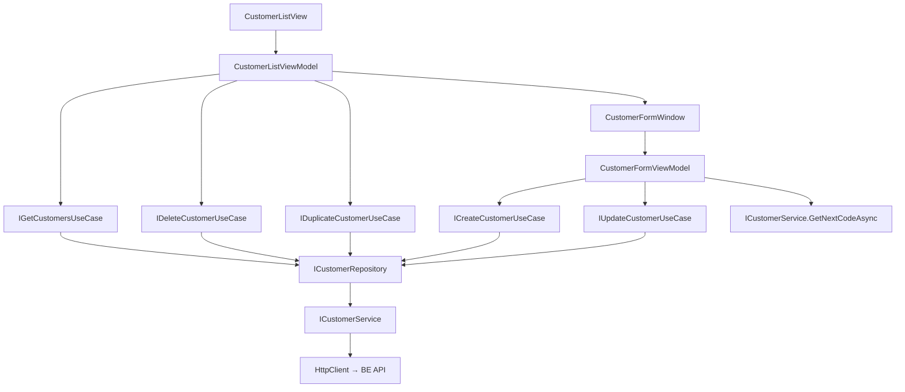

# Customers — Feature Document (App)

> **Jira:** — | **Branch:** `dev` | **Generated:** 2026-04-25

---

## PRD Summary

> Module quản lý khách hàng trong WPF Desktop Lamour — hiển thị danh sách, thêm/sửa/xóa/nhân bản khách hàng.

- **Goal:** Cho phép nhân viên Lamour quản lý đầy đủ thông tin khách hàng qua giao diện desktop.
- **User story:** As a Lamour admin, I want to view and manage the customer list so that I can track customer information for sales and invoicing.
- **Acceptance criteria:**
  - [x] Hiển thị danh sách 7 cột: Mã KH, Tên, Địa chỉ, Tỉnh, Nhóm KH, Mã số thuế, Điện thoại
  - [x] Badge **"Tổng: X khách hàng"** hiển thị cạnh tiêu đề trang — cập nhật realtime sau load/add/delete
  - [x] Form Thêm: mã KH tự động sinh (hiển thị preview từ API `next-code`)
  - [x] Form Sửa: mã KH read-only, các trường khác editable
  - [x] Nhân bản: tạo bản sao với mã mới tự sinh
  - [x] Xóa: confirm dialog trước khi xóa

---

## Business Rules

| Rule | Description |
|------|-------------|
| Mã tự động sinh | Gọi `GET /api/v1/customers/next-code` khi mở form Thêm |
| Mã read-only | Không thể chỉnh sửa `code` sau khi tạo |
| Tên bắt buộc | `name` validate tại `CreateCustomerUseCase` |
| HttpClient base URL | `http://192.168.64.1:5282` (MacBook từ UTM VM) |
| Token | `IAuthTokenStorage.GetToken()` inject vào Authorization header |

---

## Architecture Overview

### Key Components

| Layer | File | Role |
|-------|------|------|
| View | `Views/CustomerListView.xaml` | DataGrid 7 cột + toolbar |
| View | `Views/CustomerFormWindow.xaml` | Form thêm/sửa |
| ViewModel | `ViewModels/CustomerListViewModel.cs` | List state, commands |
| ViewModel | `ViewModels/CustomerFormViewModel.cs` | Form state, `LoadNextCodeAsync` |
| UseCase | `Domain/UseCases/GetCustomersUseCase.cs` | Fetch list |
| UseCase | `Domain/UseCases/CreateCustomerUseCase.cs` | Validate + create |
| UseCase | `Domain/UseCases/UpdateCustomerUseCase.cs` | Validate + update |
| UseCase | `Domain/UseCases/DeleteCustomerUseCase.cs` | Delete |
| UseCase | `Domain/UseCases/DuplicateCustomerUseCase.cs` | Clone |
| Repository | `Data/Repositories/CustomerRepository.cs` | Map DTO ↔ Domain model |
| Service | `Data/Services/CustomerService.cs` | HttpClient calls |

### Data Flow

```
CustomerListView (Loaded)
  → CustomerListViewModel.LoadCustomersCommand
  → IGetCustomersUseCase.ExecuteAsync()
  → ICustomerRepository.GetAllAsync()
  → ICustomerService.GetAllAsync()
  → HttpClient GET /api/v1/customers
  ← IEnumerable<CustomerResponseDto> → IEnumerable<Customer>
  ← ObservableCollection<Customer> updated
  ← DataGrid refreshed

CustomerFormWindow (OnContentRendered, Add mode)
  → CustomerFormViewModel.LoadNextCodeAsync()
  → ICustomerService.GetNextCodeAsync()
  → HttpClient GET /api/v1/customers/next-code
  ← "KH00002" → Code field hiển thị
```



---

## Key Files & Symbols

### Presentation
- [`Views/CustomerListView.xaml`](../Views/CustomerListView.xaml) — DataGrid, toolbar buttons, error banner, empty state `👥`
- [`Views/CustomerListView.xaml.cs`](../Views/CustomerListView.xaml.cs) — `Loaded` → `LoadCustomersCommand.ExecuteAsync`
- [`Views/CustomerFormWindow.xaml`](../Views/CustomerFormWindow.xaml) — Form: Code (disabled), Name*, Phone, Address, Province, CustomerGroup, TaxCode
- [`Views/CustomerFormWindow.xaml.cs`](../Views/CustomerFormWindow.xaml.cs) — `OnContentRendered` → `LoadNextCodeAsync()`
- [`ViewModels/CustomerListViewModel.cs`](../ViewModels/CustomerListViewModel.cs) — Commands: `LoadCustomers`, `AddCustomer`, `EditCustomer`, `DeleteCustomer`, `DuplicateCustomer`, `GoBack`; Property: `TotalCustomersText` (computed, `"Tổng: X khách hàng"`)
- [`ViewModels/CustomerFormViewModel.cs`](../ViewModels/CustomerFormViewModel.cs) — `LoadNextCodeAsync()`, `SaveCommand`, `CancelCommand`; `IsEditMode` property

### Domain
- [`Domain/Models/Customer.cs`](../Domain/Models/Customer.cs) — `Id`, `Code`, `Name`, `Address`, `Province`, `CustomerGroup`, `TaxCode`, `Phone`
- [`Domain/UseCases/CreateCustomerInput.cs`](../Domain/UseCases/CreateCustomerInput.cs) — record: `Name`, `Phone`, `Address`, `Province`, `CustomerGroup`, `TaxCode`
- [`Domain/UseCases/UpdateCustomerInput.cs`](../Domain/UseCases/UpdateCustomerInput.cs) — record: `Id`, `Name`, `Phone`, `Address`, `Province`, `CustomerGroup`, `TaxCode`

### Data
- [`Data/Services/ICustomerService.cs`](../Data/Services/ICustomerService.cs) — `GetAllAsync`, `GetNextCodeAsync`, `CreateAsync`, `UpdateAsync`, `DeleteAsync`, `DuplicateAsync`
- [`Data/Services/CustomerService.cs`](../Data/Services/CustomerService.cs) — HttpClient typed service, `SetBearerToken()`, `NextCodeResponse` record
- [`Data/Services/Dtos/CustomerResponseDto.cs`](../Data/Services/Dtos/CustomerResponseDto.cs) — snake_case JSON deserialization
- [`Data/Services/Dtos/CreateCustomerRequestDto.cs`](../Data/Services/Dtos/CreateCustomerRequestDto.cs) — No `code` field
- [`Data/Services/Dtos/UpdateCustomerRequestDto.cs`](../Data/Services/Dtos/UpdateCustomerRequestDto.cs) — No `code` field
- [`Data/Repositories/CustomerRepository.cs`](../Data/Repositories/CustomerRepository.cs) — `MapToModel(CustomerResponseDto)` helper

---

## API Contracts

| Method | Endpoint | Output |
|--------|----------|--------|
| `GET` | `/api/v1/customers` | `CustomerResponseDto[]` |
| `GET` | `/api/v1/customers/next-code` | `{ "code": "KH00002" }` |
| `POST` | `/api/v1/customers` | `CustomerResponseDto` |
| `PUT` | `/api/v1/customers/{id}` | `CustomerResponseDto` |
| `DELETE` | `/api/v1/customers/{id}` | 204 |
| `POST` | `/api/v1/customers/{id}/duplicate` | `CustomerResponseDto` |

---

## Edge Cases & Error Handling

| Scenario | Expected Behavior | Handled? |
|----------|------------------|----------|
| BE không chạy | Error banner: "Không thể tải dữ liệu: ..." | ✅ |
| `GetNextCode` API lỗi | Catch silently, Code field trống | ✅ (silent) |
| Tên trống | `ValidationException` → `ErrorMessage` trên form | ✅ |
| Xóa không tìm thấy | Error banner trên list | ✅ |
| Confirm xóa → No | Không xóa | ✅ |
| Nhân bản thất bại | Error banner trên list | ✅ |

---

## Test Coverage Notes

| Component | Test File | Coverage |
|-----------|-----------|----------|
| `CustomerListViewModel` | — | ❌ Missing |
| `CustomerFormViewModel` | — | ❌ Missing |
| `CreateCustomerUseCase` | — | ❌ Missing |
| `CustomerRepository` | — | ❌ Missing |

**Suggested test cases:**
- [ ] Load list: BE trả data → `Customers` collection populated, `HasCustomers = true`
- [ ] Load list: BE lỗi → `HasError = true`, `ErrorMessage` set
- [ ] Form Add: `LoadNextCodeAsync` → `Code` = "KH00xxx"
- [ ] Form Save: name trống → `ErrorMessage` hiển thị
- [ ] Delete: confirm Yes → item removed từ collection

---

## Notes

- DI: `HomeServiceCollectionExtensions.AddHomeModule()` — `AddHttpClient<ICustomerService, CustomerService>` + `AddTransient<Func<CustomerFormWindow>>`
- Navigation route: `NavigationRoutes.Customers.List = "CustomerListView"`
- `CustomerFormViewModel` inject `ICustomerService` trực tiếp để gọi `GetNextCodeAsync` (không qua domain UseCase vì là UI concern)

---

*Generated by `/ct-ai-document` on 2026-04-25 — Updated 2026-04-26: thêm TotalCustomersText badge*
