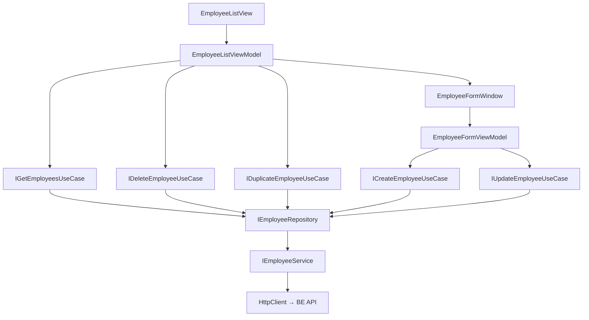

# Employees — Feature Document (App)

> **Jira:** — | **Branch:** `dev` | **Updated:** 2026-04-26

---

## PRD Summary

> Module quản lý nhân viên trong WPF Desktop Lamour — hiển thị danh sách, thêm/sửa/xóa/nhân bản nhân viên.

- **Goal:** Cho phép admin Lamour quản lý đầy đủ thông tin nhân viên, bao gồm chức vụ và đơn vị công tác.
- **User story:** As a Lamour admin, I want to view and manage the employee list so that I can track staff roles and unit assignments.
- **Acceptance criteria:**
  - [x] Hiển thị danh sách 5 cột: Tên, Số điện thoại, Chức vụ, Đơn vị, Hoạt động
  - [x] Form Thêm: nhập tên, SĐT, chức vụ, đơn vị, mật khẩu
  - [x] Form Sửa: tất cả trường editable (mật khẩu để trống = không đổi)
  - [x] Nhân bản: tạo bản sao nhân viên
  - [x] Xóa: confirm dialog trước khi xóa
  - [x] Cột **Đơn vị**: hiển thị `PGD`, `PKD`, `Spa`, `GD`, `Kho` — default `Spa`

---

## Business Rules

| Rule | Description |
|------|-------------|
| Tên bắt buộc | `Name` validate tại `CreateEmployeeUseCase` / `UpdateEmployeeUseCase` |
| SĐT optional (2026-08-19) | `Phone` không còn required — trống vẫn Save được |
| Đơn vị bắt buộc | `Unit` required — ComboBox chọn từ danh sách cố định |
| Mật khẩu để trống | Khi thêm: dùng SĐT, hoặc mã NV nếu SĐT cũng trống (fallback tại BE `CreateEmployeeUseCase`); khi sửa: giữ nguyên |
| HttpClient base URL | `http://192.168.64.1:5282` (MacBook từ UTM VM) |

---

## Architecture Overview

### Key Components

| Layer | File | Role |
|-------|------|------|
| View | `Views/EmployeeListView.xaml` | DataGrid 5 cột + toolbar |
| View | `Views/EmployeeFormWindow.xaml` | Form thêm/sửa |
| ViewModel | `ViewModels/EmployeeListViewModel.cs` | List state, commands |
| ViewModel | `ViewModels/EmployeeFormViewModel.cs` | Form state, `Roles` + `Units` lists |
| UseCase | `Domain/UseCases/GetEmployeesUseCase.cs` | Fetch list |
| UseCase | `Domain/UseCases/CreateEmployeeUseCase.cs` | Validate + create |
| UseCase | `Domain/UseCases/UpdateEmployeeUseCase.cs` | Validate + update |
| UseCase | `Domain/UseCases/DeleteEmployeeUseCase.cs` | Delete |
| UseCase | `Domain/UseCases/DuplicateEmployeeUseCase.cs` | Clone |
| Repository | `Data/Repositories/EmployeeRepository.cs` | Map DTO ↔ Domain model |
| Service | `Data/Services/EmployeeService.cs` | HttpClient calls |

### Data Flow

```
EmployeeListView (Loaded)
  → EmployeeListViewModel.LoadEmployeesCommand
  → IGetEmployeesUseCase.ExecuteAsync()
  → IEmployeeRepository.GetAllAsync()
  → IEmployeeService.GetAllAsync()
  → HttpClient GET /api/v1/employees
  ← IEnumerable<EmployeeResponseDto> → IEnumerable<Employee>
  ← ObservableCollection<Employee> updated
  ← DataGrid refreshed (5 columns including Đơn vị)
```



---

## Key Files & Symbols

### Presentation
- [`Views/EmployeeListView.xaml`](../Views/EmployeeListView.xaml) — DataGrid 5 cột: Tên, SĐT, Chức vụ, **Đơn vị**, Hoạt động
- [`Views/EmployeeListView.xaml.cs`](../Views/EmployeeListView.xaml.cs) — `Loaded` → `LoadEmployeesCommand.ExecuteAsync`
- [`Views/EmployeeFormWindow.xaml`](../Views/EmployeeFormWindow.xaml) — Form: Tên*, SĐT*, Chức vụ* (ComboBox), **Đơn vị*** (ComboBox), Mật khẩu, Hoạt động
- [`ViewModels/EmployeeListViewModel.cs`](../ViewModels/EmployeeListViewModel.cs) — Commands: `LoadEmployees`, `AddEmployee`, `EditEmployee`, `DeleteEmployee`, `DuplicateEmployee`, `GoBack`
- [`ViewModels/EmployeeFormViewModel.cs`](../ViewModels/EmployeeFormViewModel.cs) — Fields: `Name`, `Phone`, `Role`, `Unit`, `Password`, `IsActive`; Lists: `Roles`, `Units`

### Domain
- [`Domain/Models/Employee.cs`](../Domain/Models/Employee.cs) — `Id`, `Name`, `Phone`, `Role`, `Unit`, `IsActive`
- [`Domain/UseCases/CreateEmployeeInput.cs`](../Domain/UseCases/CreateEmployeeInput.cs) — record: `Name`, `Phone`, `Role`, `Unit`, `Password`, `IsActive`
- [`Domain/UseCases/UpdateEmployeeInput.cs`](../Domain/UseCases/UpdateEmployeeInput.cs) — record: `Id`, `Name`, `Phone`, `Role`, `Unit`, `Password?`, `IsActive`

### Data
- [`Data/Services/IEmployeeService.cs`](../Data/Services/IEmployeeService.cs) — `GetAllAsync`, `CreateAsync`, `UpdateAsync`, `DeleteAsync`, `DuplicateAsync`
- [`Data/Services/Dtos/EmployeeResponseDto.cs`](../Data/Services/Dtos/EmployeeResponseDto.cs) — `id`, `name`, `phone`, `role`, `unit`, `is_active`
- [`Data/Services/Dtos/CreateEmployeeRequestDto.cs`](../Data/Services/Dtos/CreateEmployeeRequestDto.cs) — `name`, `phone`, `role`, `unit`, `password`, `is_active`
- [`Data/Services/Dtos/UpdateEmployeeRequestDto.cs`](../Data/Services/Dtos/UpdateEmployeeRequestDto.cs) — same, `password` nullable
- [`Data/Repositories/EmployeeRepository.cs`](../Data/Repositories/EmployeeRepository.cs) — `MapToModel(EmployeeResponseDto)`, maps `unit`

---

## Unit Enum Values

| Value | Hiển thị | Default |
|-------|----------|---------|
| `PGD` | PGD | — |
| `PKD` | PKD | — |
| `Spa` | Spa | ✅ |
| `GD` | GD | — |
| `Kho` | Kho | — |

---

## API Contracts

| Method | Endpoint | Output |
|--------|----------|--------|
| `GET` | `/api/v1/employees` | `EmployeeResponseDto[]` |
| `POST` | `/api/v1/employees` | `EmployeeResponseDto` (201) |
| `PUT` | `/api/v1/employees/{id}` | `EmployeeResponseDto` (200) |
| `DELETE` | `/api/v1/employees/{id}` | 204 |
| `POST` | `/api/v1/employees/{id}/duplicate` | `EmployeeResponseDto` (201) |

---

## Edge Cases & Error Handling

| Scenario | Expected Behavior | Handled? |
|----------|------------------|----------|
| BE không chạy | Error banner: "Không thể tải dữ liệu: ..." | ✅ |
| Tên trống | `ValidationException` → `ErrorMessage` trên form | ✅ |
| SĐT trống | Cho phép lưu (optional) | ✅ |
| Xóa không tìm thấy | Error banner trên list | ✅ |
| Confirm xóa → No | Không xóa | ✅ |
| Mật khẩu trống (thêm mới) | Dùng SĐT làm mật khẩu | ✅ |
| Mật khẩu trống (sửa) | Giữ nguyên hash cũ | ✅ |

---

## Test Coverage Notes

| Component | Test File | Coverage |
|-----------|-----------|----------|
| `EmployeeListViewModel` | — | ❌ Missing |
| `EmployeeFormViewModel` | — | ❌ Missing |
| `CreateEmployeeUseCase` | — | ❌ Missing |
| `EmployeeRepository` | — | ❌ Missing |

**Suggested test cases:**
- [ ] Load list: BE trả data → `Employees` populated, `HasEmployees = true`
- [ ] Load list: BE lỗi → `HasError = true`
- [ ] Form Save: tên trống → `ErrorMessage` hiển thị
- [ ] Delete: confirm Yes → item removed từ collection

---

## Notes

- DI: `HomeServiceCollectionExtensions.AddHomeModule()` — `AddHttpClient<IEmployeeService, EmployeeService>` + `AddTransient<Func<EmployeeFormWindow>>`
- Navigation route: `NavigationRoutes.Employees.List = "EmployeeListView"`
- `Units` list trong `EmployeeFormViewModel` là `IReadOnlyList<string>` — hardcoded, không gọi API

---

*Updated by `/ct-ai-document` on 2026-04-26*
