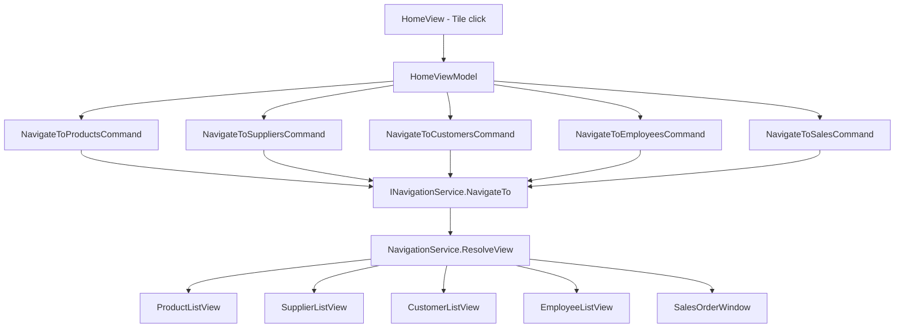

# Home Dashboard — Feature Document (App)

> **Jira:** — | **Branch:** `dev` | **Generated:** 2026-04-25

---

## PRD Summary

> Màn hình tổng quan chứa các tile điều hướng tới các module chính trong WPF Desktop Lamour.

- **Goal:** Cung cấp entry point trực quan cho toàn bộ chức năng quản lý của hệ thống Lamour.
- **User story:** As a Lamour admin, I want to see all available modules on the home screen so that I can navigate to any feature quickly.
- **Acceptance criteria:**
  - [x] Hiển thị tile `📦 Sản phẩm` → navigate ProductListView
  - [x] Hiển thị tile `🏪 Nhà cung cấp` → navigate SupplierListView
  - [x] Hiển thị tile `👥 Khách hàng` → navigate CustomerListView
  - [x] Hiển thị tile `👤 Nhân viên` → navigate EmployeeListView
  - [x] Hiển thị tile `🛒 Bán hàng` → navigate SalesOrderWindow
  - [x] Click tile → `NavigationService.NavigateTo(route)`
  - [x] Cards chia thành 4 **section groups**: **Quản lý**, **Kế toán**, **Bán hàng**, **Kho & Hàng hóa**

---

## Business Rules

| Rule | Description |
|------|-------------|
| Navigation routes | Route constants định nghĩa tại `NavigationRoutes.cs` |
| Tile layout | `WrapPanel` bên trong `StackPanel` với section headers |
| Section groups | **Quản lý**: Khách hàng, Nhân viên — **Kế toán**: Kế toán — **Bán hàng**: Bán hàng — **Kho & Hàng hóa**: Sản phẩm, Nhà cung cấp, Kho |
| No auth check | Tile hiển thị ngay, auth check ở từng module |

---

## Architecture Overview

### Key Components

| Layer | File | Role |
|-------|------|------|
| View | `Views/HomeView.xaml` | 2 section groups, 4 navigation tiles |
| ViewModel | `ViewModels/HomeViewModel.cs` | 4 `RelayCommand` navigate |
| Navigation | `Core/Navigation/NavigationRoutes.cs` | Route constants |
| Navigation | `Core/Navigation/NavigationService.cs` | `ResolveView` switch → DI resolve |

### Data Flow

```
User clicks tile
  → HomeView.InputBindings (MouseBinding)
  → HomeViewModel.NavigateToXxxCommand
  → INavigationService.NavigateTo(NavigationRoutes.Xxx.List)
  → NavigationService.ResolveView(routeName)
  → ServiceProvider.GetService(typeof(XxxListView))
  → MainWindowViewModel.CurrentContent = XxxListView
```



---

## Key Files & Symbols

### Presentation
- [`Views/HomeView.xaml`](../Views/HomeView.xaml) — `ScrollViewer > StackPanel`, 2 section headers, 4 `Border` tiles, `MouseBinding`
- [`Views/HomeView.xaml.cs`](../Views/HomeView.xaml.cs) — DataContext = `HomeViewModel`
- [`ViewModels/HomeViewModel.cs`](../ViewModels/HomeViewModel.cs) — `[RelayCommand]`: `NavigateToProducts`, `NavigateToSuppliers`, `NavigateToCustomers`, `NavigateToEmployees`, `NavigateToWarehouse`, `NavigateToAccounting`, `NavigateToSales`

### Navigation
- [`Core/Navigation/NavigationRoutes.cs`](../../../../Core/Navigation/NavigationRoutes.cs) — `Products.List`, `Suppliers.List`, `Customers.List` constants
- [`Core/Navigation/NavigationService.cs`](../../../../Core/Navigation/NavigationService.cs) — Switch-case `ResolveView`

---

## Edge Cases & Error Handling

| Scenario | Expected Behavior | Handled? |
|----------|------------------|----------|
| Route không có trong switch | `ResolveView` trả `null` → `CurrentContent = null` | ⚠️ Silent |
| DI thiếu View registration | `GetService` trả null → blank screen | ❌ Not guarded |
| Back stack | `NavigationService._backStack` stack, `GoBack()` available | ✅ |

---

## Test Coverage Notes

| Component | Test File | Coverage |
|-----------|-----------|----------|
| `HomeViewModel` | — | ❌ Missing |
| `NavigationService.ResolveView` | — | ❌ Missing |

**Suggested test cases:**
- [ ] Click Sản phẩm tile → `ProductListView` resolved
- [ ] Click Khách hàng tile → `CustomerListView` resolved
- [ ] Route không tồn tại → không crash

---

## Notes

- Khi thêm module mới: (1) add `RelayCommand` vào `HomeViewModel`, (2) add tile XAML vào section phù hợp, (3) add case vào `NavigationService.ResolveView`, (4) add constant vào `NavigationRoutes`
- Section layout: `StackPanel > [AppLabel section header] > WrapPanel > [Border tiles]` — thêm section mới bằng cách duplicate block này
- DI: registered in `HomeServiceCollectionExtensions.AddHomeModule()`
- `SalesOrderWindow` là `Window` (không phải `UserControl`) — KHÔNG đưa qua `NavigationService` vì WPF không cho phép `Window` là child của visual tree. Thay vào đó inject `Func<SalesOrderWindow>` vào `HomeViewModel` và gọi `.Show()` trực tiếp.
- Quy tắc chung: **UserControl** → NavigationService; **Window** → factory `.Show()`

---

*Generated by `/ct-ai-document` on 2026-04-25 — Updated 2026-04-26: thêm tile Nhân viên + section groups — Updated 2026-05-01: thêm section Bán hàng + tile 🛒 — Updated 2026-08-15: thêm section "Cài đặt" (5 tile: Đơn vị tính 📏, Tài khoản kế toán 📒, Danh sách Kho 🏬, Phòng ban 🏢, Khoản mục chi phí 💰) — chuyển nguyên từ section "Cài đặt" trên màn `WarehouseView` (Kho) sang đây; 5 `RelayCommand` tương ứng thêm vào `HomeViewModel`, xóa khỏi `WarehouseViewModel`. Route/DI/`NavigationRoutes` không đổi — chỉ đổi nơi hiển thị tile. — Updated 2026-08-15 (×2): tile "Kho" (`NavigateToWarehouseCommand`) đổi target từ `NavigationRoutes.Warehouse.Hub` (đã xóa) sang `NavigationRoutes.Warehouse.NhapXuatKho` — tap "Kho" giờ vào thẳng màn `WarehouseTransactionListView` (danh sách Nhập/Xuất kho); "Tổng hợp tồn kho" không còn là tile riêng, đã thành 1 nút trên toolbar của màn đó — xem [`Warehouse/docs/warehouse.md`](../../Warehouse/docs/warehouse.md) changelog cùng ngày cho chi tiết đầy đủ.*
