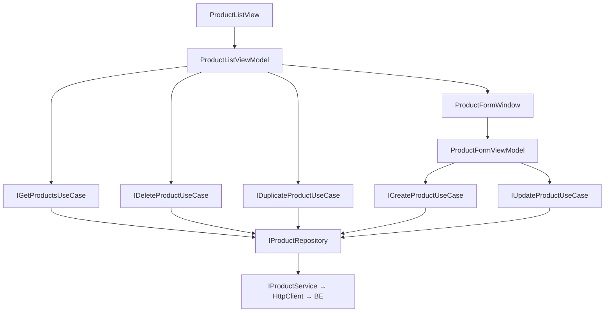

# ProductList — Feature Document (App)

> **Jira:** — | **Branch:** `dev` | **Generated:** 2026-04-25

---

## PRD Summary

> Module quản lý danh sách sản phẩm mỹ phẩm trong WPF Desktop Lamour.

- **Goal:** Cho phép quản lý hàng hóa: xem danh sách, thêm/sửa/xóa/nhân bản sản phẩm.
- **User story:** As a Lamour warehouse manager, I want to manage product inventory in the desktop app so that stock levels and pricing are always up to date.
- **Acceptance criteria:**
  - [x] Hiển thị danh sách sản phẩm với cột: Mã, Tên, Danh mục, Đơn vị, Giá vốn, Giá bán, Tồn kho, Trạng thái
  - [x] Form thêm/sửa với `code` user-entered (required, unique)
  - [x] Nhân bản với code `_COPY`
  - [x] Xóa có confirm dialog

---

## Business Rules

| Rule | Description |
|------|-------------|
| Code user-entered | Người dùng tự nhập code (khác với Customer tự sinh) |
| Code editable in Add mode | Code có thể nhập khi Thêm, read-only khi Sửa |
| Validate tại UseCase | `CreateProductUseCase` check code/name + unique |
| is_active | Sản phẩm ngừng kinh doanh không bị xóa |

---

## Architecture Overview

### Key Components

| Layer | File | Role |
|-------|------|------|
| View | `Views/ProductListView.xaml` | DataGrid + toolbar |
| View | `Views/ProductFormWindow.xaml` | Form thêm/sửa |
| ViewModel | `ViewModels/ProductListViewModel.cs` | List state + commands |
| ViewModel | `ViewModels/ProductFormViewModel.cs` | Form state + Save/Cancel |
| UseCase | `Domain/UseCases/GetProductsUseCase.cs` | Fetch list |
| UseCase | `Domain/UseCases/CreateProductUseCase.cs` | Validate + create |
| UseCase | `Domain/UseCases/UpdateProductUseCase.cs` | Validate + update |
| UseCase | `Domain/UseCases/DeleteProductUseCase.cs` | Delete |
| UseCase | `Domain/UseCases/DuplicateProductUseCase.cs` | Clone |
| Repository | `Data/Repositories/ProductRepository.cs` | DTO ↔ Domain map |
| Service | `Data/Services/ProductService.cs` | HttpClient |

### Data Flow

```
ProductListView (Loaded)
  → ProductListViewModel.LoadProductsCommand
  → IGetProductsUseCase → IProductRepository → IProductService
  → GET /api/v1/products
  ← IEnumerable<Product> → ObservableCollection<Product>
```



---

## Key Files & Symbols

### Presentation
- [`Views/ProductListView.xaml`](../Views/ProductListView.xaml) — DataGrid, 4 toolbar buttons
- [`Views/ProductListView.xaml.cs`](../Views/ProductListView.xaml.cs) — `Loaded` → `LoadProductsCommand`
- [`Views/ProductFormWindow.xaml`](../Views/ProductFormWindow.xaml) — Form fields
- [`Views/ProductFormWindow.xaml.cs`](../Views/ProductFormWindow.xaml.cs) — `Initialize(Product?)`
- [`ViewModels/ProductListViewModel.cs`](../ViewModels/ProductListViewModel.cs) — Commands: Load, Add, Edit, Delete, Duplicate, GoBack
- [`ViewModels/ProductFormViewModel.cs`](../ViewModels/ProductFormViewModel.cs) — Fields: Code, Name, Category, Unit, CostPrice, SellingPrice, StockQuantity, IsActive

### Domain
- [`Domain/Models/Product.cs`](../Domain/Models/Product.cs) — `Id`, `Code`, `Name`, `Category`, `Unit`, `CostPrice`, `SellingPrice`, `StockQuantity`, `IsActive`
- [`Domain/UseCases/CreateProductInput.cs`](../Domain/UseCases/CreateProductInput.cs) — record: all fields
- [`Domain/UseCases/UpdateProductInput.cs`](../Domain/UseCases/UpdateProductInput.cs) — record: `Id` + all fields

### Data
- [`Data/Services/IProductService.cs`](../Data/Services/IProductService.cs) — `GetAllAsync`, `CreateAsync`, `UpdateAsync`, `DeleteAsync`, `DuplicateAsync`
- [`Data/Services/ProductService.cs`](../Data/Services/ProductService.cs) — HttpClient typed service
- [`Data/Services/Dtos/ProductResponseDto.cs`](../Data/Services/Dtos/ProductResponseDto.cs) — snake_case JSON

---

## API Contracts

| Method | Endpoint | Output |
|--------|----------|--------|
| `GET` | `/api/v1/products` | `ProductResponseDto[]` |
| `POST` | `/api/v1/products` | `ProductResponseDto` (201) |
| `PUT` | `/api/v1/products/{id}` | `ProductResponseDto` |
| `DELETE` | `/api/v1/products/{id}` | 204 |
| `POST` | `/api/v1/products/{id}/duplicate` | `ProductResponseDto` (201) |

---

## Edge Cases & Error Handling

| Scenario | Expected Behavior | Handled? |
|----------|------------------|----------|
| BE không chạy | Error banner | ✅ |
| Code trùng | `ValidationException` → form error | ✅ |
| Tên/Code trống | `ValidationException` → form error | ✅ |
| Duplicate `_COPY` tồn tại | API 400 → error banner | ✅ |
| Confirm xóa → No | Không xóa | ✅ |

---

## Test Coverage Notes

| Component | Test File | Coverage |
|-----------|-----------|----------|
| `ProductListViewModel` | — | ❌ Missing |
| `ProductFormViewModel` | — | ❌ Missing |
| `CreateProductUseCase` | — | ❌ Missing |

**Suggested test cases:**
- [ ] Load: data từ BE → collection populated
- [ ] Create: code trùng → `ValidationException`
- [ ] Form: IsAddMode = true → Code enabled; IsAddMode = false → Code disabled

---

## Notes

- DI: `AddHttpClient<IProductService, ProductService>` base URL `http://192.168.64.1:5282`
- Navigation: `NavigationRoutes.Products.List = "ProductListView"`

---

*Generated by `/ct-ai-document` on 2026-04-25*
