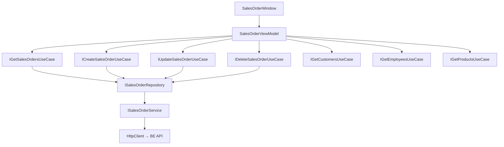

# Sales Orders — Feature Document (App)

> **Jira:** — | **Branch:** `dev` | **Generated:** 2026-05-01

---

## PRD Summary

> Module quản lý đơn hàng bán trong WPF Desktop Lamour — tạo/sửa/xóa đơn bán hàng kèm dòng chi tiết sản phẩm.

- **Goal:** Cho phép nhân viên Lamour tạo và theo dõi đơn hàng bán, tự động trừ tồn kho từ BE khi xác nhận.
- **User story:** As a Lamour staff, I want to create sales orders with product line items so that customer transactions are recorded and inventory is automatically updated.
- **Acceptance criteria:**
  - [x] Form nhập đơn hàng với đầy đủ thông tin header (khách hàng, nhân viên bán, ngày, điều khoản TT...)
  - [x] Danh sách dòng hàng (DataGrid) với cột "Tỷ lệ CK(%)" và tính toán tự động `Amount = Quantity × UnitPrice × (1 − CK/100)`
  - [x] Footer 3 giá trị thẳng hàng: Tổng tiền hàng (gross) / Tổng tiền chiết khấu / Tổng tiền thanh toán (net)
  - [x] Tự động sinh số chứng từ `BC{5 digits}` từ danh sách hiện có
  - [x] Điều hướng Prev/Next giữa các đơn hàng
  - [x] Tạo mới / Cập nhật / Xóa đơn hàng qua BE API

---

## Business Rules

| Rule | Description |
|------|-------------|
| Số chứng từ | Sinh tại client theo format `BC{5 digits}` — tính `max` từ cache list hiện có + 1 |
| Khách hàng bắt buộc | `SelectedCustomer` phải được chọn trước khi save |
| Ít nhất 1 dòng | `Lines.Count > 0` — validate tại ViewModel trước khi gọi API |
| Auto-calc Amount | `Amount = Quantity × UnitPrice × (1 − DiscountRate/100)` — khi `Quantity`, `UnitPrice`, hoặc `DiscountRate` thay đổi |
| Tỷ lệ CK | `DiscountRate` (0–100) per line; clamp tại BE; WPF nhập trực tiếp vào DataGrid |
| Footer totals | `TotalAmount` = Σ(Qty×UnitPrice) gross; `TotalDiscount` = Σ(Qty×UnitPrice×CK/100); `TotalPayment` = TotalAmount − TotalDiscount |
| TK mặc định | `ReceivableAccount = "131"`, `RevenueAccount = "511"` điền sẵn khi thêm dòng |
| Auto-fill Description | Khi chọn khách hàng → `Description = "Bán hàng {TênKH}"` |
| PaymentDueDate tự tính | Khi nhập `PaymentDueDays` → `PaymentDueDate = DocumentDate + days` |
| UTC → Local | Dates từ API (`AccountingDate`, `DocumentDate`, `PaymentDueDate`) được convert sang local time khi hiển thị |
| HttpClient base URL | `http://192.168.64.1:5282` (MacBook từ UTM VM) |
| Token | `IAuthTokenStorage.GetToken()` inject vào Authorization header |

---

## Architecture Overview

### Key Components

| Layer | File | Role |
|-------|------|------|
| View | `Views/SalesOrderWindow.xaml` | Form header + DataGrid lines + toolbar |
| View (code-behind) | `Views/SalesOrderWindow.xaml.cs` | `OnContentRendered` → `LoadAsync` + `AddNewCommand` |
| ViewModel | `ViewModels/SalesOrderViewModel.cs` | Toàn bộ state, commands, navigation, form logic; tính TotalAmount/TotalDiscount/TotalPayment |
| Domain Model | `Domain/Models/SalesOrderLineItem.cs` | Observable line item với `DiscountRate` + auto-calc Amount |
| UseCase | `Domain/UseCases/GetSalesOrdersUseCase.cs` | Fetch list |
| UseCase | `Domain/UseCases/CreateSalesOrderUseCase.cs` | Pass-through → Repository |
| UseCase | `Domain/UseCases/UpdateSalesOrderUseCase.cs` | Pass-through → Repository |
| UseCase | `Domain/UseCases/DeleteSalesOrderUseCase.cs` | Pass-through → Repository |
| Repository | `Data/Repositories/SalesOrderRepository.cs` | Delegate tới Service |
| Service | `Data/Services/SalesOrderService.cs` | HttpClient typed service, 5 operations |
| DTOs | `Data/Services/Dtos/` | `SalesOrderResponseDto`, `CreateSalesOrderRequestDto`, `UpdateSalesOrderRequestDto`, `SalesOrderLineDto` |

### Data Flow

```
SalesOrderWindow.OnContentRendered
  → ViewModel.LoadAsync()
    → LoadLookupsAsync() → [GetCustomers, GetEmployees, GetProducts] parallel load
    → LoadOrdersAsync()  → IGetSalesOrdersUseCase.ExecuteAsync()
                         → ISalesOrderRepository.GetAllAsync()
                         → ISalesOrderService.GetAllAsync()
                         → HttpClient GET /api/v1/sales-orders
                         ← IEnumerable<SalesOrderResponseDto>
  → _orderListCache populated, form shows first record

ViewModel.SaveCommand (Create)
  → Validate (customer, lines)
  → BuildCreateRequest()
  → ICreateSalesOrderUseCase.ExecuteAsync(request)
  → ISalesOrderRepository.CreateAsync(request)
  → ISalesOrderService.CreateAsync(request)
  → HttpClient POST /api/v1/sales-orders
  ← SalesOrderResponseDto → reload list → navigate to new record

ViewModel.DeleteCommand
  → IDeleteSalesOrderUseCase.ExecuteAsync(id)
  → HttpClient DELETE /api/v1/sales-orders/{id}
  ← 204 → reload list
```



---

## Key Files & Symbols

### Presentation
- [`Views/SalesOrderWindow.xaml`](../Views/SalesOrderWindow.xaml) — Form đơn hàng: header tabs + DataGrid lines + navigation toolbar
- [`Views/SalesOrderWindow.xaml.cs`](../Views/SalesOrderWindow.xaml.cs) — `OnContentRendered` → `LoadAsync()` + `AddNewCommand.Execute(null)`; `CloseButton_Click` → `Close()`
- [`ViewModels/SalesOrderViewModel.cs`](../ViewModels/SalesOrderViewModel.cs) — Commands: `AddNew`, `Save`, `Delete`, `NavigatePrev`, `NavigateNext`, `AddLine`, `RemoveLine`, `Cancel`, `LoadAsync2` (Refresh); Properties: `IsBusy`, `HasError`, `IsEditing`, `TotalAmount` (gross), `TotalDiscount`, `TotalPayment`, `LineSummary`, `Lines`

### Domain
- [`Domain/Models/SalesOrderLineItem.cs`](../Domain/Models/SalesOrderLineItem.cs) — `INotifyPropertyChanged`; `Quantity`/`UnitPrice`/`DiscountRate` setter gọi `RecalculateAmount()` → `Amount = Qty × UnitPrice × (1 − clamp(CK,0,100)/100)`
- [`Domain/UseCases/IGetSalesOrdersUseCase.cs`](../Domain/UseCases/IGetSalesOrdersUseCase.cs)
- [`Domain/UseCases/ICreateSalesOrderUseCase.cs`](../Domain/UseCases/ICreateSalesOrderUseCase.cs)
- [`Domain/UseCases/IUpdateSalesOrderUseCase.cs`](../Domain/UseCases/IUpdateSalesOrderUseCase.cs)
- [`Domain/UseCases/IDeleteSalesOrderUseCase.cs`](../Domain/UseCases/IDeleteSalesOrderUseCase.cs)

### Data
- [`Data/Services/ISalesOrderService.cs`](../Data/Services/ISalesOrderService.cs) — `GetAllAsync`, `GetByIdAsync`, `CreateAsync`, `UpdateAsync`, `DeleteAsync`
- [`Data/Services/SalesOrderService.cs`](../Data/Services/SalesOrderService.cs) — HttpClient typed service; `SetBearerToken()` gọi trước mỗi request; handle 404 riêng trong `GetByIdAsync`
- [`Data/Services/Dtos/SalesOrderResponseDto.cs`](../Data/Services/Dtos/SalesOrderResponseDto.cs) — 18 fields snake_case + `lines[]`
- [`Data/Services/Dtos/CreateSalesOrderRequestDto.cs`](../Data/Services/Dtos/CreateSalesOrderRequestDto.cs) — 14 header fields + `lines[]`
- [`Data/Services/Dtos/UpdateSalesOrderRequestDto.cs`](../Data/Services/Dtos/UpdateSalesOrderRequestDto.cs) — Cùng shape với Create
- [`Data/Services/Dtos/SalesOrderLineDto.cs`](../Data/Services/Dtos/SalesOrderLineDto.cs) — 12 fields (dùng chung request + response); thêm `discount_rate` (decimal)
- [`Data/Repositories/SalesOrderRepository.cs`](../Data/Repositories/SalesOrderRepository.cs) — Thin delegate tới `ISalesOrderService`

---

## API Contracts

| Method | Endpoint | Output |
|--------|----------|--------|
| `GET` | `/api/v1/sales-orders` | `SalesOrderResponseDto[]` |
| `GET` | `/api/v1/sales-orders/{id}` | `SalesOrderResponseDto` / 404 |
| `POST` | `/api/v1/sales-orders` | `SalesOrderResponseDto` (201) |
| `PUT` | `/api/v1/sales-orders/{id}` | `SalesOrderResponseDto` (200) |
| `DELETE` | `/api/v1/sales-orders/{id}` | 204 |

---

## ViewModel State Machine

| State | `IsEditing` | `CurrentOrder` | Form |
|-------|-------------|----------------|------|
| Idle (xem record) | `false` | set | Read-only |
| Thêm mới | `true` | `null` | Editable, form cleared |
| Đang sửa | `true` | set | Editable |
| Saving | `IsBusy = true` | — | Disabled |
| Error | `HasError = true` | — | Error banner hiển thị |

---

## Key ViewModel Logic

### Sinh số chứng từ
```csharp
// GenerateNextDocumentNumber() trong SalesOrderViewModel
const string prefix = "BC";
var maxNum = _orderListCache
    .Select(o => o.DocumentNumber)
    .Where(n => n.StartsWith(prefix, OrdinalIgnoreCase))
    .Select(n => int.TryParse(n[prefix.Length..], out var num) ? num : 0)
    .DefaultIfEmpty(0).Max();
return $"{prefix}{maxNum + 1:D5}";  // BC00001, BC00002...
```

### Tính 3 tổng tiền footer
```csharp
// RecalculateTotals() trong SalesOrderViewModel
var gross     = Lines.Sum(l => (decimal)l.Quantity * l.UnitPrice);
TotalAmount   = gross;                                         // Tổng tiền hàng (gross)
TotalDiscount = Lines.Sum(l => (decimal)l.Quantity * l.UnitPrice * clamp(l.DiscountRate) / 100m);
TotalPayment  = gross - TotalDiscount;                         // = Σ(line.Amount)
```

### Auto-fill khi chọn khách hàng
```csharp
partial void OnSelectedCustomerChanged(ISearchableItem? value)
{
    if (value is Customer c)
        Description = $"Bán hàng {c.Name}";
}
```

### Auto-calc PaymentDueDate
```csharp
partial void OnPaymentDueDaysChanged(int? value)
{
    if (value.HasValue && value > 0)
        PaymentDueDate = DocumentDate.AddDays(value.Value);
}
```

### DateTime UTC → Local (khi populate form từ API)
```csharp
AccountingDate = CurrentOrder.AccountingDate.ToLocalTime();
DocumentDate   = CurrentOrder.DocumentDate.ToLocalTime();
PaymentDueDate = CurrentOrder.PaymentDueDate?.ToLocalTime();
```

---

## Edge Cases & Error Handling

| Scenario | Expected Behavior | Handled? |
|----------|------------------|----------|
| BE không chạy | Error banner: "Không thể tải danh sách chứng từ: ..." | ✅ |
| Chưa chọn khách hàng khi Save | `ErrorMessage = "Vui lòng chọn khách hàng."` | ✅ |
| Lines rỗng khi Save | `ErrorMessage = "Vui lòng nhập ít nhất một mặt hàng."` | ✅ |
| Sản phẩm đã ngưng (BE trả 400) | `ErrorMessage = ex.Message` | ✅ |
| Xóa → BE trả 404 | Error banner trên form | ✅ |
| Cancel khi đang sửa | Reload lại dữ liệu từ API | ✅ |
| List rỗng | `_currentIndex = -1`, form trống | ✅ |
| 401 Unauthorized | `HttpRequestException` → Error banner | ⚠️ Không surface rõ lý do |
| BE trả lỗi 400 với message | `EnsureSuccessStatusCode` throw → mất error body | ⚠️ Cần parse body |
| Xóa không có confirm dialog | Xóa ngay lập tức | ❌ Thiếu confirm |

---

## Known Issues (từ code review 2026-05-01)

| # | Severity | Mô tả | Fix đề xuất |
|---|---|---|---|
| 1 | 🟠 High | `OnSelectedCustomerChanged` cast `ISearchableItem` → concrete `Customer` model — layer violation | Dùng `value?.Name` từ `ISearchableItem` interface |
| 2 | 🟡 Medium | `LoadAsync2` — tên command khó hiểu | Đổi thành `RefreshCommand` / `RefreshAsync` |
| 3 | 🟡 Medium | Không có confirm dialog trước khi xóa | Thêm `MessageBox.Show("Bạn có chắc muốn xóa?", ...)` |
| 4 | 🟡 Medium | `EnsureSuccessStatusCode()` không surface BE error body | Parse body khi status != 2xx |
| 5 | 🟡 Medium | `OnContentRendered` gọi `AddNewCommand` mỗi lần mở window | Cân nhắc chỉ gọi khi `_orderListCache` rỗng |
| 6 | 🟢 Low | `SaveAsync` gọi `LoadOrdersAsync` + `NavigateToOrder` — double round-trip | Cache result từ Create/Update response thay vì reload toàn bộ list |

---

## Test Coverage Notes

| Component | Test File | Coverage |
|-----------|-----------|----------|
| `SalesOrderViewModel` | — | ❌ Missing |
| `CreateSalesOrderUseCase` (WPF) | — | ❌ Missing |
| `SalesOrderRepository` (WPF) | — | ❌ Missing |
| `SalesOrderLineItem.RecalculateAmount` | — | ❌ Missing |

**Suggested test cases:**
- [ ] Load: BE trả data → `_orderListCache` populated, first record shown
- [ ] Load: BE lỗi → `HasError = true`, `ErrorMessage` set
- [ ] Save Create: `SelectedCustomer = null` → `ErrorMessage` hiển thị
- [ ] Save Create: `Lines.Count = 0` → `ErrorMessage` hiển thị
- [ ] Save Create: thành công → `IsEditing = false`, `OrderSaved` invoked
- [ ] `SalesOrderLineItem`: `Quantity = 3`, `UnitPrice = 100000`, `DiscountRate = 0` → `Amount = 300000`
- [ ] `SalesOrderLineItem`: `Quantity = 2`, `UnitPrice = 150000`, `DiscountRate = 10` → `Amount = 270000`
- [ ] `SalesOrderLineItem`: `DiscountRate = 110` (invalid) → clamp → `Amount = 0` (100%)
- [ ] `GenerateNextDocumentNumber`: cache có BC00005 → trả BC00006
- [ ] `GenerateNextDocumentNumber`: cache rỗng → trả BC00001
- [ ] `RecalculateTotals`: 2 lines với CK khác nhau → `TotalPayment = TotalAmount − TotalDiscount`
- [ ] `OnPaymentDueDaysChanged`: `30` ngày → `PaymentDueDate = DocumentDate + 30d`

---

## DI Registration (`HomeServiceCollectionExtensions.cs`)

```csharp
// ── Sales: Views + ViewModels ────────────────────────────────────────────
services.AddTransient<SalesOrderWindow>();
services.AddTransient<SalesOrderViewModel>();

// ── Sales: UseCases ──────────────────────────────────────────────────────
services.AddTransient<IGetSalesOrdersUseCase, GetSalesOrdersUseCase>();
services.AddTransient<ICreateSalesOrderUseCase, CreateSalesOrderUseCase>();
services.AddTransient<IUpdateSalesOrderUseCase, UpdateSalesOrderUseCase>();
services.AddTransient<IDeleteSalesOrderUseCase, DeleteSalesOrderUseCase>();

// ── Sales: Repository ────────────────────────────────────────────────────
services.AddTransient<ISalesOrderRepository, SalesOrderRepository>();

// ── Sales: Service + typed HttpClient ────────────────────────────────────
services.AddHttpClient<ISalesOrderService, SalesOrderService>(client =>
{
    client.BaseAddress = new Uri("http://192.168.64.1:5282");
    client.Timeout     = TimeSpan.FromSeconds(30);
    client.DefaultRequestHeaders.Add("Accept", "application/json");
});

// ── Sales: Window factory ────────────────────────────────────────────────
services.AddTransient<Func<SalesOrderWindow>>(sp => () => sp.GetRequiredService<SalesOrderWindow>());
```

---

## Notes

- WPF không có `GetSalesOrderByIdUseCase` — dùng list cache + navigation (Prev/Next) thay vì per-record fetch
- `SalesOrderLineItem` dùng `INotifyPropertyChanged` thủ công (không dùng CommunityToolkit) để hỗ trợ `RecalculateAmount` side-effect
- Lookup data (Customers, Employees, Products) được load khi mở window, không reload khi navigate

---

*Generated by `/ct-ai-document` on 2026-05-01 — Updated 2026-05-01: thêm DiscountRate/TotalDiscount/TotalPayment, đổi prefix BH → BC, footer 3 cột ngang*
