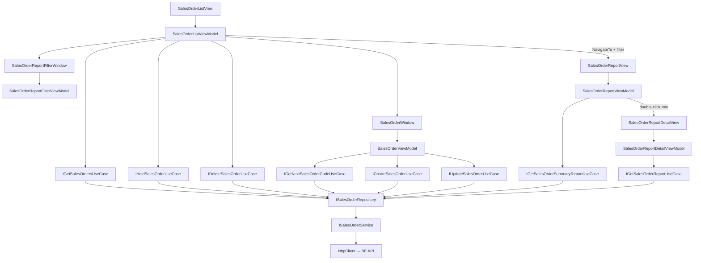

# Sales Orders — Feature Document (App)

> **Jira:** — | **Branch:** `dev` | **Generated:** 2026-05-01 | **Last updated:** 2026-08-09 (Trừ cọc tích hợp vào dropdown chọn sản phẩm)

---

## PRD Summary

> Module quản lý đơn hàng bán trong WPF Desktop Lamour — tạo/sửa/xóa đơn bán hàng kèm dòng chi tiết sản phẩm, hỗ trợ treo đơn.

- **Goal:** Cho phép nhân viên Lamour tạo, theo dõi, và treo đơn hàng bán; tự động trừ tồn kho từ BE khi ghi sổ.
- **User story:** As a Lamour staff, I want to create sales orders with product line items so that customer transactions are recorded and inventory is automatically updated.
- **Acceptance criteria:**
  - [x] Form nhập đơn hàng với đầy đủ thông tin header (khách hàng, nhân viên bán, ngày, điều khoản TT...)
  - [x] Danh sách dòng hàng (DataGrid) với cột "Tỷ lệ CK(%)" và tính toán tự động `Amount = Quantity × UnitPrice × (1 − CK/100)`
  - [x] Footer 3 giá trị thẳng hàng: Tổng tiền hàng (gross) / Tổng tiền chiết khấu / Tổng tiền thanh toán (net)
  - [x] Tự động sinh số chứng từ `BC{5 digits}` từ BE endpoint `GET /api/v1/sales-orders/next-code`
  - [x] Điều hướng Prev/Next giữa các đơn hàng
  - [x] Tạo mới / Cập nhật / Xóa đơn hàng qua BE API
  - [x] Popup alert khi ghi sổ thất bại — hiện tất cả sản phẩm không đủ kho cùng lúc
  - [x] Confirm dialog trước khi chỉnh sửa đơn hàng
  - [x] Cột "Trạng thái" trong danh sách đơn hàng (`📄 Ghi sổ` / `⏸ Treo`)
  - [x] Nút "⏸ Treo" trong toolbar danh sách
  - [x] ~~Đơn đã Confirmed không thể sửa, xóa, hoặc treo~~ — bỏ status "Confirmed" (2026-07-16), chỉ còn Ghi sổ (0) / Treo (1)
  - [x] In hóa đơn bán hàng (preview + print) tự động mở sau khi "Ghi sổ" thành công (2026-07-15)
  - [x] Tính thuế theo `Product.VatRate` khi ghi sổ — cột "Thuế suất"/"Tiền thuế" trên DataGrid + "Tổng tiền thuế"/"Tổng thanh toán (gồm thuế)" ở footer (2026-07-15)
  - [x] Ô "📊 Báo cáo" trên màn hình menu "Bán hàng" (`SalesView`, không còn ở toolbar `SalesOrderListView` — di chuyển 2026-07-18) → popup filter (Mặt hàng/Nhân viên/Khách hàng/Đơn vị tính/Nhóm VTHH/Kỳ báo cáo/Từ-Đến ngày) → trang báo cáo riêng với DataGrid + xuất Excel + in (2026-07-16, mở rộng 2026-07-18)
  - [x] Double-click 1 dòng trong báo cáo tổng hợp → drill down sang trang "Sổ chi tiết bán hàng" liệt kê đúng các chứng từ khớp dòng đó (2026-07-31)
  - [x] "Trừ cọc" — mỗi cọc còn số dư của khách hàng đang chọn hiện như 1 lựa chọn trong dropdown Mã hàng/Tên hàng (như 1 "sản phẩm ảo"); chọn → dòng tự chuyển Mã hàng=số chứng từ cọc, Tên hàng="Trừ cọc", các cột không liên quan bị disable; gõ số tiền vào "Thành tiền" (số dương, tự lưu âm) → trừ thẳng vào "Tổng thanh toán (gồm thuế)"; Ghi sổ xong tự gọi BE tạo `DepositDeduction` (2026-08-09)

---

## Business Rules

| Rule | Description |
|------|-------------|
| Số chứng từ | Lấy từ BE qua `GET /api/v1/sales-orders/next-code` khi mở form — trả `BC{5 digits}` (`BC00001`...); không còn tự tính từ full-list cache |
| Khách hàng bắt buộc | `SelectedCustomer` phải được chọn trước khi save |
| Tìm khách hàng theo SĐT | Ô "Khách hàng" (`AppSearchableComboBox`) match theo `Code`, `Name`, **và `Phone`** (2026-07-15) — gõ số điện thoại cũng lọc ra khách hàng tương ứng |
| Hiển thị SĐT trong dropdown (2026-07-15) | Dropdown list hiện `"Mã — Tên — SĐT"` (qua `ISearchableItem.DropdownText` + `SearchableItemDropdownTextConverter`); ô input sau khi chọn vẫn gọn `"Mã — Tên"` (`DisplayText`) như cũ |
| Ít nhất 1 dòng | `Lines.Count > 0` — validate tại ViewModel trước khi gọi API |
| Auto-calc Amount | `Amount = Quantity × UnitPrice × (1 − DiscountRate/100)` — khi `Quantity`, `UnitPrice`, hoặc `DiscountRate` thay đổi |
| Tỷ lệ CK | `DiscountRate` (0–100) per line; clamp tại BE; WPF nhập trực tiếp vào DataGrid |
| Tính thuế theo sản phẩm (2026-07-15) | Khi chọn sản phẩm cho 1 dòng → `TaxRate` tự set từ `Product.VatRate` (qua `SalesOrderTaxCalculator.ToPercent`: `Five→5`, `Eight→8`, `Ten→10`, còn lại → `0`); `TaxAmount = Amount × TaxRate/100`, đọc-only trên DataGrid (không nhập tay) — BE luôn tính lại authoritative, WPF chỉ là preview |
| Hàng khuyến mại → giá/CK/thuế = 0 (2026-07-25) | Tick "Hàng KM" (`IsPromotion=true`) → `UnitPrice`/`DiscountRate`/`TaxRate` tự set về `0` ngay (→ `Amount`/`TaxAmount` = 0 theo công thức có sẵn); ô "Đơn giá"/"Tỷ lệ CK(%)" chuyển `IsEnabled=False` (nền xám) khi dòng là KM — không cho sửa tay. Bỏ tick lại → khôi phục `UnitPrice`/`TaxRate` từ `SelectedProduct` (giống lúc mới chọn sản phẩm). **BE ghi đè lại y hệt (authoritative)** khi Ghi sổ — `CreateSalesOrderUseCase`/`UpdateSalesOrderUseCase` ép `UnitPrice=0`/`DiscountRate=0`/`TaxRate=0` nếu `dto.IsPromotion=true`, bất kể client gửi gì lên |
| Footer totals | `TotalAmount` = Σ(Qty×UnitPrice) gross; `TotalDiscount` = Σ(Qty×UnitPrice×CK/100); `TotalPayment` = TotalAmount − TotalDiscount (**chưa gồm thuế**); `TotalTaxAmount` = Σ(line.TaxAmount); `GrandTotal` = TotalPayment + TotalTaxAmount (tổng thanh toán thật, gồm thuế) |
| TK mặc định | `ReceivableAccount = "131"`, `RevenueAccount = "511"` điền sẵn khi thêm dòng |
| Auto-fill Description | Khi chọn khách hàng → `Description = "Bán hàng {TênKH}"` |
| Auto-select NV bán hàng | Khi chọn khách hàng → tự động chọn NV có `Id == Customer.SaleCareEmployeeId`; bỏ qua (để trống) nếu khách hàng chưa gán NV chăm sóc |
| Dirty tracking + confirm đóng | `IsDirty` bật sau `InitializeAsync`; click "Đóng" hoặc X khi `IsDirty = true` → hiện dialog xác nhận |
| PaymentDueDate tự tính | Khi nhập `PaymentDueDays` → `PaymentDueDate = DocumentDate + days` |
| UTC → Local | Dates từ API (`AccountingDate`, `DocumentDate`, `PaymentDueDate`) được convert sang local time khi hiển thị |
| HttpClient base URL | `http://192.168.64.1:5282` (MacBook từ UTM VM) |
| Token | `IAuthTokenStorage.GetToken()` inject vào Authorization header |
| BE error body | `EnsureSuccessOrThrowAsync` đọc `{ "error": "..." }` từ body 400 response → throw `Exception(message)` với text thực của BE |
| Alert khi ghi sổ lỗi | `SaveAsync` catch block gọi `MessageBox.Show(ex.Message, "Không thể ghi sổ", ..., Warning)` — hiện tất cả sản phẩm không đủ kho cùng lúc |
| Confirm trước khi sửa | `EditSalesOrderAsync` hiện `MessageBox.Show(YesNo)` trước khi mở form chỉnh sửa |
| SalesOrderStatus (2026-07-16) | `0` = Normal, nhãn hiển thị **"📄 Ghi sổ"** (mặc định khi tạo mới, BE quyết định), `1` = Held (⏸ Treo). Status `2` (Confirmed/"✅ Xác nhận") và endpoint `PUT /{id}/confirm` **đã bị xoá hoàn toàn** khỏi BE lẫn WPF |
| Treo đơn | `HoldSalesOrderCommand` → PUT `/{id}/hold` — không còn action nào khác thay đổi status |
| Báo cáo là filter-popup + trang riêng (2026-07-16) | Tile "📊 Báo cáo" trên `SalesView` (2026-07-18: chuyển từ toolbar `SalesOrderListView` lên đây) mở `SalesOrderReportFilterWindow` (chỉ chứa filter, `ShowDialog`) — không phải trang báo cáo hiển thị luôn; submit xong mới điều hướng sang `SalesOrderReportView` (trang riêng, không phải popup) |
| Báo cáo filter optional (mở rộng 2026-07-18) | Mặt hàng (checklist multi-select), Nhân viên/Khách hàng (single-select), Đơn vị tính/Nhóm VTHH (single-select, "Tất cả" = không lọc), Kỳ báo cáo (preset) + Từ ngày/Đến ngày đều optional — không chọn gì thì báo cáo trả về toàn bộ dòng |
| Báo cáo đổi sang bảng TỔNG HỢP (2026-07-18) | `SalesOrderReportView` không còn hiển thị theo dòng chứng từ chi tiết — mỗi hàng hiển thị giờ là 1 nhóm đã CỘNG DỒN cả kỳ lọc (per `(product, customer, employee)` hoặc tập con tuỳ "Thống kê theo"), khớp thiết kế tham chiếu kiểu MISA "TỔNG HỢP BÁN HÀNG THEO..." — không còn cột Số chứng từ/Ngày |
| Báo cáo gộp cả Hàng bán bị trả lại (2026-07-18) | Gọi endpoint mới `GET /summary-report` — BE tự merge dữ liệu Sales + SalesReturn; cột "SL trả lại"/"Giá trị trả lại" là số liệu THẬT (không phải 0 placeholder) |
| Báo cáo bỏ qua sản phẩm/KH/NV không hoạt động (2026-07-18) | Chỉ hiện các nhóm có ít nhất 1 dòng bán hoặc trả lại trong kỳ — khác ảnh tham chiếu MISA (liệt kê mọi sản phẩm kể cả SL=0); quyết định có chủ đích để giới hạn phạm vi |
| "Giá trị giảm giá" luôn = 0 (2026-07-18) | Cột hiển thị theo đúng layout ảnh tham chiếu nhưng khái niệm "giảm giá" (price-reduction, khác chiết khấu) không được model ở BE — cột này chỉ để khớp bố cục, chưa có dữ liệu thật |
| Mặt hàng là multi-select (2026-07-18) | `SalesOrderReportFilterWindow` đổi ô "Mặt hàng" từ `AppSearchableComboBox` single-select sang `DataGrid` checklist (`ProductCheckItem.IsSelected`); "Chọn tất cả" toggle chọn/bỏ chọn toàn bộ danh sách đang hiển thị |
| Đơn vị tính / Nhóm VTHH lọc client-side (2026-07-18) | `Product.Unit`/`Product.Category` là string tự do, KHÔNG có bảng lookup riêng — dropdown lấy distinct values từ danh sách Products đã load sẵn (`IGetProductsUseCase`), không cần API mới. Chọn ĐVT/Nhóm VTHH sẽ lọc lại checklist Mặt hàng hiển thị (client-side), đồng thời gửi `unit`/`category` lên BE để lọc kết quả báo cáo |
| Kỳ báo cáo (2026-07-18) | Dropdown preset (`SalesOrderReportPeriods`: Hôm nay/Hôm qua/Tuần này/Tuần trước/Tháng này/Tháng trước/Đầu tháng đến hiện tại/Quý này/Năm nay/Tùy chỉnh) tự động điền `FromDate`/`ToDate`; mặc định "Đầu tháng đến hiện tại" khi mở popup; chọn "Tùy chỉnh" hoặc tự sửa tay 2 DatePicker không bị ghi đè |
| Thống kê theo — 7 kiểu (2026-07-18) | Dropdown `SalesOrderReportTypes`: Mặt hàng / Mặt hàng & khách hàng / Mặt hàng & nhân viên / Khách hàng / Nhân viên / Khách hàng & nhân viên / Khách hàng & mặt hàng. Chỉ đổi CÁCH HIỂN THỊ (group + subtotal) trên `SalesOrderReportView` — không đổi filter nào, không gọi API khác, dữ liệu vẫn là cùng 1 danh sách dòng phẳng từ BE |
| Nesting 2 chiều (2026-07-18) | Với type 2 vế (vd "Mặt hàng & khách hàng"), thứ tự nhóm theo đúng thứ tự nhãn — group ngoài = vế đầu, subgroup trong = vế sau, dòng "Cộng" đóng mỗi cấp; "Mặt hàng & khách hàng" và "Khách hàng & mặt hàng" cho cùng 1 tập dữ liệu nhưng lồng nhau theo chiều ngược lại |
| Filter độc lập với Thống kê theo (2026-07-18) | Đổi type KHÔNG ẩn/disable filter nào — Mặt hàng checklist, Nhân viên, Khách hàng, Đơn vị tính, Nhóm VTHH, Kỳ báo cáo luôn hiển thị và dùng được bất kể type nào đang chọn |
| Print/Excel giữ nguyên phẳng (2026-07-18) | `PrintCommand`/`ExportExcelCommand` vẫn xuất `Lines` (danh sách phẳng, không group/subtotal) — chỉ `DisplayRows` trên DataGrid màn hình có group/subtotal; quyết định có chủ đích để giới hạn phạm vi, có thể mở rộng sau nếu cần |
| Drill-down toàn bộ 7 kiểu thống kê (2026-07-31) | Double-click áp dụng cho mọi report type, không riêng "Khách hàng" — vì `ReportDisplayRow` luôn biết ID của dimension nó đại diện bất kể Product/Customer/Employee |
| Drill-down trigger = double-click dòng (2026-07-31) | Double-click 1 dòng SẢN PHẨM/KHÁCH HÀNG/NHÂN VIÊN con (leaf row) trong `ReportGrid` → mở trang "Sổ chi tiết bán hàng"; double-click trúng dòng GROUP HEADER (Expander của report 2 chiều) không làm gì nếu chưa từng chọn dòng nào trước đó — `DataGrid.SelectedItem` không đổi khi click vào Expander (nó không phải 1 data row thật) |
| Drill-down lọc theo CẢ 2 chiều khi report 2 vế (2026-07-31) | Vd "Khách hàng & mặt hàng": double-click dòng sản phẩm trong nhóm 1 khách hàng → sổ chi tiết lọc theo ĐÚNG `customer_id` VÀ `product_id` đó (không chỉ 1 chiều) — `ReportDisplayRow` lưu ID của cả outer dimension (`SetOuterId`, gắn cùng lúc với `GroupKey`/`GroupLabel`) lẫn inner dimension (`Aggregate` tự set qua `IdFor`) |
| Drill-down kế thừa filter gốc (2026-07-31) | Ngày (Từ/Đến), Đơn vị tính, Nhóm VTHH từ `CurrentFilter` của báo cáo tổng hợp được truyền nguyên sang `SalesOrderDetailFilter` — chỉ thêm/ghi đè `product_id`/`customer_id`/`employee_id` theo dòng vừa click |
| Sổ chi tiết chỉ có dữ liệu BÁN HÀNG, chưa gộp trả lại (2026-07-31, biết trước, chưa xử lý) | Gọi lại `IGetSalesOrderReportUseCase`/`GET /report` (endpoint cấp DÒNG, trước đó không còn ai gọi từ 2026-07-18) — endpoint này chỉ trả `SalesOrderLine`, không có `SalesReturnLine`. Vì vậy tổng số liệu ở "Sổ chi tiết" sẽ KHÔNG khớp tuyệt đối với số "Doanh thu thuần" ở báo cáo tổng hợp (vốn đã gộp cả trả lại qua `/summary-report`) nếu khách/sản phẩm đó có phát sinh trả lại trong kỳ — phạm vi đã chốt với user, có thể mở rộng sau bằng cách merge thêm `ISalesReturnRepository.GetReportLinesAsync` |
| Trừ cọc — "sản phẩm ảo" trong dropdown (2026-08-09) | Khi chọn khách hàng → load `AvailableDeposits` (chỉ cọc `RemainingBalance > 0`) → mỗi cọc bọc thành 1 `DepositProductPickerItem : ISearchableItem` (`Id` âm để không đụng `Product.Id` thật, `DisplayText = "DC00001 — Trừ cọc (còn 2,000,000)"`), trộn **ở đầu** `Products` (trước sản phẩm thật) — cả khi gõ tìm kiếm theo mã/tên. Chọn item này ở cột Mã hàng/Tên hàng (double-click như chọn sản phẩm bình thường) → `SalesOrderLineItem.SelectedProduct` setter set `IsDepositDeductionRow=true`, `LinkedDeposit`, `ProductId=0`, zero hoá `Quantity`/`UnitPrice`/`DiscountRate`/`TaxRate`/`ReceivableAccount`/`RevenueAccount`; chọn lại 1 sản phẩm thật cho cùng dòng đó thì khôi phục về trạng thái sản phẩm bình thường |
| Trừ cọc — Mã hàng/Tên hàng tĩnh như sản phẩm thật | `LinkedDeposit` setter set `ProductCode = deposit.DocumentNumber`, `ProductName = "Trừ cọc"` — hiển thị y hệt 1 dòng sản phẩm (không phải combo nổi trong cell); double-click lại để đổi cọc vẫn ra đúng dropdown sản phẩm (đã lẫn sẵn các lựa chọn cọc) |
| Trừ cọc — Thành tiền luôn âm | `SalesOrderLineItem.Amount` setter: nếu `IsDepositDeductionRow=true` thì luôn lưu `-Math.Abs(value)` bất kể user gõ dấu gì — không áp dụng logic "thành tiền thủ công"/back-calculate Đơn giá của dòng sản phẩm (vô nghĩa vì `Quantity=0`) |
| Trừ cọc — không tính vào Tổng tiền hàng/Tổng tiền thanh toán, chỉ trừ vào Tổng thanh toán (gồm thuế) | `RecalculateTotals()`: `TotalAmount`/`TotalDiscount`/`TotalPayment`/`TotalTaxAmount` chỉ Sum trên `Lines.Where(!IsDepositDeductionRow)` (khớp cách BE tính `SalesOrder.TotalAmount`/`GrandTotal` — BE hoàn toàn không biết về Trừ cọc); riêng `GrandTotal = TotalPayment + TotalTaxAmount + Σ(dòng Trừ cọc.Amount)` (đã âm sẵn) — quyết định có chủ đích theo yêu cầu user, chấp nhận 2 số khác nhau tuỳ ô nhìn |
| Trừ cọc — không gửi lên BE như 1 dòng hàng | `BuildCreateRequest`/`BuildUpdateRequest`/`BuildPreviewOrderDto`: `Lines.Where(l => !l.IsDepositDeductionRow).Select(ToLineDto)` — dòng Trừ cọc không tồn tại trong `SalesOrderLineDto[]` gửi BE, không in ra hoá đơn |
| Trừ cọc — validate + gọi API sau khi Ghi sổ | `SaveAsync`: tìm `depositLine = Lines.FirstOrDefault(l => IsDepositDeductionRow && LinkedDeposit != null && Amount != 0)` — bỏ qua nếu dòng tồn tại nhưng chưa chọn cọc/chưa nhập tiền (không lỗi); nếu có, validate `|Amount| <= LinkedDeposit.RemainingBalance` trước khi gọi `_createOrder`/`_updateOrder`; sau khi đơn lưu thành công mới gọi `ICreateDepositDeductionUseCase.ExecuteAsync` với `SalesOrderId = result.Id` — nếu bước này lỗi thì đơn hàng VẪN đã lưu, chỉ hiện `MessageBox` cảnh báo riêng, không rollback |
| Trừ cọc — không tạo dòng Quỹ Tiền Mặt | Kế thừa nguyên thiết kế BE `DepositDeduction` (xem `Features/Deposits/docs/deposits.md` phía BE) — chỉ điều chỉnh `RemainingBalance` nội bộ, không đụng `CashTransaction` |

---

## Architecture Overview

### Key Components

| Layer | File | Role |
|-------|------|------|
| View (list) | `Views/SalesOrderListView.xaml` | Danh sách đơn + toolbar (Thêm / Sửa / Treo / Xóa / 📊 Báo cáo) + cột Trạng thái |
| ViewModel (list) | `ViewModels/SalesOrderListViewModel.cs` | Commands: Add/Edit/Hold/Delete; filter; ApplyFilter (không còn `OpenReport` — chuyển sang `SalesViewModel` 2026-07-18) |
| View (menu) | `Views/SalesView.xaml` | Menu "Bán hàng": 3 tile — Chứng từ bán hàng / Hàng bán bị trả lại / 📊 Báo cáo (tile Báo cáo thêm 2026-07-18) |
| ViewModel (menu) | `ViewModels/SalesViewModel.cs` | Commands: NavigateToSalesOrders/NavigateToSalesReturns/OpenReport (2026-07-18) |
| View (report filter) | `Views/SalesOrderReportFilterWindow.xaml` | Popup (`Window`, `ShowDialog`), mở rộng 2026-07-18 — "Thống kê theo" (7 kiểu, `ComboBox` thật từ 2026-07-18 thứ 2, trước đó fixed "Mặt hàng"), "Kỳ báo cáo" preset `ComboBox`, Từ/Đến `DatePicker`, Đơn vị tính/Nhóm VTHH `ComboBox`, Nhân viên/Khách hàng `AppSearchableComboBox`, `DataGrid` checklist Mặt hàng (multi-select + "Chọn tất cả"), nút "Xóa điều kiện" |
| ViewModel (report filter) | `ViewModels/SalesOrderReportFilterViewModel.cs` | Load lookups (Products/Employees/Customers) song song; derive `Units`/`Categories` distinct từ Products; `ProductItems` (`ObservableCollection<ProductCheckItem>`) lọc lại theo Unit/Category đã chọn; `SelectedPeriod` auto-fill Từ/Đến qua `ApplyPeriodPreset`; `ClearFiltersCommand`; `SubmitCommand`/`CancelCommand` set `DialogResult`; `BuildFilter()` → `SalesOrderReportFilter` |
| View (report page) | `Views/SalesOrderReportView.xaml` | Trang riêng (UserControl, navigate) — filter summary header, DataGrid dòng chi tiết, totals footer, nút In/Xuất Excel |
| ViewModel (report page) | `ViewModels/SalesOrderReportViewModel.cs` | Implements `INavigationParameterAware`; `LoadAsync` gọi `IGetSalesOrderSummaryReportUseCase` (2026-07-18, đổi từ `IGetSalesOrderReportUseCase`) → `Items` (`SalesOrderSummaryLineItem`, finest-grain triple); `RebuildDisplayRows`/`AppendGroup` group + AGGREGATE (không còn liệt kê raw) theo `CurrentFilter.ReportType`, đệ quy 1-2 cấp qua `GroupingsByType` (mỗi entry gắn `SummaryDimension` để biết cột nào hợp lệ hiển thị); `ChooseParametersCommand` (2026-07-18) mở lại `SalesOrderReportFilterWindow` ngay tại trang báo cáo; `PrintCommand`/`ExportExcelCommand` xuất `DisplayRows` (bảng tổng hợp, không còn `Lines` phẳng); `DrillDownCommand` (2026-07-31) — double-click 1 dòng → build `SalesOrderDetailFilter` từ ID lưu trên `ReportDisplayRow` + filter gốc → `NavigateTo(NavigationRoutes.SalesOrders.ReportDetail, ...)` |
| View (report detail page, 2026-07-31) | `Views/SalesOrderReportDetailView.xaml` | Drill-down target — trang riêng (UserControl, navigate), tương tự `SalesOrderReportView` nhưng KHÔNG có nút "Chọn tham số" (filter đến từ double-click, không tự chọn lại); DataGrid dòng chi tiết + totals footer + nút In/Xuất Excel |
| ViewModel (report detail page, 2026-07-31) | `ViewModels/SalesOrderReportDetailViewModel.cs` | Implements `INavigationParameterAware`, nhận `SalesOrderDetailFilter`; `LoadAsync` gọi lại `IGetSalesOrderReportUseCase` (hồi sinh — trước đó không còn ai gọi từ 2026-07-18) → `Items` (`SalesOrderReportLineItem`, dòng phẳng); `PrintCommand`/`ExportExcelCommand` riêng, không tái dùng code của `SalesOrderReportViewModel` (không có group/subtotal để xuất) |
| View (form) | `Views/SalesOrderWindow.xaml` | Form header + DataGrid lines + navigation toolbar |
| View (code-behind) | `Views/SalesOrderWindow.xaml.cs` | `OnContentRendered` → `LoadAsync` + `AddNewCommand` |
| ViewModel (form) | `ViewModels/SalesOrderViewModel.cs` | Toàn bộ state, commands, navigation, form logic; tính TotalAmount/TotalDiscount/TotalPayment |
| Domain Model (list) | `Domain/Models/SalesOrderListItem.cs` | `Status`, `StatusLabel` (📄 Ghi sổ / ⏸ Treo) |
| Domain Model (line) | `Domain/Models/SalesOrderLineItem.cs` | Observable line item với `DiscountRate` + auto-calc Amount |
| Domain Model (report filter) | `Domain/Models/SalesOrderReportFilter.cs` | POCO truyền qua navigation parameter: `ProductIds`/`ProductLabels` (list, 2026-07-18), `EmployeeId`/`CustomerId`/`Unit`/`Category`/`FromDate`/`ToDate` + label hiển thị + computed `Summary` |
| Domain Model (report detail line) | `Domain/Models/SalesOrderReportLineItem.cs` | `FromDto()`; hiển thị 1 dòng chi tiết + computed `GrandTotal = Amount + TaxAmount`. Không còn dùng bởi `SalesOrderReportViewModel` (bảng tổng hợp) từ 2026-07-18, nhưng **được `SalesOrderReportDetailViewModel` dùng lại từ 2026-07-31** cho màn drill-down "Sổ chi tiết bán hàng" |
| Domain Model (drill-down filter, 2026-07-31) | `Domain/Models/SalesOrderDetailFilter.cs` | POCO truyền qua navigation parameter khi drill-down: `Title` (label hiển thị, build sẵn từ `ReportDisplayRow`), `ProductId`/`CustomerId`/`EmployeeId` (nullable, ghi đè theo dòng vừa click), `Unit`/`Category`/`FromDate`/`ToDate` (kế thừa nguyên từ `SalesOrderReportFilter` gốc) |
| Domain Model (summary line) | `Domain/Models/SalesOrderSummaryLineItem.cs` (2026-07-18) | `FromDto(SalesOrderSummaryLineDto)`; 1 dòng = 1 triple `(product, customer, employee)` cộng dồn cả kỳ — `QuantitySold`, `SalesAmount`, `DiscountAmount`, `ReturnQuantity`, `ReturnValue`, `NetRevenue` |
| Domain Model (product checklist) | `Domain/Models/ProductCheckItem.cs` (2026-07-18) | `ObservableObject` wrapper quanh `Product` với `IsSelected` bindable cho DataGrid checkbox column |
| Domain Model (period presets) | `Domain/Models/SalesOrderReportPeriods.cs` (2026-07-18) | Static string constants + `All` list cho dropdown "Kỳ báo cáo" |
| Domain Model (report types) | `Domain/Models/SalesOrderReportTypes.cs` (2026-07-18) | Static string constants (7 kiểu) + `All` list cho dropdown "Thống kê theo" |
| Domain Model (display row) | `Domain/Models/ReportDisplayRow.cs` (2026-07-18, đổi shape sang tổng hợp; +ID fields 2026-07-31) | Row hiển thị trên DataGrid — `Aggregate(items, activeDimensions)` cộng dồn TOÀN BỘ items còn lại thành 1 dòng duy nhất (activeDimensions quyết định cột Mã/Tên hàng, Khách hàng, Nhân viên nào được điền — cột không thuộc dimension đang chọn để trống, tránh hiển thị giá trị sai/mập mờ khi 1 dòng gộp nhiều giá trị khác nhau); `Subtotal(level, dimension, groupValue, items)` — dòng cộng cấp ngoài cho type 2 vế, label chèn vào ĐÚNG cột theo `dimension` (Product/Customer/Employee), không cố định vào `ProductName`. **(2026-07-31)** thêm `ProductId`/`CustomerId`/`EmployeeId` (nullable) — `Aggregate()` tự set ID của dimension chính nó đại diện qua `IdFor()`; với report 2 vế, `RebuildDisplayRows` gọi thêm `row.SetOuterId(outerField, sample)` để dòng con biết luôn cả ID của outer dimension — phục vụ drill-down lọc theo cả 2 chiều |
| UseCase | `Domain/UseCases/GetSalesOrdersUseCase.cs` | Fetch list |
| UseCase | `Domain/UseCases/CreateSalesOrderUseCase.cs` | Pass-through → Repository |
| UseCase | `Domain/UseCases/UpdateSalesOrderUseCase.cs` | Pass-through → Repository |
| UseCase | `Domain/UseCases/DeleteSalesOrderUseCase.cs` | Pass-through → Repository |
| UseCase | `Domain/UseCases/HoldSalesOrderUseCase.cs` | PUT `/{id}/hold` → Repository |
| UseCase | `Domain/UseCases/GetNextSalesOrderCodeUseCase.cs` | Gọi `ISalesOrderRepository.GetNextCodeAsync()` |
| UseCase | `Domain/UseCases/GetSalesOrderReportUseCase.cs` | Pass-through → `ISalesOrderRepository.GetReportAsync(...)` — dùng bởi `SalesOrderReportDetailViewModel` (drill-down, 2026-07-31) |
| Repository | `Data/Repositories/SalesOrderRepository.cs` | Delegate tới Service |
| Service | `Data/Services/SalesOrderService.cs` | HttpClient typed service, 8 operations (+ `GetReportAsync`, tự build query string) + `EnsureSuccessOrThrowAsync` helper |
| DTOs | `Data/Services/Dtos/` | `SalesOrderResponseDto` (+ `status`), `CreateSalesOrderRequestDto`, `UpdateSalesOrderRequestDto`, `SalesOrderLineDto`, `SalesOrderReportLineDto` (2026-07-16) |
| View (print) | `Views/SalesOrderPrintWindow.xaml` / `.xaml.cs` | Preview + print hóa đơn bán hàng — `FlowDocument` dựng trong code-behind, không cần ViewModel riêng |

### Data Flow

```
SalesOrderListView (load on navigate)
  → SalesOrderListViewModel.LoadSalesOrdersCommand
    → IGetSalesOrdersUseCase.ExecuteAsync()
      → ISalesOrderRepository.GetAllAsync()
        → ISalesOrderService.GetAllAsync()
          → HttpClient GET /api/v1/sales-orders
          ← IEnumerable<SalesOrderResponseDto>
    → SalesOrderListItem.FromDto(dto)  ← maps Status + StatusLabel
  → ObservableCollection<SalesOrderListItem> SalesOrders populated

EditSalesOrderCommand
  → MessageBox confirm (Yes/No)
  → open SalesOrderWindow.Initialize(dto)
  → SaveAsync → POST/PUT
    → EnsureSuccessOrThrowAsync(response)
      → 2xx: success
      → 4xx: read body { "error": "..." } → throw Exception(message)
    → catch (ex): MessageBox.Show(ex.Message, "Không thể ghi sổ", Warning)

HoldSalesOrderCommand
  → ISalesOrderService.HoldAsync(id)   → PUT /api/v1/sales-orders/{id}/hold
  → Update item in _allItems + ApplyFilter

OpenReportCommand (2026-07-16, đổi sang summary-report 2026-07-18)
  → SalesOrderReportFilterWindow.ShowDialog()   ← popup, chỉ chứa filter
  → user chọn Mặt hàng(checklist)/Nhân viên/Khách hàng/ĐVT/Nhóm VTHH/Kỳ báo cáo/Từ-Đến ngày → Submit → DialogResult = true
  → window.BuildFilter() → SalesOrderReportFilter
  → _navigationService.NavigateTo(NavigationRoutes.SalesOrders.Report, filter)
    → NavigationService resolves SalesOrderReportView, sets CurrentContent
    → view.DataContext (SalesOrderReportViewModel) implements INavigationParameterAware
    → OnNavigatedTo(filter) → CurrentFilter = filter; _ = LoadAsync()
      → IGetSalesOrderSummaryReportUseCase.ExecuteAsync(productIds?, employeeId?, customerId?, unit?, category?, fromDate?, toDate?)
        → ISalesOrderRepository.GetSummaryReportAsync(...) → ISalesOrderService.GetSummaryReportAsync(...)
          → HttpClient GET /api/v1/sales-orders/summary-report?...
          ← IEnumerable<SalesOrderSummaryLineDto>
      → SalesOrderSummaryLineItem.FromDto(dto) per row → Items populated
      → RecalculateTotals() + RebuildDisplayRows() → RowsView (grouped/aggregated per ReportType)

DrillDownCommand (2026-07-31 — double-click 1 dòng trong RowsView)
  → ReportGrid_MouseDoubleClick (code-behind) đọc ReportGrid.SelectedItem as ReportDisplayRow
  → ViewModel.DrillDownCommand.Execute(row)
    → build title từ row.GroupLabel/GroupKey (outer, nếu report 2 vế) + inner dimension label + row.ProductName
    → new SalesOrderDetailFilter { ProductId = row.ProductId, CustomerId = row.CustomerId, EmployeeId = row.EmployeeId,
                                    Unit/Category/FromDate/ToDate kế thừa từ CurrentFilter }
    → _navigationService.NavigateTo(NavigationRoutes.SalesOrders.ReportDetail, detailFilter)
      → NavigationService resolves SalesOrderReportDetailView, sets CurrentContent
      → view.DataContext (SalesOrderReportDetailViewModel) implements INavigationParameterAware
      → OnNavigatedTo(filter) → Title/FilterSummary set; _ = LoadAsync()
        → IGetSalesOrderReportUseCase.ExecuteAsync(productIds?, employeeId?, customerId?, unit?, category?, fromDate?, toDate?)
          → ISalesOrderRepository.GetReportAsync(...) → ISalesOrderService.GetReportAsync(...)
            → HttpClient GET /api/v1/sales-orders/report?product_ids=&employee_id=&customer_id=&unit=&category=&from_date=&to_date=
            ← IEnumerable<SalesOrderReportLineDto>  (chỉ SalesOrderLine, KHÔNG có SalesReturnLine)
        → SalesOrderReportLineItem.FromDto(dto) per row → Items populated, totals recalculated
```



---

## Key Files & Symbols

### Presentation
- [`Views/SalesOrderListView.xaml`](../Views/SalesOrderListView.xaml) — Toolbar: ➕ Thêm / ✏️ Sửa / ⏸ Treo / 🗑️ Xóa / 📊 Báo cáo; DataGrid: cột "Trạng thái" (StatusLabel, Width=100) là cột đầu tiên
- [`Views/SalesOrderWindow.xaml`](../Views/SalesOrderWindow.xaml) — Form đơn hàng: header tabs + DataGrid lines + navigation toolbar
- [`Views/SalesOrderWindow.xaml.cs`](../Views/SalesOrderWindow.xaml.cs) — `OnContentRendered` → `LoadAsync()` + `AddNewCommand.Execute(null)`
- [`ViewModels/SalesOrderListViewModel.cs`](../ViewModels/SalesOrderListViewModel.cs) — Commands: `AddSalesOrder`, `EditSalesOrder`, `HoldSalesOrder`, `DeleteSalesOrder`, `LoadSalesOrders`, `GoBack`; `EditSalesOrderAsync` hiện confirm dialog trước khi mở form (`OpenReport` đã chuyển sang `SalesViewModel` 2026-07-18)
- [`Views/SalesView.xaml`](../Views/SalesView.xaml) / [`ViewModels/SalesViewModel.cs`](../ViewModels/SalesViewModel.cs) — Menu "Bán hàng" cấp cha; `OpenReportCommand` (2026-07-18, chuyển từ `SalesOrderListViewModel`) inject `Func<SalesOrderReportFilterWindow>` — cùng factory đã đăng ký sẵn trong DI, không cần đăng ký thêm
- [`ViewModels/SalesOrderViewModel.cs`](../ViewModels/SalesOrderViewModel.cs) — Commands: `AddNew`, `Save`, `Delete`, `NavigatePrev`, `NavigateNext`, `AddLine`, `RemoveLine`, `Cancel`, `LoadAsync2` (Refresh); `SaveAsync` catch → `MessageBox.Show(ex.Message, "Không thể ghi sổ", Warning)`; (2026-08-09) inject thêm `IGetDepositsByCustomerUseCase`/`ICreateDepositDeductionUseCase`; `_depositPickerItems` (field, rebuild trong `LoadAvailableDepositsAsync`) trộn vào `Products` qua `ResetProductFilter`/`FilterProductsByCode`/`FilterProductsByName`
- [`Views/SalesOrderReportFilterWindow.xaml`](../Views/SalesOrderReportFilterWindow.xaml) / `.xaml.cs` — Popup filter; code-behind subscribes `ViewModel.PropertyChanged` trên `DialogResult` → set `Window.DialogResult` + `Close()`; exposes `BuildFilter()` cho caller đọc sau `ShowDialog()`
- [`ViewModels/SalesOrderReportFilterViewModel.cs`](../ViewModels/SalesOrderReportFilterViewModel.cs) — `LoadLookupsCommand` (Task.WhenAll 3 lookups), `SubmitCommand`/`CancelCommand`, `BuildFilter()`
- [`Views/SalesOrderReportView.xaml`](../Views/SalesOrderReportView.xaml) / `.xaml.cs` — Trang báo cáo: filter summary, DataGrid, totals footer, nút In/Xuất Excel; code-behind trivial (`InitializeComponent()` only)
- [`ViewModels/SalesOrderReportViewModel.cs`](../ViewModels/SalesOrderReportViewModel.cs) — `OnNavigatedTo` (từ `INavigationParameterAware`) nhận `SalesOrderReportFilter` → `LoadAsync` → `RebuildDisplayRows` (2026-07-18); `PrintCommand` dựng `FlowDocument` bảng + `PrintDialog`; `ExportExcelCommand` dùng `ClosedXML.Excel.XLWorkbook` + `SaveFileDialog`; cả 2 vẫn dựa trên `Lines` (phẳng), không group

### Domain
- [`Domain/Models/SalesOrderListItem.cs`](../Domain/Models/SalesOrderListItem.cs) — `Status` (int), `StatusLabel` (`"📄 Ghi sổ" | "⏸ Treo"`), `Original` (SalesOrderResponseDto)
- [`Domain/Models/SalesOrderLineItem.cs`](../Domain/Models/SalesOrderLineItem.cs) — `INotifyPropertyChanged`; `Quantity`/`UnitPrice`/`DiscountRate` setter → `RecalculateAmount()`; (2026-08-09) thêm `IsDepositDeductionRow`/`LinkedDeposit` (`DepositResponseDto?`); `Amount` setter tự âm hoá khi `IsDepositDeductionRow`; `SelectedProduct` setter nhánh mới cho `DepositProductPickerItem`
- [`Domain/Models/DepositProductPickerItem.cs`](../Domain/Models/DepositProductPickerItem.cs) (2026-08-09) — `ISearchableItem` bọc `DepositResponseDto`; `Id` = `-Deposit.Id` (âm, tránh đụng `Product.Id`); `DisplayText = "{DocumentNumber} — Trừ cọc (còn {RemainingBalance:N0})"`
- [`Domain/Models/SalesOrderReportFilter.cs`](../Domain/Models/SalesOrderReportFilter.cs) — `ProductId`/`ProductLabel`, `EmployeeId`/`EmployeeLabel`, `CustomerId`/`CustomerLabel`, `FromDate`, `ToDate`; computed `Summary` (chuỗi "Đang lọc: ..." hoặc "Tất cả chứng từ")
- [`Domain/Models/SalesOrderReportLineItem.cs`](../Domain/Models/SalesOrderReportLineItem.cs) — `FromDto(SalesOrderReportLineDto)`; `GrandTotal => Amount + TaxAmount`
- [`Domain/UseCases/IHoldSalesOrderUseCase.cs`](../Domain/UseCases/IHoldSalesOrderUseCase.cs) — `Task<SalesOrderResponseDto> ExecuteAsync(int id, ct)`
- [`Domain/UseCases/HoldSalesOrderUseCase.cs`](../Domain/UseCases/HoldSalesOrderUseCase.cs) — delegates to `ISalesOrderRepository.HoldAsync(id, ct)`
- [`Domain/UseCases/IGetNextSalesOrderCodeUseCase.cs`](../Domain/UseCases/IGetNextSalesOrderCodeUseCase.cs) — `Task<string> ExecuteAsync(ct)`
- [`Domain/UseCases/IGetSalesOrderReportUseCase.cs`](../Domain/UseCases/IGetSalesOrderReportUseCase.cs) / `GetSalesOrderReportUseCase.cs` (2026-07-16) — thin pass-through tới `ISalesOrderRepository.GetReportAsync(...)`

### Data
- [`Data/Services/ISalesOrderService.cs`](../Data/Services/ISalesOrderService.cs) — `GetAllAsync`, `GetByIdAsync`, `CreateAsync`, `UpdateAsync`, `DeleteAsync`, `GetNextCodeAsync`, `HoldAsync`, `GetReportAsync(productIds?, employeeId?, customerId?, unit?, category?, fromDate?, toDate?)` (2026-07-16, extended 2026-07-18; không còn dùng bởi `SalesOrderReportViewModel` từ 2026-07-18 nhưng **dùng lại bởi `SalesOrderReportDetailViewModel` từ 2026-07-31** cho drill-down), `GetSummaryReportAsync(...)` cùng tham số (2026-07-18, dùng bởi `SalesOrderReportViewModel` cho bảng tổng hợp)
- [`Data/Services/SalesOrderService.cs`](../Data/Services/SalesOrderService.cs) — HttpClient typed service; `EnsureSuccessOrThrowAsync` helper đọc body 400 → lấy `{ "error": "..." }`; `HoldAsync` → `PUT /{id}/hold`; `GetReportAsync` tự build query string thủ công (không dùng `HttpUtility`), format ngày `yyyy-MM-dd`, chỉ thêm param khi có giá trị; `productIds` gửi bằng nhiều key lặp lại (`product_ids=1&product_ids=2`); `unit`/`category` qua `Uri.EscapeDataString` (2026-07-18)
- [`Data/Services/Dtos/SalesOrderResponseDto.cs`](../Data/Services/Dtos/SalesOrderResponseDto.cs) — 19 fields snake_case + `lines[]` + `[JsonPropertyName("status")] public int Status`
- [`Data/Services/Dtos/SalesOrderReportLineDto.cs`](../Data/Services/Dtos/SalesOrderReportLineDto.cs) — mirror BE `SalesOrderReportLineDto` (16 fields snake_case)
- [`Data/Repositories/ISalesOrderRepository.cs`](../Data/Repositories/ISalesOrderRepository.cs) — `GetAllAsync`, `CreateAsync`, `UpdateAsync`, `DeleteAsync`, `GetNextCodeAsync`, `HoldAsync`, `GetReportAsync` (2026-07-16, extended 2026-07-18; dùng lại từ 2026-07-31 cho drill-down), `GetSummaryReportAsync` (2026-07-18)
- [`Domain/Models/SalesOrderDetailFilter.cs`](../Domain/Models/SalesOrderDetailFilter.cs) (2026-07-31) — `Title`, `ProductId?`/`CustomerId?`/`EmployeeId?`, `Unit?`/`Category?`/`FromDate?`/`ToDate?`; truyền qua `NavigationService.NavigateTo(NavigationRoutes.SalesOrders.ReportDetail, filter)`
- [`Views/SalesOrderReportDetailView.xaml`](../Views/SalesOrderReportDetailView.xaml) / `.xaml.cs` (2026-07-31) — trang drill-down; code-behind trivial (`InitializeComponent()` + `DataContext` only, không cần xử lý column visibility như `SalesOrderReportView`)
- [`ViewModels/SalesOrderReportDetailViewModel.cs`](../ViewModels/SalesOrderReportDetailViewModel.cs) (2026-07-31) — `OnNavigatedTo` nhận `SalesOrderDetailFilter` → `LoadAsync` gọi `IGetSalesOrderReportUseCase.ExecuteAsync(productId là mảng 1 phần tử hoặc null, employeeId, customerId, unit, category, fromDate, toDate)` → `Items` (`SalesOrderReportLineItem`); `PrintCommand`/`ExportExcelCommand` viết riêng (không group/subtotal, khác `SalesOrderReportViewModel`)
- [`Domain/Models/SalesOrderSummaryLineItem.cs`](../Domain/Models/SalesOrderSummaryLineItem.cs) / [`Domain/UseCases/IGetSalesOrderSummaryReportUseCase.cs`](../Domain/UseCases/IGetSalesOrderSummaryReportUseCase.cs) / `GetSalesOrderSummaryReportUseCase.cs` (2026-07-18) — thin pass-through tới `ISalesOrderRepository.GetSummaryReportAsync(...)`
- [`Data/Repositories/SalesOrderRepository.cs`](../Data/Repositories/SalesOrderRepository.cs) — thin delegate tới `ISalesOrderService`

---

## API Contracts

| Method | Endpoint | Output |
|--------|----------|--------|
| `GET` | `/api/v1/sales-orders` | `SalesOrderResponseDto[]` |
| `GET` | `/api/v1/sales-orders/{id}` | `SalesOrderResponseDto` / 404 |
| `GET` | `/api/v1/sales-orders/next-code` | `{ "code": "BC00006" }` |
| `POST` | `/api/v1/sales-orders` | `SalesOrderResponseDto` (201) |
| `PUT` | `/api/v1/sales-orders/{id}` | `SalesOrderResponseDto` (200) |
| `DELETE` | `/api/v1/sales-orders/{id}` | 204 |
| `PUT` | `/api/v1/sales-orders/{id}/hold` | `SalesOrderResponseDto` (200) |
| `GET` | `/api/v1/sales-orders/report?product_ids=&employee_id=&customer_id=&unit=&category=&from_date=&to_date=` | `SalesOrderReportLineDto[]` |

> `PUT /api/v1/sales-orders/{id}/confirm` **đã bị xoá** (2026-07-16) — status "Confirmed" không còn tồn tại.

---

## EnsureSuccessOrThrowAsync Pattern (2026-06-11)

Thay thế `response.EnsureSuccessStatusCode()` trong `CreateAsync` và `UpdateAsync` — đọc được error message từ BE:

```csharp
private static async Task EnsureSuccessOrThrowAsync(HttpResponseMessage response, CancellationToken ct)
{
    if (response.IsSuccessStatusCode) return;
    var body = await response.Content.ReadFromJsonAsync<ApiErrorResponse>(ct);
    throw new Exception(body?.Error ?? $"Lỗi {(int)response.StatusCode}");
}
private record ApiErrorResponse(
    [property: System.Text.Json.Serialization.JsonPropertyName("error")] string? Error);
```

`SalesOrderViewModel.SaveAsync`:
```csharp
catch (Exception ex)
{
    MessageBox.Show(ex.Message, "Không thể ghi sổ", MessageBoxButton.OK, MessageBoxImage.Warning);
}
```

---

## ViewModel State Machine

### SalesOrderListViewModel

| State | Điều kiện | Hành động |
|-------|-----------|-----------|
| Loading | `IsLoading = true` | DataGrid bị che bởi overlay |
| Error | `HasError = true` | Error banner hiện `ErrorMessage` |
| No selection | `SelectedOrder == null` | Edit/Hold/Delete buttons disabled |
| Status = 0 (Normal, "📄 Ghi sổ") | — | Cả 3 buttons enabled |
| Status = 1 (Held, "⏸ Treo") | — | Hold vẫn khả dụng (toggle) |

### SalesOrderViewModel (Form)

| State | `IsEditing` | `CurrentOrder` | Form |
|-------|-------------|----------------|------|
| Idle (xem record) | `false` | set | Read-only |
| Thêm mới | `true` | `null` | Editable, form cleared |
| Đang sửa | `true` | set | Editable |
| Saving | `IsBusy = true` | — | Disabled |
| Error | `HasError = true` | — | Error banner hiển thị |

---

## Key ViewModel Logic

### Sinh số chứng từ (2026-05-23 — đã refactor)

Trước đây: tính `max` từ `_orderListCache` (~900ms). Sau khi refactor: gọi BE endpoint lightweight (~220ms):

```csharp
_nextDocumentNumber = await _getNextCode.ExecuteAsync(ct);
private string GenerateNextDocumentNumber() => _nextDocumentNumber;
```

### Tính tổng tiền footer (2026-07-15: thêm TotalTaxAmount + GrandTotal)
```csharp
var gross      = Lines.Sum(l => (decimal)l.Quantity * l.UnitPrice);
TotalAmount    = gross;
TotalDiscount  = Lines.Sum(l => (decimal)l.Quantity * l.UnitPrice * clamp(l.DiscountRate) / 100m);
TotalPayment   = gross - TotalDiscount;
TotalTaxAmount = Lines.Sum(l => l.TaxAmount);
GrandTotal     = TotalPayment + TotalTaxAmount;
```

### Auto-fill thuế theo sản phẩm (2026-07-15)
```csharp
// SalesOrderLineItem.SelectedProduct setter
if (value is Product p)
{
    ...
    TaxRate = SalesOrderTaxCalculator.ToPercent(p.VatRate);
}

// RecalculateAmount() — tách riêng RecalculateTax() để TaxRate setter
// không ghi đè Amount (vốn có thể đã được set authoritative từ BE)
private void RecalculateAmount()
{
    Amount = Quantity * UnitPrice * (1 - Math.Max(0, Math.Min(100, DiscountRate)) / 100m);
    RecalculateTax();
}
private void RecalculateTax() => TaxAmount = Amount * Math.Max(0, TaxRate) / 100m;
```

### Auto-fill khi chọn khách hàng + auto-select NV bán hàng (2026-06-11, fixed 2026-07-15)
```csharp
partial void OnSelectedCustomerChanged(ISearchableItem? value)
{
    if (value is Customer c)
    {
        Description = $"Bán hàng {c.Name}";
        if (c.SaleCareEmployeeId.HasValue)
        {
            var matched = Employees.FirstOrDefault(e => e.Id == c.SaleCareEmployeeId.Value);
            if (matched is not null)
                SelectedEmployee = matched;
        }
    }
}
```

**Fixed 2026-07-15:** Bug "chọn khách hàng nhưng không load nhân viên" — nguyên nhân là match theo `Employee.Name == Customer.SaleCare` (string, case-insensitive) fail âm thầm khi tên không khớp tuyệt đối (dư khoảng trắng, đổi tên NV, NV bị xóa). Đổi `Customer.SaleCare` (string) → `Customer.SaleCareEmployeeId` (int? FK), match bằng Id — không còn phụ thuộc chính tả. Nếu khách hàng chưa có `SaleCareEmployeeId` → NV bán hàng để trống, không có fallback tự chọn NV đang đăng nhập (quyết định có chủ đích — WPF chưa có cơ chế map user đăng nhập → Employee).

### Confirm dialog trước khi sửa (2026-06-11)
```csharp
[RelayCommand(CanExecute = nameof(HasSelection))]
private async Task EditSalesOrderAsync(CancellationToken ct = default)
{
    if (SelectedOrder is null) return;
    var confirm = MessageBox.Show(
        $"Bạn có chắc muốn chỉnh sửa chứng từ '{SelectedOrder.DocumentNumber}'?",
        "Xác nhận chỉnh sửa", MessageBoxButton.YesNo, MessageBoxImage.Question);
    if (confirm != MessageBoxResult.Yes) return;
    // open form...
}
```

### Hold command (2026-06-11, Confirm removed 2026-07-16)
```csharp
[RelayCommand(CanExecute = nameof(HasSelection))]
private async Task HoldSalesOrderAsync(CancellationToken ct = default)
{
    var updated = await _holdOrder.ExecuteAsync(SelectedOrder!.Id, ct);
    // replace item in _allItems + ApplyFilter
}
```

> `ConfirmSalesOrderAsync` / `ConfirmOrderAsync`, `IConfirmSalesOrderUseCase`, `ISalesOrderRepository.ConfirmAsync`, `ISalesOrderService.ConfirmAsync`, và endpoint `PUT /{id}/confirm` đã bị xoá hoàn toàn (2026-07-16) — status "Confirmed" (2) không còn tồn tại, chỉ còn `0` (Normal, nhãn "📄 Ghi sổ") và `1` (Held, "⏸ Treo").

### In hóa đơn bán hàng sau khi Ghi sổ (2026-07-15)

Sau khi `SaveAsync` tạo/cập nhật đơn thành công → tự động mở `SalesOrderPrintWindow` (modal) hiển thị preview hóa đơn, trước khi đóng `SalesOrderWindow`:

```csharp
StopDirtyTracking();
OrderSaved?.Invoke();
IsBusy = false;

ShowPrintPreview(result);   // mở SalesOrderPrintWindow.ShowDialog()

RequestClose?.Invoke();
```

`SalesOrderPrintWindow` dựng `FlowDocument` trong code-behind (không có ViewModel riêng — feature nhỏ, dữ liệu chỉ đọc từ `SalesOrderResponseDto` truyền vào qua `Initialize()`):
- Header công ty (tên, địa chỉ, MST, tel/website, số tài khoản) — **hard-code trong code-behind**, hệ thống chỉ phục vụ 1 công ty nên không cần bảng cấu hình riêng.
- `Điện thoại`/`Địa chỉ` khách hàng lấy từ `SelectedCustomer` (cast sang `Customer` concrete model) tại thời điểm Ghi sổ — **không có trong `SalesOrderResponseDto`**.
- Cột `THUẾ SUẤT` = `line.TaxRate` thật (denormalized từ `Product.VatRate` — xem "Tính thuế theo sản phẩm" 2026-07-15). `TỔNG CỘNG` mỗi dòng = `line.Amount + line.TaxAmount`; `Tổng tiền thanh toán` = `order.GrandTotal` (BE tính). ~~Trước 2026-07-15 dùng hằng số 8% cố định vì `SalesOrder` chưa lưu thuế — đã bỏ~~.
- Dòng "Người viết hóa đơn" ở footer để trống — nhân viên ký tay, không tự điền NV bán hàng (quyết định có chủ đích, tránh nhầm giữa NV bán hàng và người thực sự viết hóa đơn).
- **Hàng khuyến mại (2026-07-25)**: dòng có `line.IsPromotion == true` chỉ in `STT`/`Tên sản phẩm`/`SL` — 5 cột còn lại (`ĐƠN GIÁ`/`CK (%)`/`THÀNH TIỀN`/`THUẾ SUẤT`/`TỔNG CỘNG`) để trống thay vì hiện `"0"`/`"0%"` (đều = 0 do BE ép giá/CK/thuế về 0 cho hàng KM — xem Business Rules "Hàng khuyến mại → giá/CK/thuế = 0").
- Nút "🖨️ In" gọi `PrintDialog` + `FlowDocument.DocumentPaginator`; nút "✖️ Đóng" chỉ đóng preview, không huỷ đơn đã lưu.
- DI: `AddTransient<SalesOrderPrintWindow>()` + `AddTransient<Func<SalesOrderPrintWindow>>()` trong `HomeServiceCollectionExtensions.cs`, cùng pattern với `EmployeeFormWindow`/`CustomerFormWindow`.

#### Nút "In Hoá Đơn" thủ công trên toolbar popup (2026-08-05)

Trước đây preview hoá đơn chỉ tự mở đúng 1 lần ngay sau khi Ghi sổ thành công — không có cách nào in lại/in thử 1 chứng từ khi đang ở trạng thái "mới" (chưa Ghi sổ) dù đã nhập đủ dòng sản phẩm. Thêm nút "🖨️ In Hoá Đơn" trên toolbar `SalesOrderWindow` (cạnh "↩️ Hoàn"/"✖️ Đóng", nhóm luôn hiển thị), tái dùng nguyên `SalesOrderPrintWindow` đã có, không thêm hạ tầng in mới:

```csharp
// SalesOrderViewModel.cs
private bool CanPrint => Lines.Any(l => l.ProductId > 0);

[RelayCommand(CanExecute = nameof(CanPrint))]
private void Print()
{
    if (!CanPrint) return;
    ShowPrintPreview(BuildPreviewOrderDto());
}
```

Điều kiện bật nút là **có ít nhất 1 dòng đã chọn sản phẩm** (`ProductId > 0`), KHÔNG yêu cầu đã Ghi sổ — khác với "⏸ Treo" (`HasExistingOrder`, chỉ áp dụng chứng từ đã tồn tại trên BE). `PrintCommand.NotifyCanExecuteChanged()` được gọi mỗi khi dòng thêm/bớt (`Lines.CollectionChanged`) hoặc 1 field trên dòng đổi (qua helper chung `OnLinesOrTotalsChanged()`, thay `RecalculateTotals()` gọi trực tiếp trước đây).

`BuildPreviewOrderDto()` dựng `SalesOrderResponseDto` **thuần từ dữ liệu đang hiển thị trên form** (không gọi BE) — dùng đúng các field tổng đã tính sẵn client-side (`TotalPayment`/`TotalTaxAmount`/`GrandTotal` từ `RecalculateTotals()`) và `Lines.Select(ToLineDto)`. Nếu đã có `CurrentOrder` (đơn đã lưu), vẫn ưu tiên dữ liệu form hiện tại thay vì bản cũ đã lưu (phòng trường hợp đang sửa dở chưa bấm Ghi sổ) — chỉ giữ `Id`/`CreatedAt`/`Status` từ `CurrentOrder` để hiển thị đúng số chứng từ/trạng thái. Không đổi BE, không đổi layout hoá đơn.

#### Đổi khổ giấy in hoá đơn: A5 → A4 → quay lại A5 (2026-08-05)

Thử đổi sang A4 (210×297mm) dựa trên suy đoán từ ảnh mẫu MISA tham chiếu, nhưng user xác nhận lại khổ đúng vẫn là **A5** (148×210mm) — revert `A5PageWidth`/`A5PageHeight` về 148×210mm, `PrintTicket.PageMediaSize` về `PageMediaSizeName.ISOA5`.

#### Fix preview hóa đơn ngắn nhìn giống hình chữ nhật nằm ngang (2026-08-05)

Phát hiện qua đổi A4 tạm thời: `FlowDocumentScrollViewer` (dùng cho ô xem trước trong app, khác với in thật dùng `DocumentPaginator`) chỉ dùng `PageWidth`/`ColumnWidth` để giới hạn bề ngang xuống dòng — chiều cao **tự co theo đúng nội dung**, không tự kéo nền trắng ra đủ `PageHeight`. Hóa đơn ít dòng sản phẩm (vd 1 dòng) vì vậy hiển thị như hình chữ nhật nằm ngang thay vì tờ giấy đứng cao, dù bản in thật vẫn ra đúng khổ A5 portrait (in dùng `DocumentPaginator`, có tôn trọng `PageHeight`, khác `FlowDocumentScrollViewer`).

Fix: thêm `EstimateContentHeight(int lineCount)` — ước lượng thô chiều cao nội dung theo số dòng sản phẩm (cộng các hằng số cho header/tiêu đề/thông tin KH/bảng/tổng tiền/ghi chú/chữ ký), rồi chèn 1 `BlockUIContainer` chứa `Border` vô hình (`MinHeight = Math.Max(0, A5PageHeight - estimatedContentHeight)`) làm block cuối cùng của `content` — bù đủ chiều cao còn thiếu để preview luôn nhìn giống 1 trang A5 đứng. Đây chỉ là ước lượng gần đúng (WPF `Block`/`TableCell` không expose được chiều cao đã render thật, không có cách đo chính xác dễ dàng) — hóa đơn dài hơn 1 trang không bị ảnh hưởng (`Math.Max(0, ...)` kẹp về 0, không trừ âm).

#### Fix mép phải "Tổng tiền thanh toán"/"GHI CHÚ ĐƠN HÀNG" lệch so với bảng sản phẩm (2026-08-05)

`totalTable`/`noteTable` (2 khung có viền đen bên dưới bảng sản phẩm) trước đó dùng `new TableColumn()` không set `Width` — tự giãn hết chiều ngang khung chứa, RỘNG HƠN bảng sản phẩm (vốn set cứng tổng 8 cột = 490 DIU qua mảng `{ 21, 152, 28, 62, 41, 69, 48, 69 }`) → mép phải 2 khung này lệch ra ngoài so với bảng sản phẩm phía trên. Tách mảng width thành `ProductTableColumnWidths` (hằng số dùng chung, nguồn sự thật duy nhất) + `ProductTableWidth = ProductTableColumnWidths.Sum()` (= 490), rồi set `totalTable`/`noteTable` cùng `Width = ProductTableWidth` — mép phải giờ thẳng hàng với bảng sản phẩm. (`deliveryPaymentTable` — "PT giao hàng"/"PT thanh toán" — vốn đã đúng 245+245=490 từ trước, không cần sửa.)

#### 3 fix layout hoá đơn theo mẫu MISA tham chiếu (2026-08-05)

So sánh với 1 ảnh chụp hóa đơn MISA tham chiếu, phát hiện + sửa 3 điểm khác biệt trong `BuildInvoiceDocument()`:

- **Tiêu đề "HÓA ĐƠN BÁN HÀNG" bị lệch trái**: `titleTable` cũ chỉ có 2 cột bằng nhau (tiêu đề `TextAlignment.Center` trong cột 1, "Số HĐ" cột 2) → tâm chữ tiêu đề rơi vào ~25% chiều rộng trang thay vì đúng giữa. Sửa thành 3 cột: đệm rỗng (`140px`) | tiêu đề (giữa, `Auto`) | "Số HĐ" (`140px`) — cột đệm trái bằng đúng cột phải để tiêu đề được bao đối xứng, căn giữa đúng theo cả trang.
- **Cột "CK (%)" thiếu số 0**: đổi format từ `"0.##"` (bỏ số 0 thừa, vd `35%`) sang `"N2"` theo culture `vi-VN` (vd `40,00%`) — khớp cách hiển thị 2 số thập phân trong mẫu tham chiếu.
- **Tên khách hàng chưa đủ đậm**: `FontWeight.SemiBold` → `FontWeight.Bold`.
- **"PT giao hàng"/"PT thanh toán" bị xô lệch**: trước đây nối 1 chuỗi `$"PT giao hàng: {x}      PT thanh toán: {y}"` với khoảng trắng cứng — vị trí "PT thanh toán" trôi theo độ dài `DeliveryMethod`. Đổi sang bảng 2 cột cố định (`245px`/`245px`), mỗi label/giá trị 1 cell riêng — vị trí "PT thanh toán" giờ luôn cố định.

Không đổi BE, không đổi DTO — thuần chỉnh layout `FlowDocument` trong `SalesOrderPrintWindow.xaml.cs`.

#### Gộp "Tổng tiền thanh toán"/"GHI CHÚ ĐƠN HÀNG" vào chung bảng sản phẩm — hết khoảng cách giữa các hàng (2026-08-06)

Fix trước đó (2026-08-05, mục ngay trên) chỉnh cho mép PHẢI của `totalTable`/`noteTable` thẳng hàng với bảng sản phẩm, nhưng cả 3 vẫn là **3 `Table` riêng biệt** xếp chồng — mỗi bảng có viền ngoài (border) riêng của chính nó, nên dù `Margin=0` giữa các bảng, viền trên/dưới của 2 bảng liền kề vẫn render thành 2 đường viền song song sát nhau thay vì 1 đường liền — nhìn giống có khoảng cách/đường viền đôi giữa dòng sản phẩm cuối, dòng "Tổng tiền thanh toán", và dòng "GHI CHÚ ĐƠN HÀNG".

Fix triệt để: xoá hẳn `totalTable`/`noteTable` (và hằng số `ProductTableWidth` không còn ai dùng) — thêm "Tổng tiền thanh toán" và "GHI CHÚ ĐƠN HÀNG" làm **2 `TableRow` cuối cùng của CHÍNH bảng sản phẩm** (`rowGroup` dùng chung với header row + các data row), mỗi hàng 1 `TableCell` duy nhất với `ColumnSpan = ProductTableColumnWidths.Length` (= 8) để chiếm hết chiều ngang. Vì giờ là hàng của cùng 1 `Table` (`CellSpacing = 0`), viền các hàng chạm trực tiếp vào nhau — không còn viền đôi/khoảng trắng. Không đổi BE, không đổi DTO — thuần chỉnh `BuildInvoiceDocument()` trong `SalesOrderPrintWindow.xaml.cs`. WPF build 0 lỗi.

#### Redesign layout theo ảnh tham chiếu (2026-07-25)

Theo yêu cầu khớp 1 mẫu hóa đơn tham chiếu (ảnh chụp hóa đơn thật của công ty), `BuildInvoiceDocument()` được cấu trúc lại — vẫn cùng 1 file, không thêm ViewModel/dependency mới ngoài asset logo:

- **Logo công ty**: copy file gốc (`lg LM đen@4x.png`, 15419×5029px) vào `Assets/Images/lamour-logo.png` trong project, đăng ký `<Resource Include="Assets\Images\lamour-logo.png" />` trong `DesktopLamour.csproj`, load qua `new BitmapImage(new Uri("pack://application:,,,/Assets/Images/lamour-logo.png"))`, hiển thị 150×49 (`Stretch=Uniform`) trong `Image` control bọc bởi `BlockUIContainer`.
- **Header đổi từ center 1 cột → logo trái + info bên cạnh**: trước đó toàn bộ 5 dòng công ty đều `TextAlignment.Center` trong 1 cột duy nhất — giờ logo nằm bên trái, tên/địa chỉ/MST/tel/STK căn trái ngay cạnh. **Bản đầu tiên (2026-07-25) dùng `Table` 2 cột (logo `160px` trái, info `*` phải) — đã bị revert, xem bug fix bên dưới.**
- **Khung viền ngoài**: toàn bộ nội dung hóa đơn (trừ chính bản thân `frame`) được add vào `content.Blocks` — `content` là 1 `TableCell` duy nhất của 1 `Table` 1-ô (`frame`), có `BorderBrush = #9DC1E0` (`OuterBorderBrush`, xanh nhạt), `BorderThickness = 1.2`, `Padding = 20`. Đây là kỹ thuật đứng để giả lập "border quanh cả trang" mà `FlowDocument` không hỗ trợ trực tiếp (`Border` UIElement chỉ nhận 1 child, không chứa được nhiều `Block` — nên phải mượn `TableCell.Blocks` vốn là 1 `BlockCollection` thật).
- **"GHI CHÚ ĐƠN HÀNG" luôn hiển thị**: trước đây `if (!string.IsNullOrWhiteSpace(order.Notes))` mới add — giờ luôn render 1 `Table` 1-ô có border đen 0.5px, label bold + nội dung (rỗng nếu `order.Notes == null`), khớp bố cục ảnh tham chiếu (ô luôn hiện dù trống).
- **"Tổng tiền thanh toán" cũng có border**: bọc trong `Table` 1-ô cùng kiểu border với dòng Ghi chú (trước đây chỉ là `Paragraph` trần không viền).
- **Bỏ toàn bộ spacing giữa các section**: `Margin` của `headerTable`/`titleTable`/dòng info cuối cùng của khách hàng/`table` (dòng sản phẩm)/`totalTable`/`noteTable` đều đổi về `Thickness(0)` — Header, Tiêu đề, Thông tin KH, Bảng sản phẩm, Tổng tiền thanh toán, Ghi chú giờ nằm liền kề nhau, border chạm trực tiếp (không còn khoảng trắng giữa các khối). Khoảng trắng trước dòng "Ngày ... Tháng ... Năm ..." và trước bảng chữ ký **vẫn giữ nguyên** (`Margin(0,4,0,40)`) — đây là khoảng trống có chủ đích để dành chỗ ký tay, không phải phần dư cần bỏ.
- **Known gap (chưa xử lý)**: ảnh tham chiếu để **trống** ô `CK (%)`/`THUẾ SUẤT` khi giá trị = 0%, còn code hiện tại vẫn in `"0%"` — nằm ngoài phạm vi đã chốt với user (chỉ sửa logo/header/khung viền/spacing), giữ nguyên hành vi cũ.

#### Bug fix: header logo render sai — `Table` lồng nhau → `Floater` (2026-07-25)

Bản đầu tiên của header logo (mục trên) dùng 1 `Table` 2 cột lồng bên trong `content` (chính nó cũng là 1 `TableCell` của `frame` — bảng bọc khung viền ngoài). Khi test thật trên Windows (không test được qua preview HTML mockup), cột info (`Width = GridLength(1, GridUnitType.Star)`) bị đo ra gần như **0px** — toàn bộ dòng "CÔNG TY TNHH..." bị wrap từng **1 ký tự/dòng**, xếp dọc theo mép phải trang thay vì nằm ngang cạnh logo. Root cause: `Table` lồng trong `Table` với cột `Star` không có cột ngoài `Width` tường minh là 1 pattern không ổn định trong `FlowDocument` — cùng họ bug với vụ Grid `Auto`/`Star` đo ra 0 đã gặp ở `SalesOrderWindow.xaml` (xem mục layout 2026-07-25 bên dưới), lần này ở tầng `Table`/`TableColumn` thay vì `Grid`/`RowDefinition`.

Fix: bỏ hẳn `Table` lồng nhau, thay bằng `System.Windows.Documents.Floater` — cơ chế `FlowDocument` được thiết kế riêng cho "ảnh trôi nổi 1 bên + chữ tự bọc quanh" (giống `float` trong CSS), không có failure mode kể trên:
```csharp
var logoFloater = new Floater
{
    Width               = 170,
    HorizontalAlignment = HorizontalAlignment.Left,
    Margin              = new Thickness(0, 0, 14, 8),
};
logoFloater.Blocks.Add(new BlockUIContainer(logoImage));

var headerPara = new Paragraph();
headerPara.Inlines.Add(logoFloater);                 // Floater phải nằm trong Paragraph.Inlines (kế thừa Inline)
headerPara.Inlines.Add(new Bold(new Run("CÔNG TY...")));
headerPara.Inlines.Add(new LineBreak());
headerPara.Inlines.Add(new Run("Số 110/20/38 ..."));
// ... các dòng còn lại nối bằng LineBreak(), không còn TableCell/LeftLine() riêng
```
`LeftLine()` helper (dùng cho `TableCell` cũ) đã xóa vì không còn nơi nào gọi. Không có BE change nào (thuần bug UI). WPF build 0 lỗi.

### Báo cáo bán hàng (2026-07-16, di chuyển lên `SalesView` 2026-07-18)

**UX flow:** ô "📊 Báo cáo" là 1 trong 3 tile trên `SalesView` (màn hình menu "Bán hàng", cùng cấp với "Chứng từ bán hàng"/"Hàng bán bị trả lại") → mở `SalesOrderReportFilterWindow` (popup, `ShowDialog`, chỉ chứa filter — không hiển thị kết quả trong popup) → chọn Mặt hàng/Nhân viên/Khách hàng (optional, `AppSearchableComboBox` tái dùng `IGetProductsUseCase`/`IGetEmployeesUseCase`/`IGetCustomersUseCase` đã có sẵn) + Từ ngày/Đến ngày (optional) → "Đồng ý" → popup đóng → điều hướng sang `SalesOrderReportView` (trang riêng, không phải popup) hiển thị DataGrid dòng chi tiết khớp filter + totals footer + nút In/Xuất Excel.

> **2026-07-18:** `OpenReportCommand` được di chuyển từ `SalesOrderListViewModel` (toolbar của `SalesOrderListView`, bên trong "Chứng từ bán hàng") sang `SalesViewModel` (tile trên màn hình menu "Bán hàng" cấp cha) — theo yêu cầu để nút Báo cáo dễ thấy hơn, không cần vào sâu "Chứng từ bán hàng" trước. `SalesOrderListView` không còn nút "📊 Báo cáo" trong toolbar.

```csharp
// SalesViewModel (trước đây nằm ở SalesOrderListViewModel)
[RelayCommand]
private void OpenReport()
{
    var window = _reportFilterWindowFactory();
    if (window.ShowDialog() == true)
    {
        var filter = window.BuildFilter();
        _navigationService.NavigateTo(NavigationRoutes.SalesOrders.Report, filter);
    }
}
```

**Kiến trúc: fix gap "parameterized navigation" (lần đầu tiên được dùng thật)**

`INavigationService.NavigateTo(string viewName, object parameter)` đã được khai báo từ trước nhưng implementation trong `NavigationService.cs` chỉ là stub bỏ qua `parameter`:
```csharp
// TRƯỚC (stub, mọi feature khác chỉ dùng NavigateTo(viewName) 1 tham số)
public void NavigateTo(string viewName, object parameter)
{
    // Parameter-aware navigation can be extended here
    NavigateTo(viewName);
}
```
Đây là feature đầu tiên thực sự cần truyền dữ liệu qua navigation, nên đã hiện thực hoá overload này bằng một interface nhỏ mới, `Core/Navigation/INavigationParameterAware.cs`:
```csharp
public interface INavigationParameterAware
{
    void OnNavigatedTo(object? parameter);
}
```
```csharp
// SAU — NavigationService.cs
public void NavigateTo(string viewName, object parameter)
{
    NavigateTo(viewName);
    if (_mainWindowViewModel?.CurrentContent is FrameworkElement { DataContext: INavigationParameterAware aware })
        aware.OnNavigatedTo(parameter);
}
```
`SalesOrderReportViewModel` là ViewModel đầu tiên implement `INavigationParameterAware`:
```csharp
public void OnNavigatedTo(object? parameter)
{
    if (parameter is not SalesOrderReportFilter filter) return;
    CurrentFilter = filter;
    _ = LoadAsync();   // OnNavigatedTo không async được — fire-and-forget
}
```
Route mới: `NavigationRoutes.SalesOrders.Report = "SalesOrderReportView"`, thêm case trong `NavigationService.ResolveView`.

**In báo cáo** — tái dùng đúng pattern `SalesOrderPrintWindow` (`FlowDocument` + `PrintDialog`, không thư viện ngoài) nhưng dựng bảng nhiều dòng thay vì hoá đơn 1 chứng từ; có `TableRow` tổng cộng cuối bảng (`TotalsRow()`).

**Xuất Excel** — cần thêm dependency mới **`ClosedXML` 0.105.0** vào `DesktopLamour.csproj` (trước đây chỉ BE dùng ClosedXML để đọc import Excel khách hàng, đây là lần đầu WPF client tự ghi file Excel). `ExportExcelCommand` dùng `Microsoft.Win32.SaveFileDialog` + `ClosedXML.Excel.XLWorkbook`, ghi 1 sheet với header + data rows + dòng tổng bôi đậm, `AdjustToContents()`.

> ⚠️ Lưu ý implementation: bản ghi cuối (`TotalsRow()`) trong `FlowDocument` dùng `TableCell` nối tiếp (sequential append), khác với Excel export dùng `worksheet.Cell(row, col)` (địa chỉ tuyệt đối theo cột) — 2 cách này **không tự động đồng bộ layout**. Cell đầu tiên của `TotalsRow()` có `ColumnSpan = 4` (gộp 4 cột đầu) nên phải chèn đúng số cell rỗng tiếp theo để các cột số liệu (SL/Thành tiền/Thuế/Tổng cộng) không bị lệch cột — đã tự verify và fix 1 lần trong quá trình implement (thiếu 1 cell rỗng làm lệch toàn bộ số liệu sang trái 1 cột khi in).

### Drill-down: báo cáo tổng hợp → "Sổ chi tiết bán hàng" (2026-07-31)

**UX flow:** double-click bất kỳ dòng nào trong `ReportGrid` (báo cáo tổng hợp) → mở trang riêng "Sổ chi tiết bán hàng" (`SalesOrderReportDetailView`) liệt kê từng chứng từ/dòng bán hàng khớp đúng dòng vừa click, giống mẫu tham chiếu MISA "Tổng hợp bán hàng theo nhóm khách hàng" → double-click 1 nhóm → "Sổ chi tiết bán hàng".

**Vì sao không cần đổi BE:** endpoint cấp DÒNG `GET /api/v1/sales-orders/report` đã tồn tại sẵn từ 2026-07-16 nhưng bị bỏ rơi khi màn hình báo cáo đổi sang bảng tổng hợp (2026-07-18) — không còn WPF component nào gọi tới nó nữa (`Domain/Models/SalesOrderReportLineItem.cs`, `IGetSalesOrderReportUseCase`, `ISalesOrderService.GetReportAsync` đều bị bỏ không dùng, được note "LEGACY" trong doc trước đây). Tính năng này **hồi sinh** toàn bộ layer đó cho đúng use case của nó — chi tiết cấp dòng — thay vì xóa đi.

**ID plumbing — biết dòng tổng hợp đại diện cho ai:** `ReportDisplayRow` (trước đây chỉ có `ProductCode`/`ProductName` làm "identity" chung, không phân biệt được nó là Product hay Customer hay Employee ở tầng ID) được thêm 3 field `ProductId?`/`CustomerId?`/`EmployeeId?`:
```csharp
// ReportDisplayRow.Aggregate() — tự set ID của dimension NÓ đại diện (inner dimension với report 2 vế)
row.SetId(identityField, IdFor(identityField, first));

// SalesOrderReportViewModel.RebuildDisplayRows() — với report 2 vế, set thêm ID của OUTER dimension
if (isNested)
{
    row.GroupKey   = dimensions[0].Key(groupItems[0]);
    row.GroupLabel = ColumnLabelFor(dimensions[0].Field);
    row.SetOuterId(dimensions[0].Field, groupItems[0]);   // mới — cùng lúc với GroupKey/GroupLabel
}
```
Nhờ vậy 1 dòng con trong report "Khách hàng & mặt hàng" biết luôn cả `CustomerId` (outer) lẫn `ProductId` (inner) — double-click dòng đó lọc được theo **cả 2 chiều** thay vì chỉ 1.

**DrillDownCommand** (`SalesOrderReportViewModel`):
```csharp
[RelayCommand]
private void DrillDown(ReportDisplayRow? row)
{
    if (row is null) return;

    var dimensions = GroupingsByType[CurrentFilter?.ReportType ?? SalesOrderReportTypes.ByProduct];
    var innerLabel = ColumnLabelFor(dimensions[^1].Field);
    var title = row.GroupLabel is not null
        ? $"{row.GroupLabel}: {row.GroupKey}  —  {innerLabel}: {row.ProductName}"
        : $"{innerLabel}: {row.ProductName}";

    var detailFilter = new SalesOrderDetailFilter
    {
        Title = title,
        ProductId = row.ProductId, CustomerId = row.CustomerId, EmployeeId = row.EmployeeId,
        Unit = CurrentFilter?.Unit, Category = CurrentFilter?.Category,
        FromDate = CurrentFilter?.FromDate, ToDate = CurrentFilter?.ToDate,
    };
    _navigationService.NavigateTo(NavigationRoutes.SalesOrders.ReportDetail, detailFilter);
}
```
Ngày/ĐVT/Nhóm VTHH kế thừa nguyên từ `CurrentFilter` của báo cáo tổng hợp — chỉ `ProductId`/`CustomerId`/`EmployeeId` đổi theo dòng vừa click. Trigger: `ReportGrid.MouseDoubleClick` (code-behind) đọc `SelectedItem as ReportDisplayRow` rồi gọi command — double-click trúng dòng GROUP HEADER (Expander của report 2 chiều) sẽ **không kích hoạt** nếu trước đó chưa từng chọn dòng nào (Expander không phải 1 data row thật trong `DataGrid.SelectedItem`); nếu đã lỡ chọn 1 dòng khác trước đó thì double-click header sẽ dùng lại selection cũ — edge case đã biết, chưa chặn (chưa yêu cầu).

**Route mới:** `NavigationRoutes.SalesOrders.ReportDetail = "SalesOrderReportDetailView"`, thêm case trong `NavigationService.ResolveView`; DI 2 dòng mới (`SalesOrderReportDetailView`/`ViewModel`) trong `HomeServiceCollectionExtensions.cs` — không cần đăng ký lại `IGetSalesOrderReportUseCase` (đã có sẵn từ 2026-07-16).

**Trang "Sổ chi tiết bán hàng"** (`SalesOrderReportDetailView`/`ViewModel`) — cấu trúc tương tự `SalesOrderReportView` (title + filter summary + DataGrid phẳng + totals footer + In/Xuất Excel) nhưng KHÔNG có nút "Chọn tham số" (filter đến từ dòng vừa click, không tự chọn lại) và DataGrid không group/subtotal (mỗi dòng = 1 dòng chứng từ thật, dùng lại `SalesOrderReportLineItem`).

**Known gap — chưa gộp Hàng bán bị trả lại:** `GET /report` chỉ trả `SalesOrderLine`, không có `SalesReturnLine` (khác `/summary-report` đã gộp cả 2 từ 2026-07-18). Nếu khách/sản phẩm/nhân viên đó có phát sinh trả lại trong kỳ, tổng số ở "Sổ chi tiết" sẽ KHÔNG khớp tuyệt đối với "Doanh thu thuần" ở báo cáo tổng hợp. Đã note với user, chưa xử lý (phạm vi đã chốt trước khi implement) — muốn đầy đủ thì cần thêm bước merge `ISalesReturnRepository.GetReportLinesAsync` phía BE, tương tự cách `GetSalesOrderSummaryReportUseCase` đã làm.

### `SalesOrderWindow` — layout khu vực "Hàng tiền" + Footer (2026-07-25)

Hai vấn đề **độc lập nhau** được báo cáo cùng lúc trên `SalesOrderWindow.xaml`:

**1. DataGrid không hiện (xem Known Issues #7 — còn OPEN)** — pre-existing, không liên quan code mới, ảnh hưởng cả đơn mới lẫn đơn cũ, không crash. Nghi vấn rendering-tier của UTM VM, đang chờ user test registry key `DisableHWAcceleration` để xác nhận trước khi thêm fix vào code.

**2. Khoảng trắng lớn giữa vùng "Hàng tiền" và footer "Tổng tiền hàng"** — xuất hiện khi cửa sổ bị resize/maximize to hơn kích thước mặc định (`Width="1200" Height="760"`). Đã thử qua nhiều phương án trước khi chốt bản cuối:

| Phương án | Kết quả |
|---|---|
| Đổi toàn bộ `Grid.RowDefinitions` (root + `TabControl` + `TabItem` "Hàng tiền") từ `*`/`Auto` lẫn lộn sang toàn bộ `Auto`, thêm `MaxHeight` cho `DataGrid`/`TabControl` | ❌ Gây hiệu ứng ngược — control phình lên **đúng bằng `MaxHeight`** thay vì co theo nội dung thật. Gotcha WPF: set `MaxHeight` mà không kèm `Height` cụ thể khiến control có `ScrollViewer`/`ContentPresenter` nội bộ dùng `Stretch` (cả `TabControl` lẫn `DataGrid`) hiểu là "tôi muốn cao tới `MaxHeight`" thay vì "tôi chỉ cần cao bằng nội dung" |
| Thêm `Window.SizeToContent="Height"` | ❌ Xung đột với row `*` trong Grid — khi đo `SizeToContent`, row Star được đo với `availableSize=Infinity` nên tính ra 0, không hoạt động đúng cùng lúc với `*` row |
| **Bản cuối (giữ lại):** revert gần như nguyên bản gốc — root `Grid` Row 3 (`TabControl`) = `Height="*"`; `TabItem` "1. Hàng tiền" Row 0 (`DataGrid`) = `Height="*"`; không `MaxHeight`/`VerticalAlignment="Top"` nào ở cả 2. **Chỉ khác gốc đúng 1 chỗ:** Footer (root Grid Row 5) đổi từ `Height="Auto"` → `Height="100"` cố định | ✅ `DataGrid` co giãn lấp đầy tab, "+ Thêm dòng" luôn nằm sát dưới nó; Footer cố định 100px luôn sát đáy cửa sổ dù resize/maximize cỡ nào — user xác nhận đúng ý muốn |

> Bài học: khi 1 control WPF có `ScrollViewer` nội bộ (DataGrid, TabControl, ScrollViewer trực tiếp...) không set `Height` rõ ràng, tránh chỉ set `MaxHeight` một mình để "giới hạn" — nó có thể khiến control phình tới đúng giá trị `MaxHeight` thay vì co theo nội dung. Muốn giới hạn tăng trưởng mà vẫn co đúng theo nội dung thật, nên bọc trong `ScrollViewer` riêng có `MaxHeight` áp cho chính `ScrollViewer` đó, không áp trực tiếp lên control con.

---

## Edge Cases & Error Handling

| Scenario | Expected Behavior | Handled? |
|----------|------------------|----------|
| BE không chạy | Error banner: "Không thể tải dữ liệu: ..." | ✅ |
| Chưa chọn khách hàng khi Save | `ErrorMessage = "Vui lòng chọn khách hàng."` | ✅ |
| Lines rỗng khi Save | `ErrorMessage = "Vui lòng nhập ít nhất một mặt hàng."` | ✅ |
| Tồn kho không đủ — 1 sản phẩm | MessageBox với message từ BE (1 dòng lỗi) | ✅ |
| Tồn kho không đủ — nhiều sản phẩm | MessageBox với message từ BE (tất cả dòng lỗi gom lại) | ✅ |
| Sản phẩm đã ngưng (BE trả 400) | MessageBox `ex.Message` | ✅ |
| BE trả lỗi 400 với body `{ "error": "..." }` | `EnsureSuccessOrThrowAsync` parse body → `MessageBox.Show(ex.Message)` | ✅ |
| Xóa → BE trả 404 | Error banner trên form | ✅ |
| Cancel khi đang sửa | Reload lại dữ liệu từ API | ✅ |
| List rỗng | `_currentIndex = -1`, form trống | ✅ |
| 401 Unauthorized | `HttpRequestException` → Error banner | ⚠️ Không surface rõ lý do |
| Đóng form khi có dữ liệu chưa lưu | Dialog "Bạn có chắc muốn đóng? Dữ liệu chưa lưu sẽ bị mất." [Có/Không] | ✅ |
| Báo cáo: hủy popup filter (Hủy hoặc [X]) | `ShowDialog() != true` → không điều hướng, không gọi API | ✅ |
| Báo cáo: không filter nào → submit | Trả về toàn bộ dòng, `CurrentFilter.Summary = "Tất cả chứng từ"` | ✅ |
| Báo cáo: không có dòng khớp filter | Empty state "Không có dữ liệu khớp bộ lọc." | ✅ |
| Báo cáo: lỗi khi gọi API | `HasError = true`, error banner hiển thị `ErrorMessage` | ✅ |
| Xuất Excel: người dùng bấm Cancel ở SaveFileDialog | Không làm gì, không throw | ✅ |
| Xuất Excel: lỗi ghi file (đường dẫn không hợp lệ, file đang mở...) | `MessageBox.Show(ex.Message, "Xuất Excel thất bại", Warning)` | ✅ |

---

## Known Issues

| # | Severity | Mô tả | Fix đề xuất |
|---|---|---|---|
| 1 | 🟡 Medium | `OnSelectedCustomerChanged` cast `ISearchableItem` → concrete `Customer` model — layer violation (fragile string-name matching đã fix 2026-07-15 bằng `SaleCareEmployeeId` FK, nhưng cast vẫn còn) | Dùng `value?.Name` từ `ISearchableItem` interface |
| 2 | 🟡 Medium | `LoadAsync2` — tên command khó hiểu | Đổi thành `RefreshCommand` / `RefreshAsync` |
| 3 | 🟡 Medium | Không có confirm dialog trước khi xóa (list view) | Thêm `MessageBox.Show("Bạn có chắc muốn xóa?", ...)` |
| ~~4~~ | ~~🟡 Medium~~ | ~~`EnsureSuccessStatusCode()` không surface BE error body~~ | ✅ **Fixed 2026-06-11** — `EnsureSuccessOrThrowAsync` |
| 5 | 🟡 Medium | `OnContentRendered` gọi `AddNewCommand` mỗi lần mở window | Cân nhắc chỉ gọi khi `_orderListCache` rỗng |
| 6 | 🟢 Low | `SaveAsync` gọi `LoadOrdersAsync` + `NavigateToOrder` — double round-trip | Cache result từ Create/Update response thay vì reload toàn bộ list |
| 7 | 🟠 High | **[OPEN, chưa fix]** `DataGrid` ở tab "1. Hàng tiền" đôi khi không hiện gì (không cả header cột) khi mở `SalesOrderWindow` — chỉ hiện lại sau khi resize/maximize cửa sổ. Xảy ra cả đơn mới lẫn đơn đã có dòng, không crash (`C:\crash_log.txt` trống). Nghi vấn: rendering-tier glitch khi chạy WPF app qua GPU ảo hoá của UTM VM — đã đề xuất test bằng registry `HKCU\SOFTWARE\Microsoft\Avalon.Graphics\DisableHWAcceleration=1` (ép WPF dùng software rendering) nhưng **chưa có kết quả xác nhận** từ user | Chờ user test registry key; nếu xác nhận đúng nguyên nhân → thêm `RenderOptions.ProcessRenderMode = RenderMode.SoftwareOnly` vào `App.xaml.cs OnStartup` |

---

## Test Coverage Notes

| Component | Test File | Coverage |
|-----------|-----------|----------|
| `SalesOrderListViewModel` | — | ❌ Missing |
| `SalesOrderViewModel` | — | ❌ Missing |
| `CreateSalesOrderUseCase` (WPF) | — | ❌ Missing |
| `HoldSalesOrderUseCase` (WPF) | — | ❌ Missing |
| `SalesOrderRepository` (WPF) | — | ❌ Missing |
| `SalesOrderLineItem.RecalculateAmount` | — | ❌ Missing |
| `SalesOrderReportViewModel` | — | ❌ Missing |
| `SalesOrderReportFilterViewModel.BuildFilter` | — | ❌ Missing |
| `NavigationService.NavigateTo(string, object)` | — | ❌ Missing |

**Suggested test cases:**
- [ ] Load: BE trả data → `SalesOrders` populated, StatusLabel mapped đúng
- [ ] Load: BE lỗi → `HasError = true`, `ErrorMessage` set
- [ ] Save Create: `SelectedCustomer = null` → `ErrorMessage` hiển thị
- [ ] Save Create: `Lines.Count = 0` → `ErrorMessage` hiển thị
- [ ] EditSalesOrder: confirm dialog → No → form không mở
- [ ] EnsureSuccessOrThrowAsync: 400 với body `{ "error": "Lỗi X" }` → throw Exception("Lỗi X")
- [ ] EnsureSuccessOrThrowAsync: 400 không có body → throw Exception("Lỗi 400")
- [ ] `SalesOrderLineItem`: `Quantity = 3`, `UnitPrice = 100000`, `DiscountRate = 0` → `Amount = 300000`
- [ ] `SalesOrderLineItem`: `Quantity = 2`, `UnitPrice = 150000`, `DiscountRate = 10` → `Amount = 270000`
- [ ] `RecalculateTotals`: 2 lines với CK khác nhau → `TotalPayment = TotalAmount − TotalDiscount`
- [ ] `OpenReport`: popup Hủy → không gọi `NavigateTo`
- [ ] `OpenReport`: popup Submit → `NavigateTo` gọi với đúng `SalesOrderReportFilter` từ `BuildFilter()`
- [ ] `NavigateTo(viewName, parameter)`: `CurrentContent.DataContext` implement `INavigationParameterAware` → `OnNavigatedTo` được gọi với đúng parameter
- [ ] `SalesOrderReportViewModel.LoadAsync`: API trả rỗng → `HasLines = false`, totals = 0

---

## DI Registration (`HomeServiceCollectionExtensions.cs`)

```csharp
// ── Sales: Views + ViewModels ────────────────────────────────────────────
services.AddTransient<SalesOrderListView>();
services.AddTransient<SalesOrderListViewModel>();
services.AddTransient<SalesOrderWindow>();
services.AddTransient<SalesOrderViewModel>();
services.AddTransient<SalesOrderPrintWindow>();
services.AddTransient<SalesOrderReportFilterWindow>();
services.AddTransient<SalesOrderReportFilterViewModel>();
services.AddTransient<SalesOrderReportView>();
services.AddTransient<SalesOrderReportViewModel>();

// ── Sales: UseCases ──────────────────────────────────────────────────────
services.AddTransient<IGetSalesOrdersUseCase, GetSalesOrdersUseCase>();
services.AddTransient<IGetNextSalesOrderCodeUseCase, GetNextSalesOrderCodeUseCase>();
services.AddTransient<ICreateSalesOrderUseCase, CreateSalesOrderUseCase>();
services.AddTransient<IUpdateSalesOrderUseCase, UpdateSalesOrderUseCase>();
services.AddTransient<IDeleteSalesOrderUseCase, DeleteSalesOrderUseCase>();
services.AddTransient<IHoldSalesOrderUseCase, HoldSalesOrderUseCase>();
services.AddTransient<IGetSalesOrderReportUseCase, GetSalesOrderReportUseCase>();

// ── Sales: Repository ────────────────────────────────────────────────────
services.AddTransient<ISalesOrderRepository, SalesOrderRepository>();

// ── Sales: Service + typed HttpClient ────────────────────────────────────
services.AddHttpClient<ISalesOrderService, SalesOrderService>(client =>
{
    client.BaseAddress = new Uri(serverUrl);
    client.Timeout     = TimeSpan.FromSeconds(30);
    client.DefaultRequestHeaders.Add("Accept", "application/json");
});

// ── Sales: Window factory ────────────────────────────────────────────────
services.AddTransient<Func<SalesOrderWindow>>(sp => () => sp.GetRequiredService<SalesOrderWindow>());
services.AddTransient<Func<SalesOrderPrintWindow>>(sp => () => sp.GetRequiredService<SalesOrderPrintWindow>());
services.AddTransient<Func<SalesOrderReportFilterWindow>>(sp => () => sp.GetRequiredService<SalesOrderReportFilterWindow>());
```

---

## Notes

- WPF không có `GetSalesOrderByIdUseCase` — dùng list cache + navigation (Prev/Next)
- `SalesOrderListItem` là immutable (`init`-only properties) — khi Hold/Confirm, tạo item mới từ DTO rồi thay thế trong `_allItems`
- `SalesOrderLineItem` dùng `INotifyPropertyChanged` thủ công (không dùng CommunityToolkit) để hỗ trợ `RecalculateAmount` side-effect
- Lookup data (Customers, Employees, Products) được load khi mở window, không reload khi navigate
- `LoadLookupsAsync` dùng `Task.WhenAll` để load 3 lookups song song
- `_nextDocumentNumber` được cache từ `GetNextSalesOrderCodeUseCase.ExecuteAsync()` khi init
- `NavigationRoutes.SalesOrders.Report = "SalesOrderReportView"` — route mới (2026-07-16), là feature đầu tiên thực sự dùng `NavigateTo(viewName, parameter)` với parameter khác `null`
- `ClosedXML` (2026-07-16) là dependency Excel **mới thêm vào WPF client** — trước đây chỉ BE dùng để đọc import Excel khách hàng; giờ WPF cũng ghi file `.xlsx` trực tiếp từ máy client, không qua BE
- `SalesOrderReportFilterWindow` không dùng lại `Func<T>` factory pattern để trả kết quả — thay vào đó gọi trực tiếp `window.BuildFilter()` sau khi `ShowDialog() == true`, đơn giản hơn so với việc thêm 1 event/callback riêng

---

*Generated by `/ct-ai-document` on 2026-05-01*
*Updated 2026-05-01: thêm DiscountRate/TotalDiscount/TotalPayment, đổi prefix BH → BC, footer 3 cột ngang*
*Updated 2026-05-23: thêm `IGetNextSalesOrderCodeUseCase`, refactor `GenerateNextDocumentNumber` → API call, parallel `Task.WhenAll` lookups, cập nhật DI*
*Updated 2026-06-11: auto-select NV bán hàng theo `Customer.SaleCare`; dirty tracking + confirm dialog khi đóng form; fix `async void OnContentRendered`; EnsureSuccessOrThrowAsync (parse BE error body); MessageBox alert khi ghi sổ lỗi; confirm dialog trước khi sửa; SalesOrderStatus enum (Normal/Held/Confirmed); IHoldSalesOrderUseCase + IConfirmSalesOrderUseCase; Status column + Hold/Confirm toolbar buttons; cập nhật DI*
*Updated 2026-07-15: thêm `SalesOrderPrintWindow` (preview + in hóa đơn bán hàng) tự động mở sau khi Ghi sổ thành công; VAT 8% hằng số chỉ tính khi in; cập nhật DI*
*Updated 2026-07-15 (fix thuế): fix bug thuế sản phẩm bị bỏ qua khi ghi sổ — `SalesOrderLineItem` thêm `TaxRate`/`TaxAmount` (auto-fill từ `Product.VatRate` qua `SalesOrderTaxCalculator`), footer thêm `TotalTaxAmount`/`GrandTotal`, DataGrid thêm cột "Thuế suất"/"Tiền thuế"; `SalesOrderPrintWindow` bỏ hằng số 8% cũ, dùng `line.TaxRate`/`order.GrandTotal` thật từ BE*
*Updated 2026-07-15: ô "Khách hàng" tìm thêm theo số điện thoại — thêm `Phone` (default `null`) vào `ISearchableItem` (`Shared/Controls/ISearchableItem.cs`), sửa `AppSearchableComboBox.PopulateFiltered` match thêm `Phone`; áp dụng tự động cho mọi window dùng control này (Customer, Receipt, Payment, SalesOrder, SalesReturn, Warehouse) vì `Customer`/`Employee`/`Supplier` đã có sẵn field `Phone`, `Product`/`WarehouseProductItem` giữ nguyên hành vi cũ (Phone = null, không match)*
*Updated 2026-07-15 (dropdown hiện SĐT): thêm `ISearchableItem.DropdownText` (default interface member, "Mã — Tên — SĐT" nếu có Phone) — riêng cái này KHÔNG dùng `DisplayMemberPath` được vì WPF resolve property qua reflection trên runtime type, không thấy default interface implementation; thay vào đó `AppSearchableComboBox.xaml` dùng `ListBox.ItemTemplate` + `SearchableItemDropdownTextConverter` (converter gọi qua interface reference bằng C# thuần) để hiển thị đúng. `DisplayText`/`SearchBox.Text` sau khi chọn không đổi*
*Updated 2026-07-16 (bỏ status Confirmed): BE xoá hoàn toàn status "Confirmed" (2) và endpoint `PUT /{id}/confirm`; đơn mới tạo mặc định status `0` (Normal, do BE quyết định) thay vì `1` (Held) trước đây. WPF: `StatusLabel` chỉ còn `"📄 Ghi sổ"` (0, mặc định) / `"⏸ Treo"` (1) — bỏ nhánh `2 => "✅ Xác nhận"` trong `SalesOrderListItem.FromDto` và `SalesOrderViewModel.OnCurrentOrderChanged`; xoá `ConfirmOrderCommand`/`ConfirmOrderAsync` (`SalesOrderViewModel`) và `ConfirmSalesOrderCommand`/`ConfirmSalesOrderAsync` (`SalesOrderListViewModel`) cùng 2 nút "✅ Xác nhận" trong `SalesOrderWindow.xaml`/`SalesOrderListView.xaml`; xoá toàn bộ chain `IConfirmSalesOrderUseCase`/`ConfirmSalesOrderUseCase`, `ISalesOrderRepository.ConfirmAsync`/`SalesOrderRepository.ConfirmAsync`, `ISalesOrderService.ConfirmAsync`/`SalesOrderService.ConfirmAsync`, và DI registration trong `HomeServiceCollectionExtensions.cs`; `HoldSalesOrderAsync`/`HoldAsync` bỏ luôn check `Status == 2` (dead code vì Confirmed không còn tồn tại). `HoldSalesOrderCommand`/`PUT /{id}/hold` giữ nguyên, không đổi.*
*Updated 2026-07-16 (Báo cáo bán hàng): thêm nút "📊 Báo cáo" trên `SalesOrderListView` → popup filter (`SalesOrderReportFilterWindow`: Mặt hàng/Nhân viên/Khách hàng/Từ-Đến ngày, tất cả optional) → điều hướng sang trang riêng `SalesOrderReportView` (DataGrid dòng chi tiết + totals footer + In/Xuất Excel). Thêm mới: `SalesOrderReportFilter`, `SalesOrderReportLineItem`, `SalesOrderReportLineDto`, `IGetSalesOrderReportUseCase`/`GetSalesOrderReportUseCase`, `SalesOrderReportFilterViewModel`, `SalesOrderReportViewModel`, `SalesOrderReportFilterWindow`, `SalesOrderReportView`; `ISalesOrderService`/`SalesOrderService`/`ISalesOrderRepository`/`SalesOrderRepository` thêm `GetReportAsync`. Fix kiến trúc quan trọng: `NavigationService.NavigateTo(string, object parameter)` trước đây là stub bỏ qua parameter — đã hiện thực hoá thật qua interface mới `Core/Navigation/INavigationParameterAware`, đây là feature đầu tiên dùng navigation có tham số; thêm route `NavigationRoutes.SalesOrders.Report`. Thêm dependency mới **ClosedXML 0.105.0** vào `DesktopLamour.csproj` để WPF client tự xuất file Excel (trước đây chỉ BE dùng ClosedXML để đọc import). Sửa 1 bug layout: dòng tổng trong bảng in (`FlowDocument`) bị lệch cột do thiếu 1 cell rỗng sau ô gộp span-4 — đã fix trước khi merge. Cập nhật DI trong `HomeServiceCollectionExtensions.cs`. Cả BE lẫn WPF build 0 lỗi.*
*Updated 2026-07-18 (redesign bộ lọc báo cáo theo UI tham chiếu): `SalesOrderReportFilterWindow` mở rộng — thêm "Kỳ báo cáo" preset dropdown (`SalesOrderReportPeriods`, mặc định "Đầu tháng đến hiện tại", tự động điền Từ/Đến qua `ApplyPeriodPreset`), "Đơn vị tính"/"Nhóm VTHH" dropdown (distinct values từ `Product.Unit`/`Product.Category` đã load sẵn qua `IGetProductsUseCase`, không cần API mới — chọn "Tất cả" = không lọc), đổi ô "Mặt hàng" từ `AppSearchableComboBox` single-select sang `DataGrid` checklist multi-select (`ProductCheckItem`) + "Chọn tất cả", nút "Xóa điều kiện" reset toàn bộ filter. `SalesOrderReportFilter` đổi `ProductId`/`ProductLabel` (single) → `ProductIds`/`ProductLabels` (list), thêm `Unit`/`Category`. Đồng bộ contract với BE: `ISalesOrderService`/`SalesOrderRepository`/`IGetSalesOrderReportUseCase.GetReportAsync`/`ExecuteAsync` đổi `productId` (int?) → `productIds` (IEnumerable<int>?, gửi query string bằng nhiều key lặp `product_ids=`), thêm `unit`/`category` (qua `Uri.EscapeDataString`). `SalesOrderReportLineDto`/`SalesOrderReportLineItem` thêm `Unit`/`Category`; `SalesOrderReportView` DataGrid + `SalesOrderReportViewModel` Print (`FlowDocument`)/Xuất Excel (`ClosedXML`) thêm 2 cột "ĐVT"/"Nhóm VTHH". Thêm mới: `Domain/Models/ProductCheckItem.cs`, `Domain/Models/SalesOrderReportPeriods.cs`. Cả BE lẫn WPF build 0 lỗi.*
*Updated 2026-07-18 (di chuyển vị trí nút Báo cáo): theo yêu cầu, chuyển `OpenReportCommand` (+ `Func<SalesOrderReportFilterWindow>` factory) từ `SalesOrderListViewModel`/toolbar `SalesOrderListView` (bên trong "Chứng từ bán hàng") lên `SalesViewModel`/`SalesView` — tile "📊 Báo cáo" thứ 3 trên màn hình menu "Bán hàng" cấp cha, ngang hàng "Chứng từ bán hàng"/"Hàng bán bị trả lại". Không cần đăng ký DI mới (factory đã có sẵn). WPF build 0 lỗi.*
*Updated 2026-07-18 (7 kiểu "Thống kê theo" + group/subtotal): "Thống kê theo" đổi từ dropdown fixed "Mặt hàng" sang 7 kiểu thật — `SalesOrderReportTypes` (Mặt hàng, Mặt hàng & khách hàng, Mặt hàng & nhân viên, Khách hàng, Nhân viên, Khách hàng & nhân viên, Khách hàng & mặt hàng). Xác nhận với user trước khi build: (1) type đổi CÁCH HIỂN THỊ — group + subtotal — không đổi filter hay gọi API khác; (2) type 2 vế nest theo đúng thứ tự nhãn (vế đầu = group ngoài, vế sau = subgroup trong); (3) mọi filter luôn hiển thị/dùng được bất kể type; (4) Print/Excel giữ nguyên phẳng, không group (deferred). Thêm `SalesOrderReportFilter.ReportType` (truyền qua navigation parameter); `SalesOrderReportFilterViewModel.SelectedReportType`/`ReportTypes`. `SalesOrderReportViewModel` thêm `DisplayRows` (`ObservableCollection<ReportDisplayRow>`), `RebuildDisplayRows`/`AppendGroup` (đệ quy group 1-2 cấp qua `GroupingsByType`, `OrderBy` case-insensitive theo group key, subtotal = `Sum` Quantity/Amount/TaxAmount/GrandTotal của group). `SalesOrderReportView` DataGrid đổi `ItemsSource` từ `Lines` → `DisplayRows` (property names giống hệt `SalesOrderReportLineItem` nên cột XAML không đổi), thêm `RowStyle` bold + tô nền cho dòng `IsSubtotal`. Thêm mới: `Domain/Models/SalesOrderReportTypes.cs`, `Domain/Models/ReportDisplayRow.cs`. Không có BE change nào (dữ liệu vẫn cùng 1 danh sách dòng phẳng đã có sẵn product/customer/employee, group hoàn toàn client-side). WPF build 0 lỗi.*
*Updated 2026-07-18 (báo cáo đổi sang bảng TỔNG HỢP kiểu MISA, thay thế màn hình chi tiết): theo yêu cầu thiết kế lại `SalesOrderReportView` theo ảnh tham chiếu "TỔNG HỢP BÁN HÀNG THEO MẶT HÀNG" — mỗi hàng giờ là 1 nhóm CỘNG DỒN cả kỳ (Mã hàng/Tên hàng/ĐVT/Khách hàng/Nhân viên + Số lượng bán/Doanh số bán/Chiết khấu/SL trả lại/GT trả lại/GT giảm giá/Doanh thu thuần), không còn liệt kê từng dòng chứng từ riêng lẻ. Xác nhận với user trước khi build: (1) màn hình mới thế chỗ hoàn toàn (không giữ song song 2 kiểu); (2) SL/GT trả lại nối THẬT với module "Hàng bán bị trả lại" (không phải placeholder 0); (3) bỏ tính năng kéo-thả cột để nhóm động (quá phức tạp cho WPF DataGrid thường); (4) toolbar chỉ giữ In/Xuất khẩu/Đóng hoạt động thật. Gọi endpoint BE mới `GET /api/v1/sales-orders/summary-report` → `IGetSalesOrderSummaryReportUseCase`/`GetSalesOrderSummaryReportUseCase` (thin pass-through) → `ISalesOrderRepository.GetSummaryReportAsync` (đổi contract giống `GetReportAsync`) → `ISalesOrderService.GetSummaryReportAsync` (build query string y hệt pattern `GetReportAsync`, `productIds` nhiều key lặp, `unit`/`category` qua `Uri.EscapeDataString`). `SalesOrderReportViewModel` viết lại: `Items` (`SalesOrderSummaryLineItem`, finest-grain triple từ BE) thay cho `Lines`; `RebuildDisplayRows`/`AppendGroup` giữ đệ quy 1-2 cấp qua `GroupingsByType` (mỗi entry gắn thêm `SummaryDimension` Product/Customer/Employee) nhưng giờ AGGREGATE toàn bộ items ở cấp lá thành 1 dòng duy nhất thay vì liệt kê raw; subtotal chỉ thêm ở cấp KHÔNG PHẢI cấp lá (tránh dòng trùng lặp vô nghĩa vì cấp lá vốn đã là 1 dòng). Thêm `ChooseParametersCommand` mở lại `SalesOrderReportFilterWindow` ngay tại trang báo cáo (khớp nút "Chọn tham số..." trong ảnh) — không cần quay lại menu Bán hàng. `PrintCommand`/`ExportExcelCommand` viết lại theo cột mới, xuất `DisplayRows` (bảng tổng hợp) thay vì `Lines` phẳng. Thêm mới: `Domain/Models/SalesOrderSummaryLineItem.cs`, `Data/Services/Dtos/SalesOrderSummaryLineDto.cs`, `Domain/UseCases/IGetSalesOrderSummaryReportUseCase.cs`/`GetSalesOrderSummaryReportUseCase.cs`; `ReportDisplayRow.cs` đổi shape hoàn toàn (bỏ field per-document, thêm field tổng hợp + `SummaryDimension` enum). DI: thêm `IGetSalesOrderSummaryReportUseCase` trong `HomeServiceCollectionExtensions.cs`. Endpoint `/report` (chi tiết) cũ + `IGetSalesOrderReportUseCase`/`SalesOrderReportLineItem` liên quan giữ nguyên trong code, KHÔNG bị xóa, nhưng không còn được gọi từ màn hình báo cáo. Known gaps (đã note với user, không block): "Giá trị giảm giá" luôn = 0 (khái niệm không tồn tại trong domain); sản phẩm/KH/NV không có hoạt động trong kỳ sẽ không xuất hiện (khác ảnh tham chiếu vốn liệt kê cả SL=0). Cả BE lẫn WPF build 0 lỗi.*
*Updated 2026-07-18 (fix scroll + cột "Tên hàng" bị bóp hẹp): với cột `Width="*"` cùng nhiều cột fixed-width khác, WPF `DataGrid` ưu tiên co giãn cột star để vừa khít viewport thay vì hiện thanh cuộn ngang — khiến "Tên hàng" có thể bị bóp còn vài pixel trên màn hình hẹp thay vì cuộn. Fix: thêm `MinWidth="220"` cho cột "Tên hàng" (ép DataGrid tràn ngang khi không đủ chỗ thay vì bóp nhỏ) + khai báo tường minh `ScrollViewer.HorizontalScrollBarVisibility`/`VerticalScrollBarVisibility="Auto"` trên `ReportGrid` (`SalesOrderReportView.xaml`).*
*Updated 2026-07-18 (nhóm 2 vế đổi sang DataGrid grouping thật kiểu MISA, theo ảnh tham chiếu): trước đó type 2 vế (vd "Mặt hàng & khách hàng") hiển thị bằng cách chèn "dòng subtotal" thủ công xen giữa các dòng dữ liệu trong CÙNG 1 danh sách phẳng — không giống ảnh tham chiếu (dòng nhóm là 1 THANH TIÊU ĐỀ tô màu riêng "Tên hàng : {giá trị} (N)", các dòng con bên dưới chỉ hiện Mã/Tên khách hàng, KHÔNG lặp lại tên sản phẩm). Đổi sang dùng **DataGrid grouping native của WPF** (`ICollectionView.GroupDescriptions`) thay vì tự chèn dòng subtotal:
  - `ReportDisplayRow` bỏ `IsSubtotal`/`IndentLevel`/`Subtotal()`; thêm `GroupKey`/`GroupLabel` (set trên leaf row khi type có 2 dimension, dùng làm group key cho `PropertyGroupDescription`); thêm `IsGroupHeader` (chỉ dùng cho export, không dùng khi hiển thị on-screen vì WPF tự vẽ header nhóm).
  - `SalesOrderReportViewModel.RebuildDisplayRows` viết lại: leaf row giờ LUÔN LÀ 1 dòng cộng dồn đầy đủ (không còn phân biệt "raw line" vs "subtotal") — group theo TOÀN BỘ dimension đang active (1 hoặc 2 vế) thành 1 dòng duy nhất mỗi tổ hợp; field nào KHÔNG PHẢI dimension trong cùng (inner) thì để trống (vd type "Mặt hàng & khách hàng": Mã/Tên hàng để trống ở dòng con vì đã hiện ở header nhóm, chỉ Mã/Tên khách hàng hiện; ĐVT vẫn hiện vì Product có mặt trong dimension dù là outer). `DisplayRows` (ObservableCollection phẳng, đã sort sẵn) được bọc bởi `RowsView` (`ListCollectionView` qua `CollectionViewSource.GetDefaultView`), thêm `PropertyGroupDescription(GroupKey)` khi type 2 vế.
  - `SalesOrderReportView.xaml`: `ItemsSource` đổi từ `DisplayRows` → `RowsView`; thêm `HeadersVisibility="Column"` (bỏ cột row-header để căn cột khớp header nhóm tốt hơn — không hoàn hảo 100% vì cột `Tên hàng` là star-width, MISA dùng grid engine riêng nên căn cột chuẩn tuyệt đối, WPF DataGrid thường thì không); thêm `DataGrid.GroupStyle` với `HeaderTemplate` custom — 1 `Border` tô màu brand, hiển thị nhãn "{GroupLabel} : {GroupKey} ({count})" (in đậm) + 7 cột số liệu cộng dồn cho cả nhóm.
  - 2 converter mới (`Shared/Converters/`): `GroupHeaderTextConverter` (build chuỗi nhãn từ `Items` của `CollectionViewGroup`, lấy `GroupLabel`/`GroupKey` từ item đầu tiên + `Count`), `GroupSumConverter` (nhận `Items` + `ConverterParameter` tên field → tính tổng qua LINQ `Sum`, trả chuỗi định dạng `N0`/số nguyên tuỳ field) — đăng ký trong `Shared/AppConverters.xaml`.
  - Print (`FlowDocument`)/Xuất Excel (`ClosedXML`) được nâng cấp theo — thêm `BuildExportRows()` chèn 1 dòng header nhóm (in đậm, có tổng) trước mỗi nhóm mới khi phát hiện `GroupKey` đổi giữa 2 dòng liên tiếp trong `DisplayRows` (đã sort sẵn nên các dòng cùng nhóm luôn liền kề) — closes gap trước đó ("Print/Excel giữ nguyên phẳng, không group") cho type 2 vế, không tốn thêm kiến trúc mới vì tái dùng đúng `GroupKey`/`GroupLabel` đã có.
  - Known limitation (không block, đã cân nhắc trade-off do thời gian): không có nút thu gọn/mở rộng (expand/collapse) nhóm như icon "-" trong ảnh MISA — WPF `GroupStyle` mặc định không hỗ trợ toggle mà cần `GroupStyle.ContainerStyle` custom riêng (Expander control), việc này bị hoãn lại vì tăng đáng kể độ phức tạp so với lợi ích, có thể làm thêm nếu user yêu cầu. Căn cột giữa header nhóm và cột dữ liệu bên dưới cũng chỉ là ước lượng (khớp width cứng theo từng cột số liệu), không tự động đồng bộ 100% với cột `Tên hàng` (star-width).*
*Updated 2026-07-18 (fix bug: type 2 vế chỉ hiện 1 dòng, không có group header, "Số dòng = 0"): bản đầu tiên của grouping-native (commit ở trên) bị lỗi — `RebuildDisplayRows` mutate TRỰC TIẾP `DisplayRows` (ObservableCollection) BÊN TRONG khối `_rowsView.DeferRefresh()` cùng lúc với việc set `GroupDescriptions`/`SortDescriptions`. `DeferRefresh()` chỉ nhằm gộp các thay đổi CẤU HÌNH của view (Group/Sort/Filter descriptions) thành 1 lần refresh — không nhằm để mutate SOURCE COLLECTION bên trong nó; làm vậy khiến `ListCollectionView` xử lý các sự kiện `CollectionChanged` (Clear/Add) theo cấu hình group/sort CŨ (chưa áp dụng cấu hình mới vì đang bị defer), dẫn tới state nội bộ hỏng — chỉ 1 dòng còn sót lại trên UI, `RowCount` (đọc trực tiếp từ code, không qua view) lại đúng nhưng KHÔNG khớp những gì hiển thị vì bug xảy ra ở tầng view, không phải tầng data.
  - Fix triệt để: bỏ hẳn cách "mutate 1 `ObservableCollection` + `ListCollectionView` dùng chung, sống xuyên suốt qua nhiều lần rebuild". Đổi sang: mỗi lần `RebuildDisplayRows` chạy, build 1 `List<ReportDisplayRow>` MỚI (`_displayRows`, field thường không phải ObservableCollection — không còn ai bind trực tiếp vào nó), rồi tạo 1 `ListCollectionView` HOÀN TOÀN MỚI bọc quanh list đó với `GroupDescriptions`/`SortDescriptions` được set NGAY LÚC TẠO (không cần `DeferRefresh` vì view chưa bind vào UI nên không có gì để defer) — gán `RowsView` (giờ là `[ObservableProperty]`) sang instance mới này. WPF `DataGrid.ItemsSource` tự động rebind sạch sẽ khi property đổi sang view instance khác, tránh hoàn toàn nhóm bug liên quan tới mutating-while-deferred.
  - `BuildExportRows()` đổi sang đọc `_displayRows` (field) thay vì property `DisplayRows` cũ (đã xóa).*
*Updated 2026-07-18 (fix cột bị bóp — đổi toàn bộ Width sang Auto): 11/12 cột đang đặt `Width` cố định bằng pixel (90/70/140/130/100/120/110/90/110/120/130) — khi tổng width vượt quá viewport, WPF ép các cột co lại khiến tiêu đề bị cắt còn 1 ký tự ("Mã hàng"→"M", "Nhân viên"→"N", "SL trả lại"→"Sl"...). Đổi toàn bộ `Width` sang `Auto` (WPF tự đo theo nội dung + tiêu đề, lấy giá trị lớn hơn) — hết cảnh cắt chữ, cột "Tên hàng" giữ `MinWidth="220"` làm sàn. Trade-off: `GroupStyle.HeaderTemplate` (thanh tiêu đề nhóm) vẫn dùng width cứng cho các cột số liệu để căn tạm với header thật — giờ càng khó khớp chính xác 100% vì cột dữ liệu bên dưới co giãn theo nội dung (Auto), không còn cố định; chưa xử lý (cùng nhóm known limitation về căn cột đã note ở trên).*
*Updated 2026-07-18 (fix header vẫn bị cắt dù đã Auto — thêm MinWidth sàn cho từng cột): `Width="Auto"` một mình vẫn bị cắt nhẹ vài ký tự ở header (lý do nghi ngờ: WPF chừa thêm khoảng cho icon sort trong đo đạc auto-width nhưng không cộng dồn đủ). Fix chắc chắn hơn: thêm `MinWidth` làm sàn cho toàn bộ 11 cột còn lại (Mã hàng=95, ĐVT=65, Khách hàng=150, Nhân viên=115, Số lượng bán=115, Doanh số bán=125, Chiết khấu=115, SL trả lại=100, Giá trị trả lại=125, Giá trị giảm giá=140, Doanh thu thuần=150) — `Auto` vẫn được phép giãn thêm nếu nội dung dài hơn sàn, nhưng không bao giờ nhỏ hơn. Đồng thời cập nhật width cột trong `GroupStyle.HeaderTemplate` khớp theo các MinWidth mới này.*
*Updated 2026-07-18 (thêm collapse/expand cho nhóm — đóng known limitation đã note trước đó): đổi `GroupStyle.HeaderTemplate` (chỉ style nội dung header, không kiểm soát được việc ẩn/hiện `ItemsPresenter`) sang `GroupStyle.ContainerStyle` với `ControlTemplate` custom cho `GroupItem`, gốc là 1 `Expander` (`IsExpanded="True"` mặc định) — nội dung header cũ (Border/Grid + `GroupHeaderTextConverter`/`GroupSumConverter`) chuyển nguyên vẹn vào `Expander.Header` (DataContext vẫn là `CollectionViewGroup` như trước, binding không đổi); `Expander.Content` = `<ItemsPresenter/>` (danh sách dòng con — khách hàng). Mỗi `GroupItem` là 1 `Expander` instance riêng nên tự quản lý trạng thái expand/collapse độc lập, không cần thêm property nào trên ViewModel. Dùng `Expander` mặc định của WPF (chưa có style `AppExpander` riêng trong design system) — chevron toggle mặc định của hệ điều hành thay cho icon "−" trong ảnh MISA, cùng chức năng collapse/expand nhưng khác hình dạng icon.*
*Updated 2026-07-18 (dòng con hiện tên ở CỘT "Tên hàng", canh trái dưới tên nhóm, thay vì cột "Khách hàng"/"Nhân viên" riêng): trước đó với type 2 vế, dòng con (leaf) hiện tên dimension trong (vd Khách hàng) ở CỘT RIÊNG "Khách hàng" — nằm lệch phải so với chữ "Tên hàng" trong thanh tiêu đề nhóm (thanh tiêu đề dùng 1 cột `*` rộng gộp chung, còn dòng dữ liệu tách thành nhiều cột Mã hàng/Tên hàng/ĐVT/Khách hàng/Nhân viên riêng biệt). Đổi sang: dòng con luôn hiện tên dimension TRONG (dù là Khách hàng hay Nhân viên) ngay tại CỘT "Tên hàng" (thụt lề 20px), cột "Khách hàng"/"Nhân viên" để trống cho dòng con (không còn dùng — thông tin đã hiện ở cột Tên hàng) — khớp đúng layout user yêu cầu: "Centella / (thụt lề) Phương Hoa Spa" đọc dọc trong cùng 1 cột.
  - `ReportDisplayRow.Aggregate` viết lại: thêm tham số `isNested` (= `dimensions.Length == 2`) + `innerField` (thay vì 3 bool `showProduct/showCustomer/showEmployee` riêng) — khi `isNested`, tên dimension trong (Product/Customer/Employee tuỳ `innerField`) LUÔN gán vào `ProductName`, `CustomerName`/`EmployeeName` luôn để trống; khi KHÔNG nested (1 vế), giữ nguyên hành vi cũ (mỗi field hiện đúng cột tự nhiên của nó).
  - Thêm `ReportDisplayRow.IsNested` (bool) đánh dấu dòng con của type 2 vế. Bản đầu có thụt lề 20px cho dòng con qua `DataTrigger` trong `ElementStyle` cột "Tên hàng" — theo yêu cầu user đã BỎ thụt lề (không cần margin, canh trái y hệt tên nhóm phía trên). `IsNested` vẫn giữ trên model (không dùng để style nữa, nhưng vẫn đúng ngữ nghĩa nếu cần sau này).*
*Updated 2026-07-18 (cột ẩn/hiện động theo Thống kê theo + fix width Auto gây "nhảy" dữ liệu khi collapse): 3 vấn đề user báo cùng lúc — (1) cột "Tên hàng" nên bỏ, dùng cột "Khách hàng" có sẵn để hiện tên khách hàng; (2) khi filter "Mặt hàng & khách hàng" thì cột "Nhân viên" nên ẩn (luôn trống, không liên quan); (3) khi collapse/expand nhóm, dữ liệu các cột "nhảy" lung tung. Nguyên nhân gốc của cả 3: version trước dùng 1 bộ cột TĨNH (Mã hàng/Tên hàng/ĐVT/Khách hàng/Nhân viên luôn hiện) + "hack" nhét tên dimension trong (dù là Khách hàng hay Nhân viên) vào chung cột "Tên hàng" — vừa gây nhầm lẫn (cột ghi "Tên hàng" nhưng hiện tên khách hàng), vừa không ẩn được cột thật sự không liên quan; đồng thời `Width="Auto"` khiến WPF tính lại độ rộng cột dựa trên các dòng ĐANG HIỂN THỊ — khi collapse/expand làm thay đổi tập dòng visible, độ rộng cột tính lại khác đi → nhảy hình.
  - Fix (1)+(2) — cột ẩn/hiện ĐỘNG theo `ReportType`: bỏ hẳn cơ chế "nhét chung vào Tên hàng" (`ReportDisplayRow.Aggregate` quay lại nhận `showProduct/showUnit/showCustomer/showEmployee` như bản gốc — mỗi dimension về đúng cột tự nhiên của nó, KHÔNG còn tham số `isNested`/`innerField`, bỏ hẳn `IsNested`). Thêm 4 property mới trên `SalesOrderReportViewModel`: `IsProductColumnsVisible` (= dimension trong cùng là Product — tức Product KHÔNG phải dimension NGOÀI/header), `IsUnitColumnVisible` (= Product có mặt bất kỳ đâu trong dimension đang chọn), `IsCustomerColumnVisible`/`IsEmployeeColumnVisible` (tương tự, theo dimension trong cùng) — tính lại mỗi lần `RebuildDisplayRows` chạy. XAML: mỗi `DataGridColumn` (Mã hàng/Tên hàng/ĐVT/Khách hàng/Nhân viên) bind `Visibility` qua `{Binding DataContext.IsXxxVisible, ElementName=ReportGrid, Converter={StaticResource BoolToVisibilityConverter}}` — dùng `ElementName` (không phải `RelativeSource AncestorType`) vì `DataGridColumn` không nằm trong visual tree, `RelativeSource` không truy ngược lên được, còn `ElementName` tra theo NameScope của trang nên vẫn hoạt động bình thường dù target không có ancestor. Với type "Mặt hàng & khách hàng": Product là dimension NGOÀI (hiện ở group header) → ẩn Mã hàng/Tên hàng; Employee không active → ẩn Nhân viên; chỉ còn ĐVT (Product active) + Khách hàng (dimension trong) + 7 cột số liệu hiện.
  - Fix (3) — quay lại `Width` cố định bằng pixel (Mã hàng=95, Tên hàng=220, ĐVT=65, Khách hàng=150, Nhân viên=115, Số lượng bán=115, Doanh số bán=125, Chiết khấu=115, SL trả lại=100, Giá trị trả lại=125, Giá trị giảm giá=140, Doanh thu thuần=150 — đúng các số đã dùng làm `MinWidth` trước đó) thay cho `Width="Auto"` — độ rộng cột giờ ổn định, không phụ thuộc dòng nào đang render nên không còn "nhảy" khi collapse/expand. Trade-off đã chấp nhận trước đó (căn cột thanh tiêu đề nhóm chỉ là ước lượng) giờ CHÍNH XÁC HƠN vì cả 2 bên (header Grid + DataGridColumn) đều dùng width cố định giống nhau.
  - Known gap (chưa xử lý, không thuộc phạm vi lần này): Print/Excel vẫn xuất đủ cả 5 cột định danh (Mã hàng/Tên hàng/ĐVT/Khách hàng/Nhân viên) bất kể `IsXxxColumnVisible` — cột không liên quan sẽ ra ô trống trong file xuất, không ẩn cột như trên màn hình.*
*Updated 2026-07-18 (SỬA LẠI — bản trên hiểu sai yêu cầu, quay về đúng thiết kế merged-identity): sau khi làm bản "cột Khách hàng/Nhân viên ẩn/hiện động" ở trên, user chỉ ra bản đó ĐÃ LÀM MẤT layout đúng mà họ muốn (tên khách hàng nằm dưới tên sản phẩm, canh trái CÙNG 1 CỘT, không tách riêng) — tức yêu cầu trước đó "Remove cột tên hàng, thay bằng cột khách hàng" đã bị hiểu sai thành "xoá/ẩn cột Tên hàng, dùng cột Khách hàng CÓ SẴN riêng biệt" thay vì đúng ý "gộp chung 1 cột nhận diện (không cần 2 cột tách biệt)". Sửa lại triệt để lần này — bỏ HẲN khái niệm "cột Khách hàng"/"cột Nhân viên" ra khỏi bảng (không còn ẩn/hiện động nữa vì không cần tồn tại):
  - `ReportDisplayRow` bỏ hẳn field `CustomerName`/`EmployeeName` — chỉ còn `ProductCode`/`ProductName` (dùng làm cột "Mã hàng"/"Tên hàng" DUY NHẤT, luôn hiện danh tính CHÍNH của dòng đó dù là sản phẩm/khách hàng/nhân viên).
  - `Aggregate(items, identityField, showUnit)` — tham số `identityField` (không còn 3 bool `showProduct/showCustomer/showEmployee` + không còn nhánh `isNested` riêng) — map trực tiếp `ProductCode`/`ProductName` sang `(Product/Customer/Employee)Code`/`Name` tương ứng tuỳ `identityField` (luôn = `dimensions[^1].Field`, tức dimension TRONG CÙNG — với type 1 vế thì đó cũng chính là dimension duy nhất, không đổi hành vi cũ).
  - Bỏ 2 property `IsCustomerColumnVisible`/`IsEmployeeColumnVisible` trên ViewModel và code-behind (không còn cột để ẩn/hiện) — chỉ giữ `IsUnitColumnVisible` (cột ĐVT, vẫn cần ẩn khi Product không liên quan tới type đang chọn).
  - Xoá 2 `DataGridTextColumn` "Khách hàng"/"Nhân viên" khỏi `SalesOrderReportView.xaml`. Print (`FlowDocument`)/Excel (`ClosedXML`) cũng bỏ 2 cột này — đổi từ 12 cột xuống còn 10 cột (Mã hàng/Tên hàng/ĐVT + 7 cột số liệu), `TotalsRow()` đổi `ColumnSpan` từ 5→3 cho khớp.
  - Sort trong `RebuildDisplayRows` đơn giản hoá: vì `Aggregate()` LUÔN ghi danh tính vào `ProductName` bất kể là dimension gì, sort chỉ cần `OrderBy(r => r.ProductName)` — bỏ hẳn `PropertyNameFor`/`ValueFor` (dead code, không cần switch theo dimension nữa vì chỉ còn 1 field để sort).
  - Bài học: khi 1 yêu cầu ngắn gọn ("remove X thay bằng Y") có thể hiểu theo nhiều cách kiến trúc khác nhau (xoá hẳn X dùng Y có sẵn riêng, VS gộp X+Y thành 1), nên bám sát VÍ DỤ CỤ THỂ user đưa ra (khối text "Centella / Phương Hoa Spa") làm nguồn sự thật thay vì suy diễn thêm — lần trước đã bỏ qua ví dụ cụ thể để chọn 1 cách hiểu khác, gây revert công sức 2 lượt liên tiếp.*
*Updated 2026-07-18 (đổi icon collapse/expand từ chevron mặc định OS sang "−"/"+"): `Expander` mặc định của WPF dùng mũi tên xoay (▸/▾) theo theme hệ điều hành — theo yêu cầu đổi sang glyph "−" (khi mở)/"+" (khi đóng) trong 1 ô vuông viền, giống ảnh tham chiếu MISA. Viết `Expander.Template` custom hoàn toàn (thay vì chỉ style nội dung Header như trước) — bên trong là `ToggleButton` với `ToggleButton.Template` riêng: 1 `Border` 20×20 viền `AppColor.TextBrand` chứa `TextBlock` glyph, `ControlTemplate.Trigger` đổi text "−"→"+" khi `IsChecked=False`; `ContentPresenter ContentSource="Header"` hiện phần header cũ (Grid + converter bindings, không đổi) ngay bên phải glyph. `IsExpanded` vẫn bind 2 chiều tới `ToggleButton.IsChecked` qua `RelativeSource TemplatedParent` nên hành vi expand/collapse giữ nguyên, chỉ đổi phần hiển thị icon.*
*Updated 2026-07-25 (redesign UI In hóa đơn theo ảnh tham chiếu): thêm logo công ty (`Assets/Images/lamour-logo.png`, mới copy vào project + đăng ký `<Resource>` trong `DesktopLamour.csproj`) hiển thị trong header 2 cột (logo trái 160px, thông tin công ty căn trái bên phải — trước đây center 1 cột không logo); thêm khung viền ngoài màu `#9DC1E0` bọc toàn bộ hóa đơn (kỹ thuật: 1 `Table` 1-ô, add mọi block khác vào `TableCell.Blocks` của ô đó thay vì `doc.Blocks` trực tiếp, vì `FlowDocument` không có `Border` bao nhiều block cùng lúc); dòng "GHI CHÚ ĐƠN HÀNG" đổi từ ẩn khi rỗng sang LUÔN hiển thị có border; dòng "Tổng tiền thanh toán" cũng thêm border cùng kiểu; bỏ toàn bộ `Margin` giữa Header/Tiêu đề/Thông tin KH/Bảng sản phẩm/Tổng tiền thanh toán/Ghi chú (`Thickness(0)`) — các section giờ liền kề, border chạm nhau trực tiếp, chỉ giữ nguyên khoảng trắng trước Ngày/chữ ký (khoảng trống có chủ đích để ký tay). Known gap: ảnh tham chiếu để trống ô CK%/Thuế suất khi = 0%, code vẫn in "0%" — ngoài phạm vi đã chốt, chưa xử lý. Không có BE change nào (thuần UI in ấn phía WPF). WPF build 0 lỗi.*
*Updated 2026-07-25 (fix layout `SalesOrderWindow` — 2 bug độc lập): (1) User báo `DataGrid` tab "1. Hàng tiền" không hiện (kể cả header cột) lúc mở window, chỉ hiện lại sau resize/maximize — điều tra xác nhận: pre-existing (không liên quan code mới), ảnh hưởng cả đơn mới/cũ, không crash (`crash_log.txt` trống). Giả thuyết: rendering-tier glitch của WPF khi chạy qua GPU ảo hoá UTM VM — đề xuất test registry `HKCU\SOFTWARE\Microsoft\Avalon.Graphics\DisableHWAcceleration=1`, **user chưa xác nhận kết quả, vẫn OPEN** (xem Known Issues #7). (2) User báo khoảng trắng lớn giữa vùng "Hàng tiền" và footer "Tổng tiền hàng" khi resize/maximize cửa sổ to — thử qua 3 phương án: (a) đổi hết `RowDefinitions` sang `Auto` + `MaxHeight` cho `DataGrid`/`TabControl` → THẤT BẠI, phát hiện gotcha WPF: set `MaxHeight` không kèm `Height` khiến control có `ScrollViewer` nội bộ (`TabControl`, `DataGrid`) phình lên đúng bằng `MaxHeight` thay vì co theo nội dung thật; (b) thêm `Window.SizeToContent="Height"` → THẤT BẠI, xung đột với row `*` (Star row đo ra 0 khi `SizeToContent` dùng `availableSize=Infinity`); (c) **bản chốt**: revert gần nguyên bản gốc — root `Grid` Row 3 (`TabControl`) và `TabItem` "Hàng tiền" Row 0 (`DataGrid`) đều `Height="*"` (không `MaxHeight`/`VerticalAlignment="Top"`), chỉ đổi Footer (root Grid Row 5) từ `Height="Auto"` → `Height="100"` cố định — `DataGrid` co giãn lấp đầy tab, "+ Thêm dòng" sát dưới nó, Footer luôn sát đáy cửa sổ. User xác nhận đúng ý muốn. Không có BE change nào. WPF build 0 lỗi mỗi bước.*
*Updated 2026-07-25 (hàng khuyến mại: giá/CK/thuế = 0 + ẩn cột khi in): theo yêu cầu, dòng có `IsPromotion=true` giờ luôn có `UnitPrice=0`/`DiscountRate=0`/`TaxRate=0` (→ `Amount`/`TaxAmount`=0). **BE** (`CreateSalesOrderUseCase`/`UpdateSalesOrderUseCase`) ép các giá trị này về 0 khi `dto.IsPromotion=true`, bất kể client gửi gì lên (authoritative, khớp pattern `TaxRate` sẵn có). **WPF** `SalesOrderLineItem.IsPromotion` setter: tick → zero ngay 3 field trên; bỏ tick → khôi phục `UnitPrice`/`TaxRate` từ `SelectedProduct` (nếu đã chọn SP) giống lúc mới chọn sản phẩm. `SalesOrderWindow.xaml`: cột "Đơn giá"/"Tỷ lệ CK(%)" thêm `CellStyle` với `DataTrigger Binding="{Binding IsPromotion}"` → `IsEnabled=False` + nền xám khi là dòng KM (nhất quán với "Thành tiền"/"Thuế suất" vốn đã read-only). `SalesOrderPrintWindow.xaml.cs`: dòng KM khi in chỉ hiện STT/Tên sản phẩm/SL, 5 cột còn lại để trống thay vì hiện "0"/"0%". Không cần DTO/migration mới (mọi field đã có sẵn). Cả BE lẫn WPF build 0 lỗi.

Trong lúc test tính năng trên, phát hiện thêm 1 bug không liên quan (lần đầu test thật code redesign header logo hóa đơn ở bản update trước — trước giờ chỉ verify qua HTML mockup, chưa chạy thật): header logo dùng `Table` 2 cột lồng bên trong `content` (chính nó là 1 `TableCell` của bảng khung viền ngoài) khiến cột info bị đo ra ~0px, chữ "CÔNG TY TNHH..." wrap 1 ký tự/dòng dọc mép phải trang — cùng họ bug Auto/Star đo ra 0 đã gặp ở `SalesOrderWindow.xaml` nhưng lần này ở tầng `Table`/`TableColumn`. Fix: bỏ `Table` lồng nhau, thay bằng `System.Windows.Documents.Floater` (cơ chế FlowDocument chuyên cho "ảnh trôi nổi 1 bên + chữ bọc quanh", không có failure mode này) — logo `Floater Width=170 HorizontalAlignment=Left` nằm trong `Paragraph.Inlines`, các dòng công ty nối bằng `LineBreak()`. Xóa `LeftLine()` helper (không còn nơi gọi). WPF build 0 lỗi.*
*Updated 2026-07-31 (drill-down: báo cáo tổng hợp → "Sổ chi tiết bán hàng"): double-click 1 dòng bất kỳ trong `SalesOrderReportView` (áp dụng cho cả 7 kiểu "Thống kê theo") → mở trang mới `SalesOrderReportDetailView` liệt kê từng dòng chứng từ khớp đúng dimension của dòng vừa click. **Không cần đổi BE** — hồi sinh endpoint cấp DÒNG `GET /api/v1/sales-orders/report` (đã tồn tại từ 2026-07-16 nhưng bị bỏ rơi từ 2026-07-18 khi màn báo cáo đổi sang bảng tổng hợp) cùng toàn bộ layer WPF liên quan (`Domain/Models/SalesOrderReportLineItem.cs`, `IGetSalesOrderReportUseCase`, `ISalesOrderService.GetReportAsync` — trước đây note "LEGACY", giờ dùng lại đúng nghĩa). Thêm mới: `Domain/Models/SalesOrderDetailFilter.cs`, `Views/SalesOrderReportDetailView.xaml(.cs)`, `ViewModels/SalesOrderReportDetailViewModel.cs`; route `NavigationRoutes.SalesOrders.ReportDetail`. `ReportDisplayRow` thêm `ProductId?`/`CustomerId?`/`EmployeeId?` (set qua `Aggregate()` cho inner dimension + `SetOuterId()` cho outer dimension của report 2 vế) để 1 dòng tổng hợp biết chính xác nó đại diện ai — với report 2 vế (vd "Khách hàng & mặt hàng"), drill-down lọc theo **cả 2 chiều**. `SalesOrderReportViewModel` thêm `DrillDownCommand`, build `SalesOrderDetailFilter` (ID từ dòng click + Ngày/ĐVT/Nhóm VTHH kế thừa từ `CurrentFilter`); trigger qua `ReportGrid.MouseDoubleClick` (code-behind đọc `SelectedItem`). Known gap: double-click trúng dòng GROUP HEADER (Expander, không phải data row thật) không làm gì nếu chưa từng chọn dòng nào — nhưng dùng lại selection cũ nếu trước đó đã chọn dòng khác, chưa chặn. Known gap khác: sổ chi tiết chỉ có dữ liệu bán hàng (`SalesOrderLine`), chưa gộp Hàng bán bị trả lại như `/summary-report` đã làm — tổng số có thể không khớp tuyệt đối "Doanh thu thuần" nếu có phát sinh trả lại trong kỳ; đã note với user, ngoài phạm vi lần này. Cả BE lẫn WPF build 0 lỗi (BE không đổi code, chỉ đổi ghi chú doc).*
*Updated 2026-08-06 (fix khoảng cách giữa các hàng khi in hóa đơn): user báo hàng "Tổng tiền thanh toán" và "GHI CHÚ ĐƠN HÀNG" nhìn tách rời khỏi bảng sản phẩm khi in (dù `Margin=0` từ bản fix 2026-07-25) — nguyên nhân là 3 `Table` riêng biệt, mỗi bảng tự có viền ngoài nên 2 viền liền kề chồng lên nhau thành khoảng cách/đường đôi. Gộp cả 3 thành 1 `Table` duy nhất (2 hàng cuối `ColumnSpan=8`) — xem chi tiết mục "Gộp Tổng tiền thanh toán/GHI CHÚ ĐƠN HÀNG..." phía trên. Xoá `ProductTableWidth` (không còn dùng). Không đổi BE. WPF build 0 lỗi.*
*Updated 2026-08-09 (Trừ cọc — feature mới, đi qua 2 lần redesign theo phản hồi user): mục tiêu — cho phép trừ tiền cọc (đã ghi nhận qua module `Deposits` mới ở BE, xem `Features/Deposits/docs/deposits.md`) vào 1 Chứng từ bán hàng. **BE không đổi gì thêm** ở lần này — dùng nguyên endpoint `POST /api/v1/deposit-deductions` đã có sẵn từ khi xây module Deposits.
  - **Bản đầu (đã revert)**: 1 dòng đặc biệt TỰ ĐỘNG chèn ở đầu `Lines` khi khách hàng có cọc khả dụng, có `ComboBox` riêng chọn cọc luôn hiện trong ô "Tên hàng". User phản hồi 2 lần liên tiếp: (1) muốn Mã hàng/Tên hàng hiện tĩnh như 1 dòng sản phẩm thật (`DC00001` / `Trừ cọc`) thay vì combo nổi bật choán ô; (2) sau khi sửa xong bản (1), user chỉ ra muốn bỏ hẳn cơ chế tự động chèn, thay bằng chọn thủ công qua dropdown sản phẩm — **quyết định cuối cùng ở mục dưới**.
  - **Bản chốt — "Trừ cọc" là 1 lựa chọn trong dropdown sản phẩm** (giống chọn 1 sản phẩm bình thường qua "+ Thêm dòng"): thêm `Domain/Models/DepositProductPickerItem.cs` (`ISearchableItem` bọc `DepositResponseDto`, `Id` âm tránh đụng `Product.Id`, `DisplayText` hiện số dư). `SalesOrderViewModel`: field `_depositPickerItems` (rebuild trong `LoadAvailableDepositsAsync` mỗi khi đổi khách hàng, từ `IGetDepositsByCustomerUseCase` đã có sẵn) được trộn **ở đầu** `_allProducts` trong cả `ResetProductFilter`/`FilterProductsByCode`/`FilterProductsByName` (nên luôn ở đầu list kể cả khi gõ tìm, và tự lọc theo `Code`/`Name` giống sản phẩm thật). `SalesOrderLineItem.SelectedProduct` setter thêm nhánh `is DepositProductPickerItem` (set `IsDepositDeductionRow=true`, `LinkedDeposit`, zero hoá các field không liên quan) song song nhánh `is Product` cũ (nay có thêm bước khôi phục ngược nếu đổi từ dòng Trừ cọc sang chọn lại sản phẩm thật). `LinkedDeposit` setter tự gán `ProductCode`/`ProductName` — nhờ vậy Mã hàng/Tên hàng dùng lại NGUYÊN `TextBlock`/`CellEditingTemplate` gốc của cột sản phẩm, không cần custom template riêng cho dòng Trừ cọc (đã thử ở bản đầu, revert vì thừa phức tạp).
  - `Amount` setter: nếu `IsDepositDeductionRow` thì luôn lưu `-Math.Abs(value)` — user gõ số dương bình thường vào "Thành tiền", tự động âm hoá phía dưới; bỏ qua toàn bộ logic "thành tiền thủ công"/back-calculate Đơn giá (vô nghĩa với `Quantity=0`).
  - `RecalculateTotals()`: `TotalAmount`/`TotalDiscount`/`TotalPayment`/`TotalTaxAmount` CHỈ Sum trên dòng không phải Trừ cọc (khớp cách BE tính, BE hoàn toàn không biết về Trừ cọc); riêng `GrandTotal` (= "Tổng thanh toán (gồm thuế)" trên UI) cộng thêm Σ(Amount của các dòng Trừ cọc, đã âm sẵn) — quyết định có chủ đích sau khi user hỏi "sao Tổng thanh toán chưa trừ" và xác nhận số đúng nằm ở ô `GrandTotal`, không phải `TotalPayment`.
  - `SaveAsync`: `Lines.Count(!IsDepositDeductionRow) == 0` mới báo lỗi "chưa nhập mặt hàng" (dòng Trừ cọc không tính); tìm `depositLine` (đã chọn cọc VÀ có nhập tiền, bỏ qua nếu dòng tồn tại nhưng để trống) → validate `|Amount| <= RemainingBalance` trước khi gọi Create/Update → **sau khi đơn lưu thành công** mới gọi `ICreateDepositDeductionUseCase` với `SalesOrderId` vừa tạo — lỗi ở bước này chỉ hiện `MessageBox` cảnh báo riêng, đơn hàng vẫn giữ nguyên (không rollback). `BuildCreateRequest`/`BuildUpdateRequest`/`BuildPreviewOrderDto` đều lọc `!IsDepositDeductionRow` trước khi map `SalesOrderLineDto[]` — dòng Trừ cọc không bao giờ gửi lên BE hay in ra hoá đơn.
  - `SalesOrderWindow.xaml`: `Window.Resources` thêm `Style x:Key="DisabledForDepositRow"` (disable + tô xám ô khi `IsDepositDeductionRow=True`) áp cho Hàng KM/TK công nợ/TK doanh thu/ĐVT/Số lượng; Đơn giá/Tỷ lệ CK(%) thêm `DataTrigger` thứ 2 (song song trigger `IsPromotion` có sẵn) vào đúng `CellStyle` cũ. Cột Mã hàng/Tên hàng KHÔNG bị disable (phải giữ double-click-để-đổi-cọc hoạt động). Tab 6 "Thông tin bổ sung" quay lại nguyên trạng 3 field gốc (Ghi Chú/PT Giao hàng/PT Thanh toán) — phần Trừ cọc ở đây đã bị revert hoàn toàn sau redesign lần 2.
  - Bài học (giống bài học đã ghi ở entry 2026-07-18 "SỬA LẠI"): 1 yêu cầu tưởng đơn giản ("hiện trừ cọc trong list sản phẩm") có 2 cách hiểu kiến trúc khác xa nhau (auto-insert row có combo riêng, VS chọn thủ công qua dropdown sản phẩm dùng chung) — user phải test thật trên UTM và phản hồi 2 vòng thì mới chốt đúng ý; hỏi làm rõ trước khi build lại giúp tránh vòng 3.
  - Trong lúc debug tính năng này, phát hiện + xử lý xong 1 sự cố môi trường không liên quan code: build trên UTM báo `CS2012: Cannot open ...DesktopLamour.dll ... being used by another process` — do nhiều tab PowerShell còn sót tiến trình `dotnet`/`DesktopLamour.exe` cũ giữ khoá file (không phải cache/sync lỗi như nghi ngờ ban đầu) — `Get-Process dotnet, DesktopLamour | Stop-Process -Force` + `dotnet build-server shutdown` trước khi build lại là bước bắt buộc mỗi khi gặp lại lỗi này.
  - Cả BE lẫn WPF build 0 lỗi (BE không đổi code lần này). **User đã test thật trên UTM và xác nhận ổn** (full luồng: chọn khách hàng → "+ Thêm dòng" → double-click chọn "Trừ cọc" trong dropdown → nhập số tiền → Ghi sổ → Tổng thanh toán (gồm thuế) trừ đúng → Phiếu cọc giảm số dư → Báo cáo trừ cọc hiện dòng mới).*
