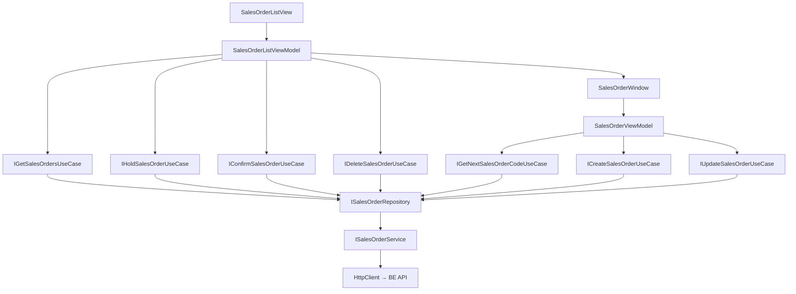

# Sales Orders — Feature Document (App)

> **Jira:** — | **Branch:** `dev` | **Generated:** 2026-05-01 | **Last updated:** 2026-06-11

---

## PRD Summary

> Module quản lý đơn hàng bán trong WPF Desktop Lamour — tạo/sửa/xóa đơn bán hàng kèm dòng chi tiết sản phẩm, hỗ trợ treo đơn và xác nhận đơn.

- **Goal:** Cho phép nhân viên Lamour tạo, theo dõi, treo và xác nhận đơn hàng bán; tự động trừ tồn kho từ BE khi ghi sổ.
- **User story:** As a Lamour staff, I want to create sales orders with product line items so that customer transactions are recorded and inventory is automatically updated.
- **Acceptance criteria:**
  - [x] Form nhập đơn hàng với đầy đủ thông tin header (khách hàng, nhân viên bán, ngày, điều khoản TT...)
  - [x] Danh sách dòng hàng (DataGrid) với cột "Tỷ lệ CK(%)" và tính toán tự động `Amount = Quantity × UnitPrice × (1 − CK/100)`
  - [x] Footer 3 giá trị thẳng hàng: Tổng tiền hàng (gross) / Tổng tiền chiết khấu / Tổng tiền thanh toán (net)
  - [x] Tự động sinh số chứng từ `BC{5 digits}` từ BE endpoint `GET /api/v1/sales-orders/next-code`
  - [x] Điều hướng Prev/Next giữa các đơn hàng
  - [x] Tạo mới / Cập nhật / Xóa đơn hàng qua BE API
  - [x] Popup alert khi ghi sổ thất bại — hiện tất cả sản phẩm không đủ kho cùng lúc
  - [x] Confirm dialog trước khi chỉnh sửa đơn hàng
  - [x] Cột "Trạng thái" trong danh sách đơn hàng (`Normal` / `⏸ Treo` / `✅ Xác nhận`)
  - [x] Nút "⏸ Treo" + "✅ Xác nhận" trong toolbar danh sách
  - [x] Đơn đã Confirmed không thể sửa, xóa, hoặc treo (BE enforce, WPF hiển thị lỗi)

---

## Business Rules

| Rule | Description |
|------|-------------|
| Số chứng từ | Lấy từ BE qua `GET /api/v1/sales-orders/next-code` khi mở form — trả `BC{5 digits}` (`BC00001`...); không còn tự tính từ full-list cache |
| Khách hàng bắt buộc | `SelectedCustomer` phải được chọn trước khi save |
| Ít nhất 1 dòng | `Lines.Count > 0` — validate tại ViewModel trước khi gọi API |
| Auto-calc Amount | `Amount = Quantity × UnitPrice × (1 − DiscountRate/100)` — khi `Quantity`, `UnitPrice`, hoặc `DiscountRate` thay đổi |
| Tỷ lệ CK | `DiscountRate` (0–100) per line; clamp tại BE; WPF nhập trực tiếp vào DataGrid |
| Footer totals | `TotalAmount` = Σ(Qty×UnitPrice) gross; `TotalDiscount` = Σ(Qty×UnitPrice×CK/100); `TotalPayment` = TotalAmount − TotalDiscount |
| TK mặc định | `ReceivableAccount = "131"`, `RevenueAccount = "511"` điền sẵn khi thêm dòng |
| Auto-fill Description | Khi chọn khách hàng → `Description = "Bán hàng {TênKH}"` |
| Auto-select NV bán hàng | Khi chọn khách hàng → tự động chọn NV có `Name == Customer.SaleCare` (case-insensitive); bỏ qua nếu không tìm thấy |
| Dirty tracking + confirm đóng | `IsDirty` bật sau `InitializeAsync`; click "Đóng" hoặc X khi `IsDirty = true` → hiện dialog xác nhận |
| PaymentDueDate tự tính | Khi nhập `PaymentDueDays` → `PaymentDueDate = DocumentDate + days` |
| UTC → Local | Dates từ API (`AccountingDate`, `DocumentDate`, `PaymentDueDate`) được convert sang local time khi hiển thị |
| HttpClient base URL | `http://192.168.64.1:5282` (MacBook từ UTM VM) |
| Token | `IAuthTokenStorage.GetToken()` inject vào Authorization header |
| BE error body | `EnsureSuccessOrThrowAsync` đọc `{ "error": "..." }` từ body 400 response → throw `Exception(message)` với text thực của BE |
| Alert khi ghi sổ lỗi | `SaveAsync` catch block gọi `MessageBox.Show(ex.Message, "Không thể ghi sổ", ..., Warning)` — hiện tất cả sản phẩm không đủ kho cùng lúc |
| Confirm trước khi sửa | `EditSalesOrderAsync` hiện `MessageBox.Show(YesNo)` trước khi mở form chỉnh sửa |
| SalesOrderStatus | `0` = Normal (mặc định), `1` = Held (⏸ Treo), `2` = Confirmed (✅ Xác nhận) |
| Treo đơn | `HoldSalesOrderCommand` → PUT `/{id}/hold`; block nếu Status == 2 (Confirmed) |
| Xác nhận đơn | `ConfirmSalesOrderCommand` → PUT `/{id}/confirm`; confirm dialog trước; block nếu Status == 2 |
| Immutability WPF | Đơn Confirmed: sửa/xóa/treo → BE trả `DomainException` → WPF hiện MessageBox lỗi |

---

## Architecture Overview

### Key Components

| Layer | File | Role |
|-------|------|------|
| View (list) | `Views/SalesOrderListView.xaml` | Danh sách đơn + toolbar (Thêm / Sửa / Treo / Xác nhận / Xóa) + cột Trạng thái |
| ViewModel (list) | `ViewModels/SalesOrderListViewModel.cs` | Commands: Add/Edit/Hold/Confirm/Delete; filter; ApplyFilter |
| View (form) | `Views/SalesOrderWindow.xaml` | Form header + DataGrid lines + navigation toolbar |
| View (code-behind) | `Views/SalesOrderWindow.xaml.cs` | `OnContentRendered` → `LoadAsync` + `AddNewCommand` |
| ViewModel (form) | `ViewModels/SalesOrderViewModel.cs` | Toàn bộ state, commands, navigation, form logic; tính TotalAmount/TotalDiscount/TotalPayment |
| Domain Model (list) | `Domain/Models/SalesOrderListItem.cs` | `Status`, `StatusLabel` (⏸ Treo / ✅ Xác nhận) |
| Domain Model (line) | `Domain/Models/SalesOrderLineItem.cs` | Observable line item với `DiscountRate` + auto-calc Amount |
| UseCase | `Domain/UseCases/GetSalesOrdersUseCase.cs` | Fetch list |
| UseCase | `Domain/UseCases/CreateSalesOrderUseCase.cs` | Pass-through → Repository |
| UseCase | `Domain/UseCases/UpdateSalesOrderUseCase.cs` | Pass-through → Repository |
| UseCase | `Domain/UseCases/DeleteSalesOrderUseCase.cs` | Pass-through → Repository |
| UseCase | `Domain/UseCases/HoldSalesOrderUseCase.cs` | PUT `/{id}/hold` → Repository |
| UseCase | `Domain/UseCases/ConfirmSalesOrderUseCase.cs` | PUT `/{id}/confirm` → Repository |
| UseCase | `Domain/UseCases/GetNextSalesOrderCodeUseCase.cs` | Gọi `ISalesOrderRepository.GetNextCodeAsync()` |
| Repository | `Data/Repositories/SalesOrderRepository.cs` | Delegate tới Service |
| Service | `Data/Services/SalesOrderService.cs` | HttpClient typed service, 8 operations + `EnsureSuccessOrThrowAsync` helper |
| DTOs | `Data/Services/Dtos/` | `SalesOrderResponseDto` (+ `status`), `CreateSalesOrderRequestDto`, `UpdateSalesOrderRequestDto`, `SalesOrderLineDto` |

### Data Flow

```
SalesOrderListView (load on navigate)
  → SalesOrderListViewModel.LoadSalesOrdersCommand
    → IGetSalesOrdersUseCase.ExecuteAsync()
      → ISalesOrderRepository.GetAllAsync()
        → ISalesOrderService.GetAllAsync()
          → HttpClient GET /api/v1/sales-orders
          ← IEnumerable<SalesOrderResponseDto>
    → SalesOrderListItem.FromDto(dto)  ← maps Status + StatusLabel
  → ObservableCollection<SalesOrderListItem> SalesOrders populated

EditSalesOrderCommand
  → MessageBox confirm (Yes/No)
  → open SalesOrderWindow.Initialize(dto)
  → SaveAsync → POST/PUT
    → EnsureSuccessOrThrowAsync(response)
      → 2xx: success
      → 4xx: read body { "error": "..." } → throw Exception(message)
    → catch (ex): MessageBox.Show(ex.Message, "Không thể ghi sổ", Warning)

HoldSalesOrderCommand
  → Block if Status == 2
  → ISalesOrderService.HoldAsync(id)   → PUT /api/v1/sales-orders/{id}/hold
  → Update item in _allItems + ApplyFilter

ConfirmSalesOrderCommand
  → Block if Status == 2
  → MessageBox confirm dialog
  → ISalesOrderService.ConfirmAsync(id) → PUT /api/v1/sales-orders/{id}/confirm
  → Update item in _allItems + ApplyFilter
```



---

## Key Files & Symbols

### Presentation
- [`Views/SalesOrderListView.xaml`](../Views/SalesOrderListView.xaml) — Toolbar: ➕ Thêm / ✏️ Sửa / ⏸ Treo / ✅ Xác nhận / 🗑️ Xóa; DataGrid: cột "Trạng thái" (StatusLabel, Width=100) là cột đầu tiên
- [`Views/SalesOrderWindow.xaml`](../Views/SalesOrderWindow.xaml) — Form đơn hàng: header tabs + DataGrid lines + navigation toolbar
- [`Views/SalesOrderWindow.xaml.cs`](../Views/SalesOrderWindow.xaml.cs) — `OnContentRendered` → `LoadAsync()` + `AddNewCommand.Execute(null)`
- [`ViewModels/SalesOrderListViewModel.cs`](../ViewModels/SalesOrderListViewModel.cs) — Commands: `AddSalesOrder`, `EditSalesOrder`, `HoldSalesOrder`, `ConfirmSalesOrder`, `DeleteSalesOrder`, `LoadSalesOrders`, `GoBack`; `EditSalesOrderAsync` hiện confirm dialog trước khi mở form
- [`ViewModels/SalesOrderViewModel.cs`](../ViewModels/SalesOrderViewModel.cs) — Commands: `AddNew`, `Save`, `Delete`, `NavigatePrev`, `NavigateNext`, `AddLine`, `RemoveLine`, `Cancel`, `LoadAsync2` (Refresh); `SaveAsync` catch → `MessageBox.Show(ex.Message, "Không thể ghi sổ", Warning)`

### Domain
- [`Domain/Models/SalesOrderListItem.cs`](../Domain/Models/SalesOrderListItem.cs) — `Status` (int), `StatusLabel` (`"" | "⏸ Treo" | "✅ Xác nhận"`), `Original` (SalesOrderResponseDto)
- [`Domain/Models/SalesOrderLineItem.cs`](../Domain/Models/SalesOrderLineItem.cs) — `INotifyPropertyChanged`; `Quantity`/`UnitPrice`/`DiscountRate` setter → `RecalculateAmount()`
- [`Domain/UseCases/IHoldSalesOrderUseCase.cs`](../Domain/UseCases/IHoldSalesOrderUseCase.cs) — `Task<SalesOrderResponseDto> ExecuteAsync(int id, ct)`
- [`Domain/UseCases/HoldSalesOrderUseCase.cs`](../Domain/UseCases/HoldSalesOrderUseCase.cs) — delegates to `ISalesOrderRepository.HoldAsync(id, ct)`
- [`Domain/UseCases/IConfirmSalesOrderUseCase.cs`](../Domain/UseCases/IConfirmSalesOrderUseCase.cs) — `Task<SalesOrderResponseDto> ExecuteAsync(int id, ct)`
- [`Domain/UseCases/ConfirmSalesOrderUseCase.cs`](../Domain/UseCases/ConfirmSalesOrderUseCase.cs) — delegates to `ISalesOrderRepository.ConfirmAsync(id, ct)`
- [`Domain/UseCases/IGetNextSalesOrderCodeUseCase.cs`](../Domain/UseCases/IGetNextSalesOrderCodeUseCase.cs) — `Task<string> ExecuteAsync(ct)`

### Data
- [`Data/Services/ISalesOrderService.cs`](../Data/Services/ISalesOrderService.cs) — `GetAllAsync`, `GetByIdAsync`, `CreateAsync`, `UpdateAsync`, `DeleteAsync`, `GetNextCodeAsync`, `HoldAsync`, `ConfirmAsync`
- [`Data/Services/SalesOrderService.cs`](../Data/Services/SalesOrderService.cs) — HttpClient typed service; `EnsureSuccessOrThrowAsync` helper đọc body 400 → lấy `{ "error": "..." }`; `HoldAsync` → `PUT /{id}/hold`; `ConfirmAsync` → `PUT /{id}/confirm`
- [`Data/Services/Dtos/SalesOrderResponseDto.cs`](../Data/Services/Dtos/SalesOrderResponseDto.cs) — 19 fields snake_case + `lines[]` + `[JsonPropertyName("status")] public int Status`
- [`Data/Repositories/ISalesOrderRepository.cs`](../Data/Repositories/ISalesOrderRepository.cs) — `GetAllAsync`, `CreateAsync`, `UpdateAsync`, `DeleteAsync`, `GetNextCodeAsync`, `HoldAsync`, `ConfirmAsync`
- [`Data/Repositories/SalesOrderRepository.cs`](../Data/Repositories/SalesOrderRepository.cs) — thin delegate tới `ISalesOrderService`

---

## API Contracts

| Method | Endpoint | Output |
|--------|----------|--------|
| `GET` | `/api/v1/sales-orders` | `SalesOrderResponseDto[]` |
| `GET` | `/api/v1/sales-orders/{id}` | `SalesOrderResponseDto` / 404 |
| `GET` | `/api/v1/sales-orders/next-code` | `{ "code": "BC00006" }` |
| `POST` | `/api/v1/sales-orders` | `SalesOrderResponseDto` (201) |
| `PUT` | `/api/v1/sales-orders/{id}` | `SalesOrderResponseDto` (200) |
| `DELETE` | `/api/v1/sales-orders/{id}` | 204 |
| `PUT` | `/api/v1/sales-orders/{id}/hold` | `SalesOrderResponseDto` (200) |
| `PUT` | `/api/v1/sales-orders/{id}/confirm` | `SalesOrderResponseDto` (200) |

---

## EnsureSuccessOrThrowAsync Pattern (2026-06-11)

Thay thế `response.EnsureSuccessStatusCode()` trong `CreateAsync` và `UpdateAsync` — đọc được error message từ BE:

```csharp
private static async Task EnsureSuccessOrThrowAsync(HttpResponseMessage response, CancellationToken ct)
{
    if (response.IsSuccessStatusCode) return;
    var body = await response.Content.ReadFromJsonAsync<ApiErrorResponse>(ct);
    throw new Exception(body?.Error ?? $"Lỗi {(int)response.StatusCode}");
}
private record ApiErrorResponse(
    [property: System.Text.Json.Serialization.JsonPropertyName("error")] string? Error);
```

`SalesOrderViewModel.SaveAsync`:
```csharp
catch (Exception ex)
{
    MessageBox.Show(ex.Message, "Không thể ghi sổ", MessageBoxButton.OK, MessageBoxImage.Warning);
}
```

---

## ViewModel State Machine

### SalesOrderListViewModel

| State | Điều kiện | Hành động |
|-------|-----------|-----------|
| Loading | `IsLoading = true` | DataGrid bị che bởi overlay |
| Error | `HasError = true` | Error banner hiện `ErrorMessage` |
| No selection | `SelectedOrder == null` | Edit/Hold/Confirm/Delete buttons disabled |
| Status = 0 (Normal) | — | Cả 4 buttons enabled |
| Status = 1 (Held) | — | Hold/Confirm available |
| Status = 2 (Confirmed) | — | Hold/Confirm/Edit/Delete → MessageBox info hoặc BE từ chối |

### SalesOrderViewModel (Form)

| State | `IsEditing` | `CurrentOrder` | Form |
|-------|-------------|----------------|------|
| Idle (xem record) | `false` | set | Read-only |
| Thêm mới | `true` | `null` | Editable, form cleared |
| Đang sửa | `true` | set | Editable |
| Saving | `IsBusy = true` | — | Disabled |
| Error | `HasError = true` | — | Error banner hiển thị |

---

## Key ViewModel Logic

### Sinh số chứng từ (2026-05-23 — đã refactor)

Trước đây: tính `max` từ `_orderListCache` (~900ms). Sau khi refactor: gọi BE endpoint lightweight (~220ms):

```csharp
_nextDocumentNumber = await _getNextCode.ExecuteAsync(ct);
private string GenerateNextDocumentNumber() => _nextDocumentNumber;
```

### Tính 3 tổng tiền footer
```csharp
var gross     = Lines.Sum(l => (decimal)l.Quantity * l.UnitPrice);
TotalAmount   = gross;
TotalDiscount = Lines.Sum(l => (decimal)l.Quantity * l.UnitPrice * clamp(l.DiscountRate) / 100m);
TotalPayment  = gross - TotalDiscount;
```

### Auto-fill khi chọn khách hàng + auto-select NV bán hàng (2026-06-11)
```csharp
partial void OnSelectedCustomerChanged(ISearchableItem? value)
{
    if (value is Customer c)
    {
        Description = $"Bán hàng {c.Name}";
        if (!string.IsNullOrWhiteSpace(c.SaleCare))
        {
            var matched = Employees.FirstOrDefault(e =>
                string.Equals(e.Name, c.SaleCare, StringComparison.OrdinalIgnoreCase));
            if (matched is not null)
                SelectedEmployee = matched;
        }
    }
}
```

### Confirm dialog trước khi sửa (2026-06-11)
```csharp
[RelayCommand(CanExecute = nameof(HasSelection))]
private async Task EditSalesOrderAsync(CancellationToken ct = default)
{
    if (SelectedOrder is null) return;
    var confirm = MessageBox.Show(
        $"Bạn có chắc muốn chỉnh sửa chứng từ '{SelectedOrder.DocumentNumber}'?",
        "Xác nhận chỉnh sửa", MessageBoxButton.YesNo, MessageBoxImage.Question);
    if (confirm != MessageBoxResult.Yes) return;
    // open form...
}
```

### Hold / Confirm commands (2026-06-11)
```csharp
[RelayCommand(CanExecute = nameof(HasSelection))]
private async Task HoldSalesOrderAsync(CancellationToken ct = default)
{
    if (SelectedOrder?.Status == 2)
    {
        MessageBox.Show("Không thể treo đơn đã xác nhận.", "Thông báo", ..., Information);
        return;
    }
    var updated = await _holdOrder.ExecuteAsync(SelectedOrder!.Id, ct);
    // replace item in _allItems + ApplyFilter
}

[RelayCommand(CanExecute = nameof(HasSelection))]
private async Task ConfirmSalesOrderAsync(CancellationToken ct = default)
{
    if (SelectedOrder?.Status == 2)
    {
        MessageBox.Show("Đơn hàng đã được xác nhận trước đó.", ...);
        return;
    }
    var dialog = MessageBox.Show(
        $"Xác nhận đơn '{SelectedOrder!.DocumentNumber}'? Sau khi xác nhận không thể chỉnh sửa.",
        "Xác nhận đơn hàng", MessageBoxButton.YesNo, MessageBoxImage.Question);
    if (dialog != MessageBoxResult.Yes) return;
    var updated = await _confirmOrder.ExecuteAsync(SelectedOrder.Id, ct);
    // replace item in _allItems + ApplyFilter
}
```

---

## Edge Cases & Error Handling

| Scenario | Expected Behavior | Handled? |
|----------|------------------|----------|
| BE không chạy | Error banner: "Không thể tải dữ liệu: ..." | ✅ |
| Chưa chọn khách hàng khi Save | `ErrorMessage = "Vui lòng chọn khách hàng."` | ✅ |
| Lines rỗng khi Save | `ErrorMessage = "Vui lòng nhập ít nhất một mặt hàng."` | ✅ |
| Tồn kho không đủ — 1 sản phẩm | MessageBox với message từ BE (1 dòng lỗi) | ✅ |
| Tồn kho không đủ — nhiều sản phẩm | MessageBox với message từ BE (tất cả dòng lỗi gom lại) | ✅ |
| Sản phẩm đã ngưng (BE trả 400) | MessageBox `ex.Message` | ✅ |
| BE trả lỗi 400 với body `{ "error": "..." }` | `EnsureSuccessOrThrowAsync` parse body → `MessageBox.Show(ex.Message)` | ✅ |
| Chỉnh sửa đơn đã Confirmed | BE từ chối → MessageBox lỗi | ✅ |
| Xóa đơn đã Confirmed | BE từ chối → MessageBox lỗi | ✅ |
| Treo đơn đã Confirmed | WPF block trước, hiện MessageBox info | ✅ |
| Xác nhận đơn đã Confirmed | WPF block trước, hiện MessageBox info | ✅ |
| Xóa → BE trả 404 | Error banner trên form | ✅ |
| Cancel khi đang sửa | Reload lại dữ liệu từ API | ✅ |
| List rỗng | `_currentIndex = -1`, form trống | ✅ |
| 401 Unauthorized | `HttpRequestException` → Error banner | ⚠️ Không surface rõ lý do |
| Đóng form khi có dữ liệu chưa lưu | Dialog "Bạn có chắc muốn đóng? Dữ liệu chưa lưu sẽ bị mất." [Có/Không] | ✅ |

---

## Known Issues

| # | Severity | Mô tả | Fix đề xuất |
|---|---|---|---|
| 1 | 🟠 High | `OnSelectedCustomerChanged` cast `ISearchableItem` → concrete `Customer` model — layer violation | Dùng `value?.Name` từ `ISearchableItem` interface |
| 2 | 🟡 Medium | `LoadAsync2` — tên command khó hiểu | Đổi thành `RefreshCommand` / `RefreshAsync` |
| 3 | 🟡 Medium | Không có confirm dialog trước khi xóa (list view) | Thêm `MessageBox.Show("Bạn có chắc muốn xóa?", ...)` |
| ~~4~~ | ~~🟡 Medium~~ | ~~`EnsureSuccessStatusCode()` không surface BE error body~~ | ✅ **Fixed 2026-06-11** — `EnsureSuccessOrThrowAsync` |
| 5 | 🟡 Medium | `OnContentRendered` gọi `AddNewCommand` mỗi lần mở window | Cân nhắc chỉ gọi khi `_orderListCache` rỗng |
| 6 | 🟢 Low | `SaveAsync` gọi `LoadOrdersAsync` + `NavigateToOrder` — double round-trip | Cache result từ Create/Update response thay vì reload toàn bộ list |

---

## Test Coverage Notes

| Component | Test File | Coverage |
|-----------|-----------|----------|
| `SalesOrderListViewModel` | — | ❌ Missing |
| `SalesOrderViewModel` | — | ❌ Missing |
| `CreateSalesOrderUseCase` (WPF) | — | ❌ Missing |
| `HoldSalesOrderUseCase` (WPF) | — | ❌ Missing |
| `ConfirmSalesOrderUseCase` (WPF) | — | ❌ Missing |
| `SalesOrderRepository` (WPF) | — | ❌ Missing |
| `SalesOrderLineItem.RecalculateAmount` | — | ❌ Missing |

**Suggested test cases:**
- [ ] Load: BE trả data → `SalesOrders` populated, StatusLabel mapped đúng
- [ ] Load: BE lỗi → `HasError = true`, `ErrorMessage` set
- [ ] Save Create: `SelectedCustomer = null` → `ErrorMessage` hiển thị
- [ ] Save Create: `Lines.Count = 0` → `ErrorMessage` hiển thị
- [ ] EditSalesOrder: confirm dialog → No → form không mở
- [ ] HoldSalesOrder: Status == 2 → MessageBox info, không call API
- [ ] ConfirmSalesOrder: Status == 2 → MessageBox info, không call API
- [ ] ConfirmSalesOrder: confirm dialog → No → không call API
- [ ] EnsureSuccessOrThrowAsync: 400 với body `{ "error": "Lỗi X" }` → throw Exception("Lỗi X")
- [ ] EnsureSuccessOrThrowAsync: 400 không có body → throw Exception("Lỗi 400")
- [ ] `SalesOrderLineItem`: `Quantity = 3`, `UnitPrice = 100000`, `DiscountRate = 0` → `Amount = 300000`
- [ ] `SalesOrderLineItem`: `Quantity = 2`, `UnitPrice = 150000`, `DiscountRate = 10` → `Amount = 270000`
- [ ] `RecalculateTotals`: 2 lines với CK khác nhau → `TotalPayment = TotalAmount − TotalDiscount`

---

## DI Registration (`HomeServiceCollectionExtensions.cs`)

```csharp
// ── Sales: Views + ViewModels ────────────────────────────────────────────
services.AddTransient<SalesOrderListView>();
services.AddTransient<SalesOrderListViewModel>();
services.AddTransient<SalesOrderWindow>();
services.AddTransient<SalesOrderViewModel>();

// ── Sales: UseCases ──────────────────────────────────────────────────────
services.AddTransient<IGetSalesOrdersUseCase, GetSalesOrdersUseCase>();
services.AddTransient<IGetNextSalesOrderCodeUseCase, GetNextSalesOrderCodeUseCase>();
services.AddTransient<ICreateSalesOrderUseCase, CreateSalesOrderUseCase>();
services.AddTransient<IUpdateSalesOrderUseCase, UpdateSalesOrderUseCase>();
services.AddTransient<IDeleteSalesOrderUseCase, DeleteSalesOrderUseCase>();
services.AddTransient<IHoldSalesOrderUseCase, HoldSalesOrderUseCase>();
services.AddTransient<IConfirmSalesOrderUseCase, ConfirmSalesOrderUseCase>();

// ── Sales: Repository ────────────────────────────────────────────────────
services.AddTransient<ISalesOrderRepository, SalesOrderRepository>();

// ── Sales: Service + typed HttpClient ────────────────────────────────────
services.AddHttpClient<ISalesOrderService, SalesOrderService>(client =>
{
    client.BaseAddress = new Uri(serverUrl);
    client.Timeout     = TimeSpan.FromSeconds(30);
    client.DefaultRequestHeaders.Add("Accept", "application/json");
});

// ── Sales: Window factory ────────────────────────────────────────────────
services.AddTransient<Func<SalesOrderWindow>>(sp => () => sp.GetRequiredService<SalesOrderWindow>());
```

---

## Notes

- WPF không có `GetSalesOrderByIdUseCase` — dùng list cache + navigation (Prev/Next)
- `SalesOrderListItem` là immutable (`init`-only properties) — khi Hold/Confirm, tạo item mới từ DTO rồi thay thế trong `_allItems`
- `SalesOrderLineItem` dùng `INotifyPropertyChanged` thủ công (không dùng CommunityToolkit) để hỗ trợ `RecalculateAmount` side-effect
- Lookup data (Customers, Employees, Products) được load khi mở window, không reload khi navigate
- `LoadLookupsAsync` dùng `Task.WhenAll` để load 3 lookups song song
- `_nextDocumentNumber` được cache từ `GetNextSalesOrderCodeUseCase.ExecuteAsync()` khi init

---

*Generated by `/ct-ai-document` on 2026-05-01*
*Updated 2026-05-01: thêm DiscountRate/TotalDiscount/TotalPayment, đổi prefix BH → BC, footer 3 cột ngang*
*Updated 2026-05-23: thêm `IGetNextSalesOrderCodeUseCase`, refactor `GenerateNextDocumentNumber` → API call, parallel `Task.WhenAll` lookups, cập nhật DI*
*Updated 2026-06-11: auto-select NV bán hàng theo `Customer.SaleCare`; dirty tracking + confirm dialog khi đóng form; fix `async void OnContentRendered`; EnsureSuccessOrThrowAsync (parse BE error body); MessageBox alert khi ghi sổ lỗi; confirm dialog trước khi sửa; SalesOrderStatus enum (Normal/Held/Confirmed); IHoldSalesOrderUseCase + IConfirmSalesOrderUseCase; Status column + Hold/Confirm toolbar buttons; cập nhật DI*
