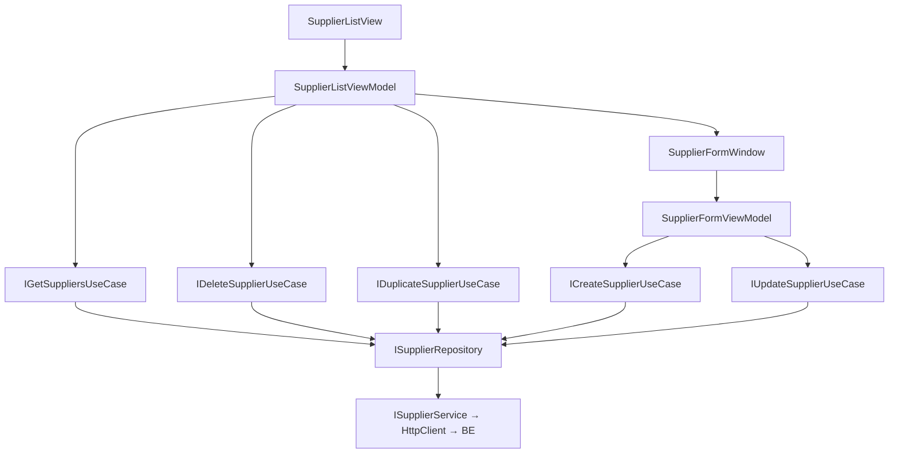

# Suppliers — Feature Document (App)

> **Jira:** — | **Branch:** `dev` | **Generated:** 2026-04-25

---

## PRD Summary

> Module quản lý danh sách nhà cung cấp trong WPF Desktop Lamour.

- **Goal:** Cho phép nhân viên quản lý thông tin nhà cung cấp mỹ phẩm phục vụ nghiệp vụ nhập hàng.
- **User story:** As a Lamour admin, I want to manage supplier information in the desktop app so that import invoices can reference valid suppliers.
- **Acceptance criteria:**
  - [x] Hiển thị DataGrid: Mã NCC, Tên, Địa chỉ, Nhóm, Mã số thuế, Điện thoại, Ngừng theo dõi
  - [x] Thêm/Sửa qua `SupplierFormWindow`
  - [x] Nhân bản với code `_COPY`
  - [x] Xóa với confirm dialog

---

## Business Rules

| Rule | Description |
|------|-------------|
| Code user-entered | Người dùng nhập, unique case-insensitive |
| Code read-only khi Sửa | `IsEnabled="{Binding IsAddMode}"` |
| `is_stop_tracking` | Checkbox "Ngừng theo dõi" — không xóa record |
| Code & Name required | Validate tại `CreateSupplierUseCase` BE-side |

---

## Architecture Overview

### Key Components

| Layer | File | Role |
|-------|------|------|
| View | `Views/SupplierListView.xaml` | DataGrid + 4 toolbar buttons |
| View | `Views/SupplierFormWindow.xaml` | Form: Code*, Name*, Phone, Address, Group, TaxCode, IsStopTracking |
| ViewModel | `ViewModels/SupplierListViewModel.cs` | List + commands |
| ViewModel | `ViewModels/SupplierFormViewModel.cs` | Form state + Save/Cancel |
| UseCase | `Domain/UseCases/GetSuppliersUseCase.cs` | Fetch list |
| UseCase | `Domain/UseCases/CreateSupplierUseCase.cs` | Validate + create |
| UseCase | `Domain/UseCases/UpdateSupplierUseCase.cs` | Validate + update |
| UseCase | `Domain/UseCases/DeleteSupplierUseCase.cs` | Delete |
| UseCase | `Domain/UseCases/DuplicateSupplierUseCase.cs` | Clone |
| Repository | `Data/Repositories/SupplierRepository.cs` | DTO ↔ Domain map |
| Service | `Data/Services/SupplierService.cs` | HttpClient typed service |

### Data Flow

```
SupplierListView (Loaded)
  → SupplierListViewModel.LoadSuppliersCommand
  → IGetSuppliersUseCase → ISupplierRepository → ISupplierService
  → GET /api/v1/suppliers
  ← IEnumerable<Supplier> → ObservableCollection<Supplier>
```



---

## Key Files & Symbols

### Presentation
- [`Views/SupplierListView.xaml`](../Views/SupplierListView.xaml) — DataGrid 7 cột, toolbar: Thêm / Nhân bản / Sửa / Xóa
- [`Views/SupplierListView.xaml.cs`](../Views/SupplierListView.xaml.cs) — `Loaded` → `LoadSuppliersCommand`
- [`Views/SupplierFormWindow.xaml`](../Views/SupplierFormWindow.xaml) — Code (enabled Add / disabled Edit), Name, Phone, Address, Group, TaxCode, IsStopTracking checkbox
- [`Views/SupplierFormWindow.xaml.cs`](../Views/SupplierFormWindow.xaml.cs) — `Initialize(Supplier?)`
- [`ViewModels/SupplierListViewModel.cs`](../ViewModels/SupplierListViewModel.cs) — Commands: `LoadSuppliers`, `AddSupplier`, `EditSupplier`, `DeleteSupplier`, `DuplicateSupplier`, `GoBack`; `[ObservableProperty] Supplier? SelectedSupplier`
- [`ViewModels/SupplierFormViewModel.cs`](../ViewModels/SupplierFormViewModel.cs) — Fields: Code, Name, Phone, Address, Group, TaxCode, IsStopTracking; `IsAddMode` property

### Domain
- [`Domain/Models/Supplier.cs`](../Domain/Models/Supplier.cs) — `Id`, `Code`, `Name`, `Address`, `Group`, `TaxCode`, `Phone`, `IsStopTracking`
- [`Domain/UseCases/CreateSupplierInput.cs`](../Domain/UseCases/CreateSupplierInput.cs) — record: `Code`, `Name`, `Phone`, `Address`, `Group`, `TaxCode`, `IsStopTracking`
- [`Domain/UseCases/UpdateSupplierInput.cs`](../Domain/UseCases/UpdateSupplierInput.cs) — record: `Id` + all fields

### Data
- [`Data/Services/ISupplierService.cs`](../Data/Services/ISupplierService.cs) — `GetAllAsync`, `CreateAsync`, `UpdateAsync`, `DeleteAsync`, `DuplicateAsync`
- [`Data/Services/SupplierService.cs`](../Data/Services/SupplierService.cs) — HttpClient, `SetBearerToken()`, base URL `http://192.168.64.1:5282`
- [`Data/Services/Dtos/SupplierResponseDto.cs`](../Data/Services/Dtos/SupplierResponseDto.cs) — snake_case: `is_stop_tracking`
- [`Data/Repositories/SupplierRepository.cs`](../Data/Repositories/SupplierRepository.cs) — `MapToModel` helper

---

## API Contracts

| Method | Endpoint | Output |
|--------|----------|--------|
| `GET` | `/api/v1/suppliers` | `SupplierResponseDto[]` |
| `POST` | `/api/v1/suppliers` | `SupplierResponseDto` (201) |
| `PUT` | `/api/v1/suppliers/{id}` | `SupplierResponseDto` |
| `DELETE` | `/api/v1/suppliers/{id}` | 204 |
| `POST` | `/api/v1/suppliers/{id}/duplicate` | `SupplierResponseDto` (201) |

---

## Edge Cases & Error Handling

| Scenario | Expected Behavior | Handled? |
|----------|------------------|----------|
| BE không chạy | Error banner: "Không thể tải dữ liệu: ..." | ✅ |
| Code/Name trống | API 400 → error banner | ✅ |
| Code trùng | API 400 → error banner | ✅ |
| Duplicate `_COPY` tồn tại | API 400 → error banner | ✅ |
| Xóa NCC đang dùng trong ImportInvoice | Chưa enforce — API 500 | ❌ |
| Confirm xóa → No | Không xóa | ✅ |

---

## Test Coverage Notes

| Component | Test File | Coverage |
|-----------|-----------|----------|
| `SupplierListViewModel` | — | ❌ Missing |
| `SupplierFormViewModel` | — | ❌ Missing |
| `CreateSupplierUseCase` | — | ❌ Missing |

**Suggested test cases:**
- [ ] Load: data → `Suppliers` populated, `HasSuppliers = true`
- [ ] Form Add: `IsAddMode = true` → Code enabled
- [ ] Form Edit: `IsAddMode = false` → Code disabled
- [ ] Save: empty name → `ValidationException`
- [ ] Duplicate: thành công → item thêm vào collection

---

## Notes

- Pattern này là **reference pattern** cho các module mới (Customers follow cùng structure)
- DI: `AddHttpClient<ISupplierService, SupplierService>` + `AddTransient<Func<SupplierFormWindow>>`
- Navigation: `NavigationRoutes.Suppliers.List = "SupplierListView"`

---

*Generated by `/ct-ai-document` on 2026-04-25*
