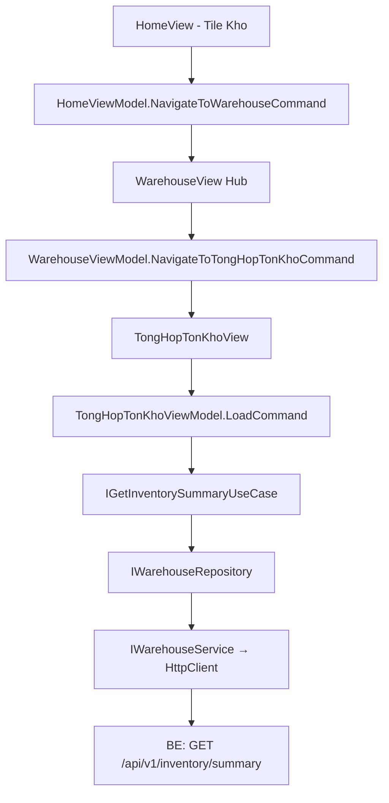

# Warehouse — Feature Document (App)

> **Jira:** — | **Branch:** `dev` | **Generated:** 2026-04-26

---

## PRD Summary

> Module quản lý kho hàng hóa trong WPF Desktop Lamour — hub điều hướng tới các nghiệp vụ kho.

- **Goal:** Cho phép nhân viên xem tổng hợp tồn kho theo kỳ và quản lý phiếu nhập/xuất kho.
- **User story:** As a Lamour warehouse manager, I want to view inventory summary by date range so that I can track stock movements (opening, imports, exports, closing) for each product.
- **Acceptance criteria:**
  - [x] Tile `🏭 Kho` tại HomeView → navigate WarehouseView (hub)
  - [x] WarehouseView hiển thị 3 tiles nghiệp vụ: Tổng hợp tồn kho, Phiếu Nhập Kho (placeholder), Phiếu Xuất Kho (placeholder)
  - [x] Tổng hợp tồn kho: date picker `Từ ngày` / `Đến ngày` + DataGrid 11 cột
  - [x] Fetch data tự động khi navigate vào màn hình (default: đầu tháng → hôm nay)
  - [x] Nút "Xem báo cáo" để load lại với date range mới
  - [x] Nút "← Quay lại" + "🏠 Trang chủ" trên WarehouseView và TongHopTonKhoView
  - [x] Hiển thị cả sản phẩm inactive trong Tổng hợp tồn kho
  - [ ] Phiếu Nhập Kho — chưa triển khai (placeholder mờ)
  - [ ] Phiếu Xuất Kho — chưa triển khai (placeholder mờ)

---

## Business Rules

| Rule | Description |
|------|-------------|
| Default date range | `FromDate` = ngày đầu tháng hiện tại, `ToDate` = hôm nay |
| Closing qty | `ClosingQty = OpeningQty + ImportQty - ExportQty` (hiện tại = `Product.StockQuantity`) |
| Closing value | `ClosingValue = ClosingQty × Product.CostPrice` |
| Opening/Import/Export | Hiện tại = 0 (sẽ tính từ bảng invoice khi Phiếu Nhập/Xuất triển khai) |
| Tất cả sản phẩm | Tổng hợp tồn kho hiển thị cả sản phẩm active và inactive, sort theo `Code` |
| Placeholder tiles | Phiếu Nhập Kho & Xuất Kho hiển thị `Opacity=0.4`, không click được |
| Auth required | BE endpoint `[Authorize]` — WPF gắn Bearer token từ `IAuthTokenStorage` |

---

## Architecture Overview

### Key Components

| Layer | File | Role |
|-------|------|------|
| View | `Views/WarehouseView.xaml` | Hub: 3 tile điều hướng |
| View | `Views/TongHopTonKhoView.xaml` | Date filter + DataGrid tổng hợp |
| ViewModel | `ViewModels/WarehouseViewModel.cs` | GoBack + NavigateToTongHopTonKho |
| ViewModel | `ViewModels/TongHopTonKhoViewModel.cs` | State: FromDate, ToDate, Items, LoadCommand |
| UseCase | `Domain/UseCases/GetInventorySummaryUseCase.cs` | Delegate tới repository |
| Repository | `Data/Repositories/WarehouseRepository.cs` | DTO → Domain model map |
| Service | `Data/Services/WarehouseService.cs` | HttpClient → BE `/api/v1/inventory/summary` |

### Data Flow

```
TongHopTonKhoView (Loaded event)
  → TongHopTonKhoViewModel.LoadCommand
  → IGetInventorySummaryUseCase.ExecuteAsync(fromDate, toDate)
  → IWarehouseRepository.GetSummaryAsync(fromDate, toDate)
  → IWarehouseService.GetInventorySummaryAsync(fromDate, toDate)
  → GET /api/v1/inventory/summary?from_date=YYYY-MM-DD&to_date=YYYY-MM-DD
  ← IEnumerable<InventorySummaryItemDto>
  → map → IEnumerable<InventorySummaryItem>
  → ObservableCollection<InventorySummaryItem> → DataGrid
```



---

## Key Files & Symbols

### Presentation
- [`Views/WarehouseView.xaml`](../Views/WarehouseView.xaml) — Hub: 3 Border tiles, Tổng hợp active, Nhập/Xuất `Opacity=0.4`
- [`Views/WarehouseView.xaml.cs`](../Views/WarehouseView.xaml.cs) — DataContext = `WarehouseViewModel`
- [`Views/TongHopTonKhoView.xaml`](../Views/TongHopTonKhoView.xaml) — `DatePicker` × 2 + `DataGrid` 11 cột + loading overlay + error banner
- [`Views/TongHopTonKhoView.xaml.cs`](../Views/TongHopTonKhoView.xaml.cs) — `Loaded` event → `LoadCommand.ExecuteAsync(null)`
- [`ViewModels/WarehouseViewModel.cs`](../ViewModels/WarehouseViewModel.cs) — `[RelayCommand]`: `GoBack`, `NavigateToHome`, `NavigateToTongHopTonKho`
- [`ViewModels/TongHopTonKhoViewModel.cs`](../ViewModels/TongHopTonKhoViewModel.cs) — `[RelayCommand]`: `GoBack`, `NavigateToHome`, `Load` — `ObservableProperty`: `IsLoading`, `HasError`, `ErrorMessage`, `HasItems`, `FromDate`, `ToDate` — `ObservableCollection<InventorySummaryItem> Items`

### Domain
- [`Domain/Models/InventorySummaryItem.cs`](../Domain/Models/InventorySummaryItem.cs) — `ProductId`, `Code`, `Name`, `Unit`, `OpeningQty/Value`, `ImportQty/Value`, `ExportQty/Value`, `ClosingQty/Value`
- [`Domain/UseCases/IGetInventorySummaryUseCase.cs`](../Domain/UseCases/IGetInventorySummaryUseCase.cs) — `ExecuteAsync(DateOnly, DateOnly, CancellationToken)`
- [`Domain/UseCases/GetInventorySummaryUseCase.cs`](../Domain/UseCases/GetInventorySummaryUseCase.cs) — delegates tới `IWarehouseRepository`

### Data
- [`Data/Services/IWarehouseService.cs`](../Data/Services/IWarehouseService.cs) — `GetInventorySummaryAsync(DateOnly, DateOnly, CancellationToken)`
- [`Data/Services/WarehouseService.cs`](../Data/Services/WarehouseService.cs) — typed HttpClient, gắn Bearer token
- [`Data/Services/Dtos/InventorySummaryItemDto.cs`](../Data/Services/Dtos/InventorySummaryItemDto.cs) — snake_case JSON fields
- [`Data/Repositories/IWarehouseRepository.cs`](../Data/Repositories/IWarehouseRepository.cs) — `GetSummaryAsync`
- [`Data/Repositories/WarehouseRepository.cs`](../Data/Repositories/WarehouseRepository.cs) — map DTO → `InventorySummaryItem`

---

## API Contracts

| Method | Endpoint | Query Params | Output |
|--------|----------|-------------|--------|
| `GET` | `/api/v1/inventory/summary` | `from_date=YYYY-MM-DD&to_date=YYYY-MM-DD` | `InventorySummaryItemDto[]` |

**Response shape (per item):**
```json
{
  "product_id": 1,
  "code": "SP001",
  "name": "Kem dưỡng da",
  "unit": "Hộp",
  "opening_qty": 0,
  "opening_value": 0,
  "import_qty": 0,
  "import_value": 0,
  "export_qty": 0,
  "export_value": 0,
  "closing_qty": 150,
  "closing_value": 7500000
}
```

> **Note:** `opening_qty`, `import_qty`, `export_qty` hiện trả về `0` do chưa có bảng invoice. `closing_qty` = `Product.StockQuantity`, `closing_value` = `StockQuantity × CostPrice`.

---

## DataGrid Columns

| Header | Binding | Width |
|--------|---------|-------|
| Mã hàng | `Code` | 110 |
| Tên hàng | `Name` | `*` |
| ĐVT | `Unit` | 70 |
| Đầu kỳ SL | `OpeningQty` (N0) | 100 |
| Đầu kỳ GT | `OpeningValue` (N0) | 110 |
| Nhập SL | `ImportQty` (N0) | 90 |
| Nhập GT | `ImportValue` (N0) | 110 |
| Xuất SL | `ExportQty` (N0) | 90 |
| Xuất GT | `ExportValue` (N0) | 110 |
| Cuối kỳ SL | `ClosingQty` (N0) | 100 |
| Cuối kỳ GT | `ClosingValue` (N0) | 110 |

---

## Edge Cases & Error Handling

| Scenario | Expected Behavior | Handled? |
|----------|-----------------|----------|
| BE không chạy | Error banner với message | ✅ |
| Token hết hạn | `EnsureSuccessStatusCode` → 401 → error banner | ✅ |
| Không có sản phẩm active | Empty state icon + text | ✅ |
| OperationCanceledException | Bỏ qua silently | ✅ |
| FromDate > ToDate | BE trả danh sách rỗng | ⚠️ Chưa validate phía WPF |
| Placeholder tile bị click | Không bind command → không phản hồi | ✅ |

---

## Navigation

| Route Constant | Value | Resolves To |
|----------------|-------|-------------|
| `NavigationRoutes.Warehouse.Hub` | `"WarehouseView"` | `WarehouseView` |
| `NavigationRoutes.Warehouse.TongHopTonKho` | `"TongHopTonKhoView"` | `TongHopTonKhoView` |

Back stack: `TongHopTonKhoView` → `WarehouseView` → `HomeView`

---

## Test Coverage Notes

| Component | Test File | Coverage |
|-----------|-----------|----------|
| `TongHopTonKhoViewModel` | — | ❌ Missing |
| `GetInventorySummaryUseCase` | — | ❌ Missing |
| `WarehouseRepository` | — | ❌ Missing |

**Suggested test cases:**
- [ ] Load: data từ BE → `Items` populated, `HasItems = true`
- [ ] Load: BE error → `HasError = true`, `ErrorMessage` set
- [ ] Load: empty list → `HasItems = false`, empty state shown
- [ ] ViewModel: default `FromDate` = ngày đầu tháng, `ToDate` = hôm nay
- [ ] GoBack: `NavigationService.GoBack()` được gọi

---

## Roadmap

| Feature | Status |
|---------|--------|
| Tổng hợp tồn kho | ✅ Done |
| Phiếu Nhập Kho | 🔲 Planned |
| Phiếu Xuất Kho | 🔲 Planned |
| Opening balance từ invoice history | 🔲 Blocked by Phiếu Nhập/Xuất |

---

## Notes

- DI: `AddHttpClient<IWarehouseService, WarehouseService>` base URL `http://192.168.64.1:5282`
- Khi triển khai Phiếu Nhập Kho: cần tạo `ImportInvoice` entity trên BE → cập nhật `GetInventorySummaryUseCase` tính `opening_qty` và `import_qty` từ bảng invoice
- `AppLabel` không hỗ trợ `TextWrapping` — dùng `TextBlock` nếu cần wrap text dài

---

*Generated by `/ct-ai-document` on 2026-04-26 — Updated 2026-04-28: add 🏠 Home button, fix GoBack navigation, show inactive products*

---

## Changelog — 2026-08-15: "Nhập, xuất kho" — danh sách gộp thay thế tile "Phiếu Nhập Kho"

> ⚠️ Doc này đã cũ (2026-04-26) so với thực tế hiện tại — `WarehouseReceipts` (Phiếu nhập kho) đã được xây và ship từ lâu (xem `Views/WarehouseReceiptListView.xaml`, doc riêng chưa có ở phía client), bảng "Feature Coverage" phía trên không còn đúng. Chỉ ghi chú nhanh thay đổi lần này, không rewrite lại toàn bộ doc.

- Tile "Phiếu Nhập Kho" (📥) trên `WarehouseView.xaml` đổi thành **"Nhập, xuất kho"** (📦) — trỏ sang màn mới `WarehouseTransactionListView` (route `NavigationRoutes.Warehouse.NhapXuatKho`) hiển thị **gộp** cả Nhập kho (`WarehouseReceipt`) lẫn Xuất kho (suy ra từ `SalesOrder` đã ghi sổ — hệ thống không có entity "Phiếu xuất kho" riêng). Bỏ hẳn tile "Phiếu Xuất Kho" placeholder mờ (chưa từng wire).
- Màn mới: bộ lọc Từ/Đến ngày + Loại (Tất cả/Nhập kho/Xuất kho), master `DataGrid` (Ngày hạch toán/Ngày chứng từ/Số chứng từ/Diễn giải/Tổng tiền/Người giao-nhận/Đối tượng/Đã lập CT bán hàng/Ngày ghi sổ kho/Loại chứng từ) + panel "Chi tiết" bind `SelectedItem.Lines`. Gọi `GET /api/v1/warehouse-transactions` (BE mới — xem `Lamour.Application/Features/Warehouse/docs/warehouse.md` changelog cùng ngày cho chi tiết mapping/known-gap).
- Đi kèm: đổi prefix số chứng từ Sales Order từ `BC` → `XK` toàn project (xem `Sales/docs/sales.md` changelog 2026-08-15) — số Xuất kho hiển thị trong màn này chính là số `XK...` của Sales Order, không sinh số riêng.
- Route `WarehouseReceiptListView` (Phiếu Nhập Kho cũ) vẫn còn nguyên, chỉ không còn tile nào trỏ tới trực tiếp; nút "+ Thêm" ở màn mới tái dùng `WarehouseReceiptFormWindow` để tạo phiếu Nhập kho.

---

## Changelog — 2026-08-15 (×2): chuyển section "Cài đặt" từ `WarehouseView` sang `HomeView`

- 5 tile (Đơn vị tính 📏, Tài khoản kế toán 📒, Danh sách Kho 🏬, Phòng ban 🏢, Khoản mục chi phí 💰) chuyển nguyên vẹn (icon/label/route giữ nguyên) từ section "Cài đặt" trên `WarehouseView.xaml` sang section "Cài đặt" mới trên `HomeView.xaml` (Trang chủ) — xem [`Home/docs/home.md`](../../Home/docs/home.md). 5 `RelayCommand` tương ứng dời từ `WarehouseViewModel` sang `HomeViewModel`. `WarehouseView` giờ chỉ còn section "Nghiệp vụ kho" (Tổng hợp tồn kho, Nhập-xuất kho). Không đổi route/DI/BE.

---

## Changelog — 2026-08-15 (×3): xóa hẳn hub `WarehouseView` — tile "Kho" ở Home vào thẳng "Nhập, Xuất Kho"; "Tổng hợp tồn kho" thành nút trên toolbar

> Yêu cầu: đưa logic "Tổng hợp tồn kho" ra khỏi vị trí tile riêng trong hub, để tap "Kho" ở Trang chủ vào thẳng danh sách giao dịch Nhập/Xuất kho, còn "Tổng hợp tồn kho" trở thành 1 nút ngang hàng với "Phiếu Nhập"/"Phiếu Xuất" trên toolbar của chính màn đó. Sau đợt chuyển "Cài đặt" ra `HomeView` trước đó, hub `WarehouseView` chỉ còn 2 tile ("Tổng hợp tồn kho" + "Nhập, xuất kho") — nay dời nốt "Tổng hợp tồn kho" thì hub **không còn tile nào cần thiết**, nên xóa hẳn màn hub thay vì giữ lại rỗng.

**Điều hướng mới**: `HomeViewModel.NavigateToWarehouse` đổi target từ `NavigationRoutes.Warehouse.Hub` → `NavigationRoutes.Warehouse.NhapXuatKho` — tile "Kho" ở Trang chủ giờ vào thẳng `WarehouseTransactionListView`.

**Toolbar `WarehouseTransactionListView.xaml`** đổi từ 1 nút ("+ Thêm") thành 3 nút:
- **"📥 Phiếu Nhập"** (đổi tên từ "+ Thêm", giữ nguyên `OpenFormCommand`) — mở thẳng `WarehouseReceiptFormWindow` tạo phiếu nhập kho mới.
- **"📤 Phiếu Xuất"** (mới) — `OpenSalesOrderCommand` mở thẳng `SalesOrderWindow` (`Initialize(null)`, cùng pattern với `SalesOrderListViewModel.AddSalesOrderAsync`) — vì hệ thống không có luồng "tạo phiếu xuất kho" riêng, xuất kho chỉ sinh ra từ 1 Chứng từ bán hàng đã ghi sổ.
- **"📊 Tổng hợp tồn kho"** (mới) — `NavigateToTongHopTonKhoCommand` điều hướng sang `TongHopTonKhoView` (route không đổi, `NavigationRoutes.Warehouse.TongHopTonKho`).

Cả 2 nút mới đều gọi lại `LoadCommand` sau khi đóng dialog thành công, để danh sách giao dịch tự refresh nếu vừa tạo thêm phiếu.

Thêm nút "🏠 Trang chủ" (`NavigateToHomeCommand`) vào header — trước đây màn này chỉ có "← Quay lại" vì luôn được vào qua hub (đã có sẵn nút Home); giờ là điểm vào trực tiếp từ Trang chủ nên cần nút Home riêng, khớp pattern `TongHopTonKhoView`.

**Xóa hẳn** (đã orphan hoàn toàn, không còn nơi nào trỏ tới):
- `Views/WarehouseView.xaml`, `Views/WarehouseView.xaml.cs`, `ViewModels/WarehouseViewModel.cs`
- `NavigationRoutes.Warehouse.Hub` constant
- Case tương ứng trong `NavigationService.ResolveView`
- DI registration `services.AddTransient<WarehouseView>()`/`<WarehouseViewModel>()` trong `HomeServiceCollectionExtensions`

Không đổi BE, không đổi migration.

---

## Changelog — 2026-08-15 (×4): polish visual panel "Chi tiết" khớp ảnh tham chiếu

> User gửi lại đúng ảnh MISA đã dùng cho 3 lần trước, yêu cầu chung "Update UI Kho như hình". Vì cấu trúc chính (bảng danh sách, bộ lọc, panel Chi tiết) đã khớp từ 3 lần trước, hỏi lại để khoanh vùng — user chỉ rõ: "UI ở dưới mỗi transaction", tức panel "Chi tiết" (`DataGrid` dòng hàng).

- `WarehouseTransactionListView.xaml` — detail `DataGrid`: `GridLinesVisibility="Horizontal"` → `"All"` (viền đủ 4 cạnh mỗi ô, khớp lưới đặc trong ảnh thay vì chỉ kẻ ngang); `RowHeight="26"` (dòng gọn hơn); cột "TK Nợ"/"TK Có" căn giữa (trước để mặc định trái).
- 4 cột không có dữ liệu theo dõi (**Mã quy cách**, **Số lô**, **Hạn sử dụng**, **Số khế ước** — hệ thống chưa model lô hàng/hạn sử dụng, xem Known gap ở changelog 2026-08-15 đầu tiên) tô nền xám (`AppColor.BackgroundSecondary`, `#F7F7F7`) qua `CellStyle` mới `UntrackedColumnCellStyle` — khớp cách MISA tô xám các cột "khóa"/không áp dụng trong ảnh, giúp phân biệt rõ với cột có dữ liệu thật thay vì cùng nền trắng gây hiểu nhầm là bug/thiếu data.
- Không đổi cấu trúc/logic — thuần CSS-level polish, không đổi ViewModel, không đổi BE.

---

**Updated 2026-08-15 (visual polish pass — "update màn hình Kho cho đẹp"):**

> User yêu cầu chung chung "update màn hình Kho cho đẹp" (không kèm ảnh tham chiếu cụ thể lần này). Vì đã polish riêng panel Chi tiết ở changelog trước, lần này làm 1 lượt tổng thể cho cả `WarehouseTransactionListView` — header lưới, 2 cột trạng thái/loại chứng từ, và toolbar — tái dùng đúng pattern màu đã có sẵn trong app (badge `Trạng thái` ở `WarehouseReceiptListView`, header 2 tông `GroupHeaderBrush` ở `TongHopTonKhoView`) để đồng bộ trong cả module Kho, không tự bịa màu mới.

- `WarehouseTransactionListView.xaml` — thêm `GridHeaderStyle` (nền `#BDD7EE`, chữ SemiBold, viền `#9CB8D4`) áp cho cả master grid và detail grid — cùng tông màu header đã dùng ở `TongHopTonKhoView.xaml` để 2 màn trong module Kho nhìn đồng bộ.
- Cột **"Loại chứng từ"** đổi từ text thường → badge bo góc: "Nhập kho" = vàng nhạt (`#FFF8E1`/`#F57F17`), "Xuất kho bán hàng" = xanh dương nhạt (`#E3F2FD`/`#1976D2`) — dễ quét mắt phân biệt loại giao dịch hơn, khớp pattern badge `Trạng thái` đã có ở `WarehouseReceiptListView.xaml`.
- Cột **"Đã lập CT bán hàng"** đổi từ text "Đã lập"/rỗng → badge xanh lá (`#E8F5E9`/`#388E3C`) với dấu ✓ khi `HasSalesOrder=true`, trong suốt khi false — nổi bật hơn giữa nhiều cột text thường.
- Master grid: thêm `RowHeight="32"` (trước dùng default, hơi chật khi có badge); detail grid: `RowHeight="26"` → `"28"` để cân đối với badge padding.
- Toolbar: thêm 1 `Border` phân cách mảnh (1px, `AppColor.BorderThin`) giữa nhóm 3 nút hành động (Phiếu Nhập/Phiếu Xuất/Tổng hợp tồn kho) và nhóm bộ lọc (Từ/Đến/Loại) — tách bạch 2 nhóm chức năng khác nhau về mặt thị giác.
- Không đổi ViewModel/logic/BE — thuần visual polish.

---

**Updated 2026-08-15 (×2 — căn giữa dọc + toolbar filter polish):**

> Sau lượt polish trên, user phản hồi "text chỉnh ở giữa" — thử căn ngang trước (header + cột) nhưng user chỉnh lại: ý là **căn giữa theo chiều dọc**, không phải chiều ngang. Nguyên nhân: `TextBlock` mặc định dồn lên sát mép trên khi `RowHeight` > chiều cao chữ (do `VerticalAlignment` mặc định là `Stretch` nhưng `TextBlock` không tự căn giữa nội dung trong phần được stretch).

- `WarehouseTransactionListView.xaml` — revert toàn bộ căn ngang đã thêm nhầm (header `HorizontalContentAlignment` về `Left`, bỏ style `CenterCellText` khỏi các cột, badge "Loại chứng từ" về `HorizontalAlignment="Left"`).
- Thêm `VerticalCenterCellStyle` (`DataGridCell.VerticalContentAlignment="Center"`) áp qua `CellStyle` cho cả master grid và detail grid — cách chuẩn để căn giữa dọc toàn bộ ô mà không phải sửa từng `ElementStyle`. `UntrackedColumnCellStyle` (4 cột xám) `BasedOn` style này để vừa giữ nền xám vừa căn giữa dọc.
- User phản hồi tiếp với ảnh chụp toolbar bộ lọc (Từ/Đến/Loại) — `DatePicker`/`ComboBox` hiển thị ngày kiểu Mỹ (`7/15/2026`) và text dồn trái, không đồng bộ với format `dd/MM/yyyy` dùng trong lưới. Thêm style `ToolbarDatePicker`/`ToolbarComboBox` (`HorizontalContentAlignment="Center"`, viền `AppColor.BorderRegular`) + `Language="vi-VN"` trên 2 `DatePicker` để hiển thị đúng định dạng ngày Việt Nam thay vì theo culture mặc định của máy.
- User xác nhận "ok, it is good" — kết thúc lượt polish "Kho" cho phần này.

---

## Changelog — 2026-08-22: fix "Phiếu nhập kho" (`WarehouseReceiptFormWindow`) — ô "Tên hàng" không gợi ý + fallback kho ngầm định

> Doc này chưa có mục riêng cho `WarehouseReceiptFormWindow`/`WarehouseReceipts` (xem ghi chú "doc đã cũ" ở changelog 2026-08-15 đầu tiên) — ghi tạm ở đây vì đây là nơi gần nhất đang track module Kho phía WPF. User báo bug qua `/ct-be-to-desktop`: "gõ tên sản phẩm không thấy hiện list sản phẩm" ở popup "Phiếu nhập kho".

- **Cột "Tên hàng" trong `WarehouseReceiptFormWindow.xaml`** dùng `ComboBox` thường (`IsEditable="True"`) cho `CellEditingTemplate` — không tự lọc theo text gõ và không tự mở dropdown khi gõ (chỉ nhảy tới item khớp gần nhất trong list hiện có sẵn, phải bấm mũi tên/F4 mới thấy list đầy đủ), khác với 2 field cạnh đó ("Đối tượng", "NV bán hàng") đã dùng đúng `controls:AppSearchableComboBox` (có search-as-you-type). Fix: đổi cột "Tên hàng" sang `AppSearchableComboBox` (`ItemsSource="{Binding DataContext.Products,...}"`, `SelectedItem="{Binding SelectedProduct}"`, `IsNullable="True"`) — không cần sửa BE, `GET /api/v1/products` đã trả đủ list, WPF vẫn load-all-rồi-filter-client-side như các field khác.
- **Fallback kho ngầm định đổi `Id=1` ("Kho chính"/`KHO01`) → `Id=4` ("HH"/"Hàng hoá")**: theo yêu cầu, khi sản phẩm chưa gán kho ngầm định (`Product.DefaultWarehouseId` là `int?`, có thể null) thì dòng phiếu nhập nên fallback về kho "HH" thay vì "Kho chính". `WarehouseReceiptFormViewModel.SaveAsync`: `WarehouseId = (SelectedProduct as WarehouseProductItem)?.DefaultWarehouseId ?? 1` → `?? 4`. Cột "Kho" trên UI (`TextBlock` bind `SelectedProduct.DefaultWarehouseCode`) thêm `TargetNullValue=HH` để hiển thị khớp đúng giá trị sẽ thực sự được lưu khi Ghi sổ, tránh trường hợp ô để trống trong lúc nhập nhưng lại lưu "HH" phía sau (gây hiểu nhầm là chưa gán kho). Warehouse `Id=4`/`Code="HH"` seed sẵn ở BE (`WarehouseConfiguration.HasData`, cùng `Id=1` "Kho chính" và `Id=5` "TB").
- Không cần EF migration, không đổi contract API — thuần WPF-side. WPF build 0 lỗi. Chưa test thật trên UTM (chỉ build được từ máy Mac, không chạy được WPF UI) — cần user tự verify trên UTM.

---

*Updated 2026-08-22: fix "Phiếu nhập kho" — cột "Tên hàng" migrate sang `AppSearchableComboBox` + fallback kho ngầm định đổi sang "HH"*

*Updated 2026-08-22 (ẩn section "Kho"/"Sản phẩm" khỏi filter form trên `TongHopTonKhoView`): user thấy 2 section checklist "Kho — bỏ chọn tất cả = tất cả kho" và "Sản phẩm — bỏ chọn tất cả = tất cả sản phẩm" (nằm dưới hàng filter Kỳ/Từ-Đến ngày/ĐVT/Nhóm VTHH) và hỏi vì sao xuất hiện — đây là filter có sẵn từ trước (không phải bug), cho phép thu hẹp báo cáo theo kho/sản phẩm cụ thể (map vào `warehouse_ids`/`product_ids` khi gọi `GET /api/v1/inventory/summary`). Theo yêu cầu, ẩn cả 2 section khỏi UI — bọc chung trong 1 `StackPanel Visibility="Collapsed"`, KHÔNG xoá field/logic trong `TongHopTonKhoViewModel` (`WarehouseItems`/`ProductItems`/`InitializeFilters`/`LoadCommand` giữ nguyên, hành vi "không tick gì = tất cả kho/sản phẩm" vẫn đúng vì mặc định không tick sẵn) — có thể mở lại dễ dàng sau này chỉ bằng cách bỏ `Visibility="Collapsed"`. Không có BE change nào. WPF build 0 lỗi. Chưa test thật trên UTM.

**Lưu ý riêng:** trong lúc audit màn này để trả lời câu hỏi trên, phát hiện phần "Key Files & Symbols"/mô tả UseCase phía trên trong chính file docs này đã LỖI THỜI — vẫn ghi `ExecuteAsync(DateOnly, DateOnly, CancellationToken)` cho `IGetInventorySummaryUseCase`, thiếu hẳn `warehouseIds/categoryId/productUnitId/productIds` đã có từ đợt filter-row rework trước đó, và bảng command của `TongHopTonKhoViewModel` thiếu `DismissError`/`ClearConditions`/`InitializeFilters`/`DrillDown`. Chưa sửa lại phần đó trong lần update này (ngoài phạm vi yêu cầu) — nếu cần audit sâu hơn màn "Tổng hợp tồn kho", nên đọc thẳng code thay vì tin theo phần mô tả cũ đó.

*Updated 2026-08-22 (thêm filter theo cột, nhúng thẳng trong header, cho "Sổ Chi Tiết Vật Tư Hàng Hóa" và "Nhập/Xuất Kho"): theo yêu cầu "add filter column feature for screens giống Sổ chi tiết bán hàng" — nhân bản đúng pattern đã chốt ở `SalesOrderReportDetailView`/`SalesOrderReportDetailViewModel` (Sales module). Trước khi làm, chuyển các class filter dùng chung (`FilterOperator`, `NumericColumnFilter`, `DateColumnFilter`, `FilterOperatorSymbols`) từ `Sales.Domain.Models` sang `Shared/Models/ColumnFilterModels.cs` (namespace `DesktopLamour.Shared.Models`) để tránh Warehouse/Accounting/Deposits phải phụ thuộc chéo vào module Sales — 2 converter `FilterOperatorSymbolConverter`/`FilterOperatorLabelConverter` (đã đăng ký sẵn global trong `AppConverters.xaml`) cũng đổi theo cùng namespace. `SalesOrderReportDetailView`/`ViewModel` cập nhật `using`/`xmlns:models` tương ứng, build lại xác nhận không đổi hành vi gì.
  - **`InventoryDetailView.xaml`/`InventoryDetailViewModel.cs`** ("Sổ Chi Tiết Vật Tư Hàng Hóa"): thêm filter cho cả 11 cột — Ngày hạch toán/Ngày chứng từ (`DateColumnFilter`), Số chứng từ/Diễn giải/ĐVT (text Contains), SL/Giá trị Nhập-Xuất-Tồn (`NumericColumnFilter`, ép `int`→`decimal` cho các cột SL vì model gốc là `int`). Cột "Số chứng từ" vẫn là link click-để-mở-chứng-từ (`LinkCell` style + `LinesDataGrid_MouseDoubleClick` code-behind) — chỉ thêm textbox filter vào header, không đụng gì tới hành vi click. `_allItems`/`ApplyFilters()` mới thêm; `OpeningQty`/`OpeningValue`/`ClosingQty`/`ClosingValue` là số dư đầu/cuối kỳ (không phải tổng theo dòng) nên KHÔNG có filter, giữ nguyên vì filter theo dòng không áp dụng lên số dư kỳ.
  - **`WarehouseTransactionListView.xaml`/`WarehouseTransactionListViewModel.cs`** ("Nhập/Xuất Kho"): thêm filter cho cả 10 cột, gồm 2 cột dạng badge hiển thị qua `DataGridTemplateColumn` ("Đã lập CT bán hàng", "Loại chứng từ") — filter Contains-match trên đúng chuỗi hiển thị của badge đó (không phải giá trị enum thô). Vì màn này đã có `GridHeaderStyle` riêng (border/màu tuỳ biến) thay vì style mặc định, agent SỬA thẳng `HorizontalContentAlignment` của style đó thành `Stretch` thay vì thêm 1 `DataGrid.ColumnHeaderStyle` mới (2 style cùng set 1 property sẽ lỗi biên dịch) — giữ nguyên giao diện header màu/border cũ. Toolbar lọc theo khoảng ngày/loại chứng từ + double-click điều hướng (in đơn bán hàng/mở chi tiết) không đổi gì.
  - Cả 2 màn: `CanUserSortColumns="False"` được thêm (sort xung đột với control tương tác trong header); không thêm nút "Xóa điều kiện" (ngoài phạm vi yêu cầu, có thể bổ sung sau nếu cần). Không có BE change nào ở cả 2. WPF build 0 lỗi (build lại toàn project sau khi cả 4 màn — Sales/Accounting/Warehouse×2/Deposits — sửa song song, xác nhận không đụng nhau). Chưa test thật trên UTM.

*Updated 2026-08-22 (fix cuộn ngang cho "Sổ Chi Tiết Vật Tư Hàng Hóa" và "Nhập/Xuất Kho"): cả 2 màn đều có cột "Diễn giải" `Width="*"` — trộn cột star với `ScrollViewer.HorizontalScrollBarVisibility="Auto"` là lỗi WPF DataGrid đã biết (ưu tiên bóp cột cho vừa khít viewport thay vì hiện thanh cuộn ngang, y hệt lỗi đã gặp và fix ở "Sổ chi tiết bán hàng" 2026-07-18/2026-08-22). Đổi "Diễn giải" sang `Width="250"` (fixed) ở cả 2 màn, thêm tường minh `ScrollViewer.HorizontalScrollBarVisibility="Auto"`/`VerticalScrollBarVisibility="Auto"` trên `DataGrid`. Không đổi binding/filter/logic nào khác. WPF build 0 lỗi.*

*Updated 2026-08-22 (fix "Phiếu nhập kho" — dòng trống mới thêm hiện sẵn Số lượng=1/TK Nợ=111/TK Có=131 dù chưa chọn sản phẩm): `WarehouseReceiptLineItem.cs` trước đó set `Quantity = 1`, `DebitAccount = "111"`, `CreditAccount = "131"` làm giá trị mặc định ngay trong field initializer — áp dụng ngay cho mọi dòng trống trong số 100 dòng auto-add (`InitialEmptyLineCount`, `WarehouseReceiptFormViewModel.LoadAsync`), kể cả khi `SelectedProduct` vẫn `null`. Khác với pattern chuẩn đã có ở `SalesOrderLineItem` (Sales module) — nơi các field tương tự (`Quantity=0`, `ReceivableAccount`/`RevenueAccount=""`) chỉ được điền THẬT bên trong `SelectedProduct` setter khi user chọn 1 sản phẩm thật, và `SalesOrderViewModel.AddLine()` có ghi rõ comment quy tắc này ("Dòng mới phải thực sự rỗng — không Kho/TK/Số lượng mặc định hiển thị sẵn").
  - Fix: đổi field initializer về rỗng (`Quantity` mặc định `0`, `DebitAccount`/`CreditAccount` mặc định `""`); chuyển việc điền `Quantity=1`/`DebitAccount="111"`/`CreditAccount="131"` vào bên trong `OnSelectedProductChanged(ISearchableItem? value)` — chỉ chạy khi `value is WarehouseProductItem p` (đã chọn sản phẩm thật), y hệt vị trí `UnitPrice = p.CostPrice` sẵn có.
  - `WarehouseReceiptFormWindow.xaml`: cột "Số lượng" thêm `Converter={StaticResource BlankPreserveConverter}, ConverterParameter=0` (đã có sẵn converter này, dùng y hệt cách `SalesOrderWindow.xaml` hiển thị Quantity) — để dòng trống hiện Số lượng trống thay vì hiện chữ "0" chình ình. `DebitAccount`/`CreditAccount` là `string` nên rỗng đã tự hiện trống, không cần converter.

*Updated 2026-08-22 (fix crash khi click item ở "Tổng hợp tồn kho" — `AppTypography.BodyLabel` không tồn tại): user report double-click 1 dòng ở `TongHopTonKhoView` (navigate sang drill-down `InventoryDetailView` = "Sổ Chi Tiết Vật Tư Hàng Hóa") throw `System.Windows.Markup.XamlParseException`: `'Provide value on 'System.Windows.StaticResourceExtension' threw an exception.' Line number '69' and line position '36'` (kèm crash_log.txt xác nhận trigger từ `TongHopTonKhoView.SummaryDataGrid_MouseDoubleClick`). Root cause: `InventoryDetailView.xaml` dòng 69/70/75/76 (section "Số dư đầu kỳ:"/"Tồn cuối kỳ:") dùng `Style="{StaticResource AppTypography.BodyLabel}"` — key này **không được định nghĩa ở đâu cả** (grep xác nhận `Shared/Styles/AppLabelStyles.xaml` và `Themes/AppTypography.xaml` chỉ có `DisplayPage/DisplaySection/HeaderPage/HeaderSection/LabelPage/LabelSection/LabelCaption/BodySection/BodyCaption/NoteSection` — không có `BodyLabel`), nên WPF throw ngay lúc parse XAML khi `InventoryDetailView` lần đầu được khởi tạo. Đây là bug có sẵn từ trước, không liên quan phần filter cột vừa thêm ở màn này (2026-08-22, mục "thêm filter theo cột" phía trên) — chỉ là chưa ai từng double-click vào để lộ ra.
  - Fix: đổi cả 4 chỗ `AppTypography.BodyLabel` → `AppTypography.LabelSection` (key hợp lệ, đúng trọng lượng thị giác — label đậm dạng inline — cho ngữ cảnh "Số dư đầu kỳ:"/giá trị đi kèm trong thanh tổng hợp). Không đổi binding/logic nào khác. WPF build 0 lỗi. Chưa test thật trên UTM.
  - Save logic (`WarehouseReceiptFormViewModel`) đã sẵn lọc `Lines.Where(l => l.SelectedProduct is not null)` trước khi build request gửi BE — thay đổi này không ảnh hưởng gì tới hành vi lưu/gửi API, chỉ đổi giá trị HIỂN THỊ mặc định của dòng còn trống. Không có BE change nào. WPF build 0 lỗi. Chưa test thật trên UTM.*

*Updated 2026-08-22 (thêm tính năng "Bỏ ghi" cho "Phiếu Nhập Kho", mở từ "Nhập, Xuất Kho"): theo yêu cầu "bỏ ghi sau đó sửa rồi bấm ghi sổ" — trước đây `WarehouseReceipt` chỉ có Create + Confirm, không có Update/Unconfirm/Cancel nào, và `WarehouseReceiptFormWindow` là form create-only (comment cũ: "Form này luôn là tạo mới") với "Lưu" fuse Create+Confirm làm một — nghĩa là 1 phiếu NK chưa từng thực sự dừng ở Draft sau khi lưu. Double-click 1 dòng Nhập kho (Import) ở `WarehouseTransactionListView` ("Nhập, Xuất Kho") trước đây mở `WarehouseTransactionDetailWindow` (chỉ xem).
  - **BE** (`be-window-lamour`): thêm `IUnconfirmWarehouseReceiptUseCase`/`UnconfirmWarehouseReceiptUseCase` (`POST /api/v1/warehouse-receipts/{id}/unconfirm` — chỉ cho Confirmed; validate tồn kho đủ để hoàn tác cho TẤT CẢ dòng trước khi trừ dòng nào (two-pass) — chặn + báo lỗi rõ ràng nếu tồn kho hiện tại không đủ do đã phát sinh xuất kho sau khi ghi sổ, đúng rule "stock never negative"; set lại `Status=Draft`, `ConfirmedAt=null`, không thêm audit field nào theo yêu cầu) và `IUpdateWarehouseReceiptUseCase`/`UpdateWarehouseReceiptUseCase` (`PUT /api/v1/warehouse-receipts/{id}` — chỉ cho Draft, lặp lại đúng validation của Create, replace toàn bộ `Lines` qua `.Clear()` + add lại vì Draft chưa từng cộng tồn kho nên Update không cần tính lại tồn kho gì). DI đăng ký trong `Program.cs`. Không có migration (không đổi schema). BE build 0 lỗi.
  - **WPF**: thêm `IUnconfirmWarehouseReceiptUseCase`/`IUpdateWarehouseReceiptUseCase` (Domain/UseCases, mirror pattern `ConfirmWarehouseReceiptUseCase`) + 2 method tương ứng trên `IWarehouseReceiptService`/`WarehouseReceiptService` + `UpdateWarehouseReceiptRequestDto` (mirror `CreateWarehouseReceiptRequestDto`).
  - `WarehouseReceiptFormViewModel`: thêm `Initialize(WarehouseReceiptResponseDto? existing)` để mở form ở chế độ Sửa (populate header + Lines từ phiếu đã lưu — set `SelectedProduct` trước rồi ghi đè `Quantity`/`UnitPrice`/`TK Nợ`/`TK Có`/các field thống kê bằng dữ liệu thật, vì `WarehouseReceiptLineItem.OnSelectedProductChanged` tự điền giá trị mặc định khi gán `SelectedProduct`); thêm `ReceiptId`/`ReceiptNumber`/`Status`/`IsConfirmed`/`IsEditable`; `SaveCommand` giờ rẽ nhánh Update+Confirm (khi `ReceiptId != null`, tức đang sửa phiếu đã Bỏ ghi) hoặc Create+Confirm (tạo mới, giữ nguyên hành vi cũ); thêm `UnconfirmCommand` (có xác nhận `MessageBox`, `CanExecute=IsConfirmed`).
  - `WarehouseReceiptFormWindow.xaml`: khóa Grid form + TabControl bảng hàng hóa bằng `IsEnabled="{Binding IsEditable}"` khi phiếu đang Confirmed (phải Bỏ ghi mới sửa được); footer thêm nút "↩ Bỏ ghi" (hiện khi `IsConfirmed`) đứng cạnh "💾 Cất" (chỉ hiện khi `IsEditable`).
  - `WarehouseTransactionListViewModel.ShowDetailAsync`: nhánh Import đổi từ mở `WarehouseTransactionDetailWindow` (chỉ xem) sang gọi `IGetWarehouseReceiptByIdUseCase` rồi mở `WarehouseReceiptFormWindow.Initialize(receipt)` — cho phép Bỏ ghi/Sửa/Ghi sổ lại ngay từ "Nhập, Xuất Kho". Bỏ dependency `_detailWindowFactory` không còn dùng trong ViewModel này (nhánh Export vẫn mở `SalesOrderPrintWindow` như cũ, không đổi); `WarehouseTransactionDetailWindow` vẫn giữ nguyên cho `InventoryDetailViewModel` (drill-down từ "Tổng hợp tồn kho" — ngoài phạm vi yêu cầu lần này, user chọn rõ chỉ áp dụng ở "Nhập, Xuất Kho").
  - WPF build 0 lỗi, 0 cảnh báo. BE build 0 lỗi, 0 cảnh báo. Chưa test thật trên UTM (đặc biệt case chặn Bỏ ghi khi tồn kho không đủ).*

*Updated 2026-08-22 (fix filter row `TongHopTonKhoView` bị mất control khi WrapPanel xuống dòng — sau đó xác định KHÔNG PHẢI nguyên nhân chính, xem entry ngay dưới): lần fix đầu nghi do `WrapPanel` xuống dòng tách label khỏi control (y hệt lỗi từng gặp ở `SalesView`) — bọc mỗi cặp label+control vào 1 `StackPanel Orientation="Horizontal"` ở `TongHopTonKhoView.xaml` (Kỳ/Từ ngày/Đến ngày/Đơn vị tính/Nhóm VTHH) và 2 file khác ngoài module Warehouse (`BulkCustomerReceiptSearchWindow.xaml`, `BackupView.xaml` — Accounting/Backups). Đây vẫn là cải thiện đúng (giữ nguyên), nhưng user xác nhận **chưa fix hết bug thật sự report ban đầu** ("Vẫn còn bị nè").
  - Root cause thật: `AppSearchableComboBox` (`Shared/Controls/AppSearchableComboBox.xaml`) có `FieldBorder` nội bộ hardcode `Height="44"` — set `Height` bên ngoài nhỏ hơn 44 (32 hoặc 36) làm phần ô nhập liệu search bị clip, y hệt bug `AppSearchableComboBox` bottom-clipping đã từng gặp và fix ở filter form `SalesView` trước đó trong session. Rà project (`grep AppSearchableComboBox` + kiểm từng `Height` gán ngoài) tìm thấy 3 chỗ bị: `TongHopTonKhoView.xaml` (2 control, Height=36 — cùng lúc bump cả `ComboBox`/`DatePicker`/2 nút trong cùng filter row từ 36→44 cho đồng bộ chiều cao), `BulkCustomerReceiptSearchWindow.xaml` ("NV bán hàng", Height=32 — bump cả `TextBox`/`ComboBox`/2 `DatePicker`/nút trong cùng filter row từ 32→44), `BulkCustomerReceiptWindow.xaml` ("NV thu nợ", Height=32, layout Grid chứ không phải WrapPanel — bug này không liên quan gì WrapPanel, chỉ do Height nhỏ hơn 44 — bump cả 2 `DatePicker` cùng row từ 32→44 cho đồng bộ). Các file `AppSearchableComboBox` khác trong project (SalesView, SalesOrderWindow, ProductFormWindow, DepositWindow, SalesReturnWindow, WarehouseReceiptFormWindow, PaymentWindow, ReceiptWindow, CustomerFormWindow...) đã set đúng 44 hoặc không set Height (mặc định Auto, không bị clip) — không cần sửa. Không đổi binding/logic filter nào, chỉ đổi Height. WPF build 0 lỗi, 0 cảnh báo. Chưa test thật trên UTM.*

*Updated 2026-08-22 (fix `DatePicker` không căn giữa nội dung theo chiều dọc — nội dung dồn lên top khi box cao 44): user report 2 ô "Từ"/"Đến" ở `BulkCustomerReceiptSearchWindow` bị lệch lên trên sau khi bump Height 32→44 ở fix trước. Nguyên nhân: `DatePicker` (khác `ComboBox`/`TextBox` cùng hàng đã có sẵn `VerticalContentAlignment="Center"`) không set thuộc tính này, nên khi `Height` set cao hơn nội dung thực tế, text + icon lịch mặc định dồn lên top thay vì giữa. Rà toàn project (`grep "<DatePicker"` ở 18 file, kiểm từng tag thiếu `VerticalContentAlignment`) và fix tất cả các `DatePicker` cỡ chuẩn (Height 34-44, dùng trong form/filter chính, KHÔNG đụng tới các `DatePicker` nhỏ Height=22/FontSize=10 trong header filter theo cột của DataGrid — cỡ quá nhỏ, chưa xác nhận có bug tương tự, để nguyên):
  - `BulkCustomerReceiptSearchWindow.xaml` (2), `BulkCustomerReceiptWindow.xaml` (2), `ReceiptWindow.xaml` (2), `PaymentWindow.xaml` (2), `SalesOrderWindow.xaml` (3, gồm cả `PaymentDueDate`), `DepositWindow.xaml` (2), `SalesReturnWindow.xaml` (2), `SalesOrderReportFilterWindow.xaml` (2), `WarehouseReceiptFormWindow.xaml` (2) — thêm `VerticalContentAlignment="Center"`.
  - `WarehouseTransactionListView.xaml` (toolbar "Từ"/"Đến") đã có sẵn qua `Style="{StaticResource ToolbarDatePicker}"` (set `VerticalContentAlignment="Center"` trong style) — không cần sửa. `TongHopTonKhoView.xaml` cũng đã có sẵn từ trước — không cần sửa.
  - (Trong lúc rà, có 1 lần thử dùng script `perl` regex để tự động thêm thuộc tính hàng loạt nhưng script bị lỗi cú pháp và không chạy đúng — đã kiểm tra kỹ bằng `xmllint --noout` trên TOÀN BỘ file `.xaml` trong project, xác nhận không file nào bị hỏng cấu trúc trước khi chuyển sang sửa thủ công từng file bằng `sed`/Edit tool.) Không đổi binding/logic nào, chỉ thêm 1 thuộc tính căn giữa. WPF build 0 lỗi, 0 cảnh báo. Chưa test thật trên UTM.*

---

## Changelog — 2026-08-28: workflow "Lập PN → In Phiếu Nhập Kho" (Mẫu 01-VT)

> Theo yêu cầu `/ct-be-to-desktop` — sau khi "Lập PN" (tạo + ghi sổ 1 Phiếu nhập kho) ở `WarehouseReceiptFormWindow`, tự động mở cửa sổ in theo đúng mẫu chứng từ kế toán chuẩn "PHIẾU NHẬP KHO" (Mẫu 01-VT, Thông tư 200/2014/TT-BTC), khớp ảnh mẫu MISA user gửi.

- **Mới — `Views/WarehouseReceiptPrintWindow.xaml(.cs)`**: FlowDocument A5, khung viền ngoài, logo nổi góc trái (pattern tái dùng từ `SalesOrderPrintWindow`). Bảng sản phẩm dùng **2 hàng tiêu đề** — hàng nhãn ("Tên, nhãn hiệu.../ Mã số / ĐVT / Số lượng theo chứng từ / Số lượng thực nhập / Đơn giá / Thành tiền") + hàng ký hiệu tham chiếu chuẩn form A/B/C/D/E/1/2/3 ngay dưới — đây là cấu trúc **bắt buộc của mẫu chính thức**, không phải cột tự thêm. `ColumnWidths = { 26, 55, 105, 55, 45, 55, 70, 79 }`.
  - "Số lượng theo chứng từ" và "Số lượng thực nhập" **cùng lấy 1 giá trị** `line.Quantity` (hệ thống không phân biệt SL chứng từ khác SL thực nhập — không model lệch số, khác trường hợp có kiểm nhận riêng) — đúng theo quyết định đã hỏi trước khi build (không tạo field giả cho cột SL chứng từ nếu chưa có kiểm nhận riêng biệt).
  - "Nhập tại kho": lấy tên kho từ dòng đầu tiên có `WarehouseId` (không phải field header riêng trên `WarehouseReceipt` — 1 phiếu có thể có nhiều dòng khác kho nhau về lý thuyết, nhưng UI hiện tại luôn dùng chung 1 kho/phiếu nên lấy dòng đầu là đủ).
  - "Số tiền bằng chữ": dùng `VietnameseNumberToWordsHelper.ToWords(receipt.TotalAmount)` (helper mới — xem bên dưới).
  - Chữ ký: "Người lập phiếu" / "Người giao hàng" / "Thủ kho" / "Kế toán trưởng" (4 ô, đúng mẫu 01-VT) — không có "Giám đốc" (mẫu 01-VT chuẩn không bắt buộc, khác Mẫu hóa đơn bán hàng).
- **Mới — `Shared/Helpers/VietnameseNumberToWordsHelper.cs`**: `ToWords(decimal amount)` — chuyển số tiền sang chữ tiếng Việt chuẩn kế toán (mười/mươi, mốt/tư/lăm exceptions, "linh" trước hàng đơn vị khi hàng chục = 0, nhóm nghìn/triệu/tỷ qua `GroupUnits = { "", "nghìn", "triệu", "tỷ", "nghìn tỷ", "triệu tỷ", "tỷ tỷ" }`); `ReadThreeDigits(long n, bool padHundred)` xử lý từng nhóm 3 chữ số. Không phụ thuộc thư viện ngoài, thuần thuật toán — dùng chung được cho mọi màn in cần "Số tiền bằng chữ" sau này (Phiếu thu/chi hiện đang không có dòng này, SalesOrder/SalesReturn cũng có thể tái dùng nếu cần).
- **`SalesReturnViewModel`** (module Sales, không phải Warehouse — nhưng cùng đợt build): `CreateWarehouseReceiptAsync` đổi từ hiện `MessageBox` báo thành công sang gọi `IGetWarehouseReceiptByIdUseCase` lấy lại phiếu đầy đủ rồi mở `WarehouseReceiptPrintWindow` — dùng lại nguyên cửa sổ in này cho luồng "Lập PN" phát sinh từ màn Hàng bán bị trả lại (nhập lại hàng vào kho), không tạo cửa sổ in Phiếu Nhập Kho riêng thứ 2.
- DI: `WarehouseReceiptPrintWindow` + `Func<WarehouseReceiptPrintWindow>` factory đăng ký trong `HomeServiceCollectionExtensions.cs`.
- Không có BE change nào — dùng nguyên `WarehouseReceiptResponseDto` đã có đủ field cần thiết. WPF build 0 lỗi. Chưa test thật trên UTM.*

## Changelog — 2026-08-31: fix crash in ấn "Phiếu Nhập Kho" + layout khớp MISA + đổi mặc định lọc ngày

Bug crash bên dưới là lỗi **có sẵn từ trước** trong `WarehouseReceiptPrintWindow` (2026-08-28), chưa từng lộ ra vì đây là lần đầu cửa sổ in này thực sự được mở qua UTM thật (workflow "Ghi sổ" ở SalesReturn vừa merge — xem `SalesReturn/docs/sales-return.md` — khiến nó chạy lần đầu tiên trên máy thật).

- **Fix crash `ArgumentException: "Item belongs to another collection currently. Item must be removed first."`** khi `BuildDocument` render bảng "Ngày.../Số:/Nợ/Có" — root cause: helper `CombineRow(TableCell left, TableCell right)` cũ lấy `TableCell` đã add vào 1 `TableRow` tạm rồi add tiếp vào `TableRow` khác — WPF coi 1 `TableCell` chỉ được thuộc về đúng 1 `TableRow` (logical parent), add lần 2 vào row khác ném lỗi ngay lúc pagination (không phải lúc compile, nên `dotnet build` sạch không bắt được). Fix: dựng thẳng từng `TableRow` với `TableCell` **mới tạo riêng** cho từng dòng, xoá hẳn `CombineRow`.
- **Canh giữa Title/"Ngày.../Số:" đúng 1 trục dọc, "Nợ:/Có:" sát lề phải**: gộp cả 3 dòng (title + Ngày + Số) vào **CHUNG 1 bảng 3 cột** (`spacer | nội dung giữa | Nợ/Có`) thay vì để title là 1 `Paragraph` full-width riêng — 2 cơ chế canh giữa khác nhau (paragraph center theo content width thật vs. table-cell center theo width của riêng cột nó) chỉ cần lệch 1 chút trong ước lượng content width (padding/border khung ngoài) là 2 trục lệch nhau ngay; đặt chung 1 bảng thì tâm luôn trùng nhau **bất kể** content width thật là bao nhiêu.
- **Nợ/Có bị khuất/tràn khỏi khung viền phải**: cột chứa Nợ/Có trước đó ăn hết phần chiều rộng còn lại (đúng bằng content width ước lượng) → chữ bị đè sát/tràn biên khi ước lượng lệch. Fix: rút ngắn cột + thêm `Padding` phải (~10px) trên cell, chừa khoảng thở rõ ràng thay vì tính khít.
- **Để trống "Tổng số tiền (Viết bằng chữ)" khi `TotalAmount == 0`** thay vì tự in "Không đồng" — khớp mẫu MISA (để trống chờ điền tay/dữ liệu thật thay vì hiện chữ như đã có giá trị thật).
- Tất cả fix trên chỉ trong `WarehouseReceiptPrintWindow.xaml.cs`, không đổi DTO/BE. WPF build 0 lỗi mỗi bước; verify bằng screenshot thật từ UTM do user gửi qua từng vòng so ảnh MISA (không phải chỉ `dotnet build`, vì bug crash ở trên chính là loại lỗi build sạch không bắt được).

**`WarehouseTransactionListViewModel`** ("Nhập, Xuất Kho") — đổi mặc định `FromDate`/`ToDate` từ lùi 1 tháng (`DateTime.Today.AddMonths(-1)` → `DateTime.Today`, rolling 30 ngày) sang "Đầu tháng đến hiện tại" (`new(Today.Year, Today.Month, 1)` → `Today`) — cùng đợt đổi đồng bộ toàn app, xem `SalesReturn/docs/sales-return.md` mục 6 để biết danh sách đầy đủ các màn khác cũng đổi theo.
