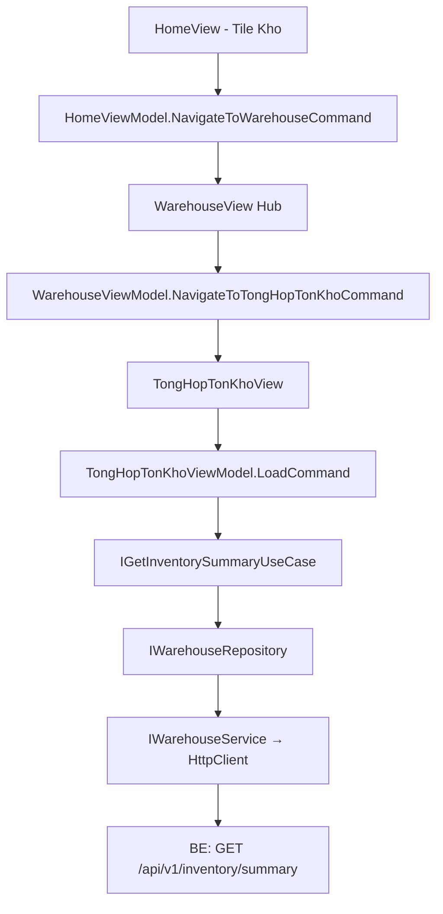

# Warehouse — Feature Document (App)

> **Jira:** — | **Branch:** `dev` | **Generated:** 2026-04-26

---

## PRD Summary

> Module quản lý kho hàng hóa trong WPF Desktop Lamour — hub điều hướng tới các nghiệp vụ kho.

- **Goal:** Cho phép nhân viên xem tổng hợp tồn kho theo kỳ và quản lý phiếu nhập/xuất kho.
- **User story:** As a Lamour warehouse manager, I want to view inventory summary by date range so that I can track stock movements (opening, imports, exports, closing) for each product.
- **Acceptance criteria:**
  - [x] Tile `🏭 Kho` tại HomeView → navigate WarehouseView (hub)
  - [x] WarehouseView hiển thị 3 tiles nghiệp vụ: Tổng hợp tồn kho, Phiếu Nhập Kho (placeholder), Phiếu Xuất Kho (placeholder)
  - [x] Tổng hợp tồn kho: date picker `Từ ngày` / `Đến ngày` + DataGrid 11 cột
  - [x] Fetch data tự động khi navigate vào màn hình (default: đầu tháng → hôm nay)
  - [x] Nút "Xem báo cáo" để load lại với date range mới
  - [x] Nút "← Quay lại" + "🏠 Trang chủ" trên WarehouseView và TongHopTonKhoView
  - [x] Hiển thị cả sản phẩm inactive trong Tổng hợp tồn kho
  - [ ] Phiếu Nhập Kho — chưa triển khai (placeholder mờ)
  - [ ] Phiếu Xuất Kho — chưa triển khai (placeholder mờ)

---

## Business Rules

| Rule | Description |
|------|-------------|
| Default date range | `FromDate` = ngày đầu tháng hiện tại, `ToDate` = hôm nay |
| Closing qty | `ClosingQty = OpeningQty + ImportQty - ExportQty` (hiện tại = `Product.StockQuantity`) |
| Closing value | `ClosingValue = ClosingQty × Product.CostPrice` |
| Opening/Import/Export | Hiện tại = 0 (sẽ tính từ bảng invoice khi Phiếu Nhập/Xuất triển khai) |
| Tất cả sản phẩm | Tổng hợp tồn kho hiển thị cả sản phẩm active và inactive, sort theo `Code` |
| Placeholder tiles | Phiếu Nhập Kho & Xuất Kho hiển thị `Opacity=0.4`, không click được |
| Auth required | BE endpoint `[Authorize]` — WPF gắn Bearer token từ `IAuthTokenStorage` |

---

## Architecture Overview

### Key Components

| Layer | File | Role |
|-------|------|------|
| View | `Views/WarehouseView.xaml` | Hub: 3 tile điều hướng |
| View | `Views/TongHopTonKhoView.xaml` | Date filter + DataGrid tổng hợp |
| ViewModel | `ViewModels/WarehouseViewModel.cs` | GoBack + NavigateToTongHopTonKho |
| ViewModel | `ViewModels/TongHopTonKhoViewModel.cs` | State: FromDate, ToDate, Items, LoadCommand |
| UseCase | `Domain/UseCases/GetInventorySummaryUseCase.cs` | Delegate tới repository |
| Repository | `Data/Repositories/WarehouseRepository.cs` | DTO → Domain model map |
| Service | `Data/Services/WarehouseService.cs` | HttpClient → BE `/api/v1/inventory/summary` |

### Data Flow

```
TongHopTonKhoView (Loaded event)
  → TongHopTonKhoViewModel.LoadCommand
  → IGetInventorySummaryUseCase.ExecuteAsync(fromDate, toDate)
  → IWarehouseRepository.GetSummaryAsync(fromDate, toDate)
  → IWarehouseService.GetInventorySummaryAsync(fromDate, toDate)
  → GET /api/v1/inventory/summary?from_date=YYYY-MM-DD&to_date=YYYY-MM-DD
  ← IEnumerable<InventorySummaryItemDto>
  → map → IEnumerable<InventorySummaryItem>
  → ObservableCollection<InventorySummaryItem> → DataGrid
```



---

## Key Files & Symbols

### Presentation
- [`Views/WarehouseView.xaml`](../Views/WarehouseView.xaml) — Hub: 3 Border tiles, Tổng hợp active, Nhập/Xuất `Opacity=0.4`
- [`Views/WarehouseView.xaml.cs`](../Views/WarehouseView.xaml.cs) — DataContext = `WarehouseViewModel`
- [`Views/TongHopTonKhoView.xaml`](../Views/TongHopTonKhoView.xaml) — `DatePicker` × 2 + `DataGrid` 11 cột + loading overlay + error banner
- [`Views/TongHopTonKhoView.xaml.cs`](../Views/TongHopTonKhoView.xaml.cs) — `Loaded` event → `LoadCommand.ExecuteAsync(null)`
- [`ViewModels/WarehouseViewModel.cs`](../ViewModels/WarehouseViewModel.cs) — `[RelayCommand]`: `GoBack`, `NavigateToHome`, `NavigateToTongHopTonKho`
- [`ViewModels/TongHopTonKhoViewModel.cs`](../ViewModels/TongHopTonKhoViewModel.cs) — `[RelayCommand]`: `GoBack`, `NavigateToHome`, `Load` — `ObservableProperty`: `IsLoading`, `HasError`, `ErrorMessage`, `HasItems`, `FromDate`, `ToDate` — `ObservableCollection<InventorySummaryItem> Items`

### Domain
- [`Domain/Models/InventorySummaryItem.cs`](../Domain/Models/InventorySummaryItem.cs) — `ProductId`, `Code`, `Name`, `Unit`, `OpeningQty/Value`, `ImportQty/Value`, `ExportQty/Value`, `ClosingQty/Value`
- [`Domain/UseCases/IGetInventorySummaryUseCase.cs`](../Domain/UseCases/IGetInventorySummaryUseCase.cs) — `ExecuteAsync(DateOnly, DateOnly, CancellationToken)`
- [`Domain/UseCases/GetInventorySummaryUseCase.cs`](../Domain/UseCases/GetInventorySummaryUseCase.cs) — delegates tới `IWarehouseRepository`

### Data
- [`Data/Services/IWarehouseService.cs`](../Data/Services/IWarehouseService.cs) — `GetInventorySummaryAsync(DateOnly, DateOnly, CancellationToken)`
- [`Data/Services/WarehouseService.cs`](../Data/Services/WarehouseService.cs) — typed HttpClient, gắn Bearer token
- [`Data/Services/Dtos/InventorySummaryItemDto.cs`](../Data/Services/Dtos/InventorySummaryItemDto.cs) — snake_case JSON fields
- [`Data/Repositories/IWarehouseRepository.cs`](../Data/Repositories/IWarehouseRepository.cs) — `GetSummaryAsync`
- [`Data/Repositories/WarehouseRepository.cs`](../Data/Repositories/WarehouseRepository.cs) — map DTO → `InventorySummaryItem`

---

## API Contracts

| Method | Endpoint | Query Params | Output |
|--------|----------|-------------|--------|
| `GET` | `/api/v1/inventory/summary` | `from_date=YYYY-MM-DD&to_date=YYYY-MM-DD` | `InventorySummaryItemDto[]` |

**Response shape (per item):**
```json
{
  "product_id": 1,
  "code": "SP001",
  "name": "Kem dưỡng da",
  "unit": "Hộp",
  "opening_qty": 0,
  "opening_value": 0,
  "import_qty": 0,
  "import_value": 0,
  "export_qty": 0,
  "export_value": 0,
  "closing_qty": 150,
  "closing_value": 7500000
}
```

> **Note:** `opening_qty`, `import_qty`, `export_qty` hiện trả về `0` do chưa có bảng invoice. `closing_qty` = `Product.StockQuantity`, `closing_value` = `StockQuantity × CostPrice`.

---

## DataGrid Columns

| Header | Binding | Width |
|--------|---------|-------|
| Mã hàng | `Code` | 110 |
| Tên hàng | `Name` | `*` |
| ĐVT | `Unit` | 70 |
| Đầu kỳ SL | `OpeningQty` (N0) | 100 |
| Đầu kỳ GT | `OpeningValue` (N0) | 110 |
| Nhập SL | `ImportQty` (N0) | 90 |
| Nhập GT | `ImportValue` (N0) | 110 |
| Xuất SL | `ExportQty` (N0) | 90 |
| Xuất GT | `ExportValue` (N0) | 110 |
| Cuối kỳ SL | `ClosingQty` (N0) | 100 |
| Cuối kỳ GT | `ClosingValue` (N0) | 110 |

---

## Edge Cases & Error Handling

| Scenario | Expected Behavior | Handled? |
|----------|-----------------|----------|
| BE không chạy | Error banner với message | ✅ |
| Token hết hạn | `EnsureSuccessStatusCode` → 401 → error banner | ✅ |
| Không có sản phẩm active | Empty state icon + text | ✅ |
| OperationCanceledException | Bỏ qua silently | ✅ |
| FromDate > ToDate | BE trả danh sách rỗng | ⚠️ Chưa validate phía WPF |
| Placeholder tile bị click | Không bind command → không phản hồi | ✅ |

---

## Navigation

| Route Constant | Value | Resolves To |
|----------------|-------|-------------|
| `NavigationRoutes.Warehouse.Hub` | `"WarehouseView"` | `WarehouseView` |
| `NavigationRoutes.Warehouse.TongHopTonKho` | `"TongHopTonKhoView"` | `TongHopTonKhoView` |

Back stack: `TongHopTonKhoView` → `WarehouseView` → `HomeView`

---

## Test Coverage Notes

| Component | Test File | Coverage |
|-----------|-----------|----------|
| `TongHopTonKhoViewModel` | — | ❌ Missing |
| `GetInventorySummaryUseCase` | — | ❌ Missing |
| `WarehouseRepository` | — | ❌ Missing |

**Suggested test cases:**
- [ ] Load: data từ BE → `Items` populated, `HasItems = true`
- [ ] Load: BE error → `HasError = true`, `ErrorMessage` set
- [ ] Load: empty list → `HasItems = false`, empty state shown
- [ ] ViewModel: default `FromDate` = ngày đầu tháng, `ToDate` = hôm nay
- [ ] GoBack: `NavigationService.GoBack()` được gọi

---

## Roadmap

| Feature | Status |
|---------|--------|
| Tổng hợp tồn kho | ✅ Done |
| Phiếu Nhập Kho | 🔲 Planned |
| Phiếu Xuất Kho | 🔲 Planned |
| Opening balance từ invoice history | 🔲 Blocked by Phiếu Nhập/Xuất |

---

## Notes

- DI: `AddHttpClient<IWarehouseService, WarehouseService>` base URL `http://192.168.64.1:5282`
- Khi triển khai Phiếu Nhập Kho: cần tạo `ImportInvoice` entity trên BE → cập nhật `GetInventorySummaryUseCase` tính `opening_qty` và `import_qty` từ bảng invoice
- `AppLabel` không hỗ trợ `TextWrapping` — dùng `TextBlock` nếu cần wrap text dài

---

*Generated by `/ct-ai-document` on 2026-04-26 — Updated 2026-04-28: add 🏠 Home button, fix GoBack navigation, show inactive products*

---

## Changelog — 2026-08-15: "Nhập, xuất kho" — danh sách gộp thay thế tile "Phiếu Nhập Kho"

> ⚠️ Doc này đã cũ (2026-04-26) so với thực tế hiện tại — `WarehouseReceipts` (Phiếu nhập kho) đã được xây và ship từ lâu (xem `Views/WarehouseReceiptListView.xaml`, doc riêng chưa có ở phía client), bảng "Feature Coverage" phía trên không còn đúng. Chỉ ghi chú nhanh thay đổi lần này, không rewrite lại toàn bộ doc.

- Tile "Phiếu Nhập Kho" (📥) trên `WarehouseView.xaml` đổi thành **"Nhập, xuất kho"** (📦) — trỏ sang màn mới `WarehouseTransactionListView` (route `NavigationRoutes.Warehouse.NhapXuatKho`) hiển thị **gộp** cả Nhập kho (`WarehouseReceipt`) lẫn Xuất kho (suy ra từ `SalesOrder` đã ghi sổ — hệ thống không có entity "Phiếu xuất kho" riêng). Bỏ hẳn tile "Phiếu Xuất Kho" placeholder mờ (chưa từng wire).
- Màn mới: bộ lọc Từ/Đến ngày + Loại (Tất cả/Nhập kho/Xuất kho), master `DataGrid` (Ngày hạch toán/Ngày chứng từ/Số chứng từ/Diễn giải/Tổng tiền/Người giao-nhận/Đối tượng/Đã lập CT bán hàng/Ngày ghi sổ kho/Loại chứng từ) + panel "Chi tiết" bind `SelectedItem.Lines`. Gọi `GET /api/v1/warehouse-transactions` (BE mới — xem `Lamour.Application/Features/Warehouse/docs/warehouse.md` changelog cùng ngày cho chi tiết mapping/known-gap).
- Đi kèm: đổi prefix số chứng từ Sales Order từ `BC` → `XK` toàn project (xem `Sales/docs/sales.md` changelog 2026-08-15) — số Xuất kho hiển thị trong màn này chính là số `XK...` của Sales Order, không sinh số riêng.
- Route `WarehouseReceiptListView` (Phiếu Nhập Kho cũ) vẫn còn nguyên, chỉ không còn tile nào trỏ tới trực tiếp; nút "+ Thêm" ở màn mới tái dùng `WarehouseReceiptFormWindow` để tạo phiếu Nhập kho.

---

## Changelog — 2026-08-15 (×2): chuyển section "Cài đặt" từ `WarehouseView` sang `HomeView`

- 5 tile (Đơn vị tính 📏, Tài khoản kế toán 📒, Danh sách Kho 🏬, Phòng ban 🏢, Khoản mục chi phí 💰) chuyển nguyên vẹn (icon/label/route giữ nguyên) từ section "Cài đặt" trên `WarehouseView.xaml` sang section "Cài đặt" mới trên `HomeView.xaml` (Trang chủ) — xem [`Home/docs/home.md`](../../Home/docs/home.md). 5 `RelayCommand` tương ứng dời từ `WarehouseViewModel` sang `HomeViewModel`. `WarehouseView` giờ chỉ còn section "Nghiệp vụ kho" (Tổng hợp tồn kho, Nhập-xuất kho). Không đổi route/DI/BE.

---

## Changelog — 2026-08-15 (×3): xóa hẳn hub `WarehouseView` — tile "Kho" ở Home vào thẳng "Nhập, Xuất Kho"; "Tổng hợp tồn kho" thành nút trên toolbar

> Yêu cầu: đưa logic "Tổng hợp tồn kho" ra khỏi vị trí tile riêng trong hub, để tap "Kho" ở Trang chủ vào thẳng danh sách giao dịch Nhập/Xuất kho, còn "Tổng hợp tồn kho" trở thành 1 nút ngang hàng với "Phiếu Nhập"/"Phiếu Xuất" trên toolbar của chính màn đó. Sau đợt chuyển "Cài đặt" ra `HomeView` trước đó, hub `WarehouseView` chỉ còn 2 tile ("Tổng hợp tồn kho" + "Nhập, xuất kho") — nay dời nốt "Tổng hợp tồn kho" thì hub **không còn tile nào cần thiết**, nên xóa hẳn màn hub thay vì giữ lại rỗng.

**Điều hướng mới**: `HomeViewModel.NavigateToWarehouse` đổi target từ `NavigationRoutes.Warehouse.Hub` → `NavigationRoutes.Warehouse.NhapXuatKho` — tile "Kho" ở Trang chủ giờ vào thẳng `WarehouseTransactionListView`.

**Toolbar `WarehouseTransactionListView.xaml`** đổi từ 1 nút ("+ Thêm") thành 3 nút:
- **"📥 Phiếu Nhập"** (đổi tên từ "+ Thêm", giữ nguyên `OpenFormCommand`) — mở thẳng `WarehouseReceiptFormWindow` tạo phiếu nhập kho mới.
- **"📤 Phiếu Xuất"** (mới) — `OpenSalesOrderCommand` mở thẳng `SalesOrderWindow` (`Initialize(null)`, cùng pattern với `SalesOrderListViewModel.AddSalesOrderAsync`) — vì hệ thống không có luồng "tạo phiếu xuất kho" riêng, xuất kho chỉ sinh ra từ 1 Chứng từ bán hàng đã ghi sổ.
- **"📊 Tổng hợp tồn kho"** (mới) — `NavigateToTongHopTonKhoCommand` điều hướng sang `TongHopTonKhoView` (route không đổi, `NavigationRoutes.Warehouse.TongHopTonKho`).

Cả 2 nút mới đều gọi lại `LoadCommand` sau khi đóng dialog thành công, để danh sách giao dịch tự refresh nếu vừa tạo thêm phiếu.

Thêm nút "🏠 Trang chủ" (`NavigateToHomeCommand`) vào header — trước đây màn này chỉ có "← Quay lại" vì luôn được vào qua hub (đã có sẵn nút Home); giờ là điểm vào trực tiếp từ Trang chủ nên cần nút Home riêng, khớp pattern `TongHopTonKhoView`.

**Xóa hẳn** (đã orphan hoàn toàn, không còn nơi nào trỏ tới):
- `Views/WarehouseView.xaml`, `Views/WarehouseView.xaml.cs`, `ViewModels/WarehouseViewModel.cs`
- `NavigationRoutes.Warehouse.Hub` constant
- Case tương ứng trong `NavigationService.ResolveView`
- DI registration `services.AddTransient<WarehouseView>()`/`<WarehouseViewModel>()` trong `HomeServiceCollectionExtensions`

Không đổi BE, không đổi migration.

---

## Changelog — 2026-08-15 (×4): polish visual panel "Chi tiết" khớp ảnh tham chiếu

> User gửi lại đúng ảnh MISA đã dùng cho 3 lần trước, yêu cầu chung "Update UI Kho như hình". Vì cấu trúc chính (bảng danh sách, bộ lọc, panel Chi tiết) đã khớp từ 3 lần trước, hỏi lại để khoanh vùng — user chỉ rõ: "UI ở dưới mỗi transaction", tức panel "Chi tiết" (`DataGrid` dòng hàng).

- `WarehouseTransactionListView.xaml` — detail `DataGrid`: `GridLinesVisibility="Horizontal"` → `"All"` (viền đủ 4 cạnh mỗi ô, khớp lưới đặc trong ảnh thay vì chỉ kẻ ngang); `RowHeight="26"` (dòng gọn hơn); cột "TK Nợ"/"TK Có" căn giữa (trước để mặc định trái).
- 4 cột không có dữ liệu theo dõi (**Mã quy cách**, **Số lô**, **Hạn sử dụng**, **Số khế ước** — hệ thống chưa model lô hàng/hạn sử dụng, xem Known gap ở changelog 2026-08-15 đầu tiên) tô nền xám (`AppColor.BackgroundSecondary`, `#F7F7F7`) qua `CellStyle` mới `UntrackedColumnCellStyle` — khớp cách MISA tô xám các cột "khóa"/không áp dụng trong ảnh, giúp phân biệt rõ với cột có dữ liệu thật thay vì cùng nền trắng gây hiểu nhầm là bug/thiếu data.
- Không đổi cấu trúc/logic — thuần CSS-level polish, không đổi ViewModel, không đổi BE.

---

**Updated 2026-08-15 (visual polish pass — "update màn hình Kho cho đẹp"):**

> User yêu cầu chung chung "update màn hình Kho cho đẹp" (không kèm ảnh tham chiếu cụ thể lần này). Vì đã polish riêng panel Chi tiết ở changelog trước, lần này làm 1 lượt tổng thể cho cả `WarehouseTransactionListView` — header lưới, 2 cột trạng thái/loại chứng từ, và toolbar — tái dùng đúng pattern màu đã có sẵn trong app (badge `Trạng thái` ở `WarehouseReceiptListView`, header 2 tông `GroupHeaderBrush` ở `TongHopTonKhoView`) để đồng bộ trong cả module Kho, không tự bịa màu mới.

- `WarehouseTransactionListView.xaml` — thêm `GridHeaderStyle` (nền `#BDD7EE`, chữ SemiBold, viền `#9CB8D4`) áp cho cả master grid và detail grid — cùng tông màu header đã dùng ở `TongHopTonKhoView.xaml` để 2 màn trong module Kho nhìn đồng bộ.
- Cột **"Loại chứng từ"** đổi từ text thường → badge bo góc: "Nhập kho" = vàng nhạt (`#FFF8E1`/`#F57F17`), "Xuất kho bán hàng" = xanh dương nhạt (`#E3F2FD`/`#1976D2`) — dễ quét mắt phân biệt loại giao dịch hơn, khớp pattern badge `Trạng thái` đã có ở `WarehouseReceiptListView.xaml`.
- Cột **"Đã lập CT bán hàng"** đổi từ text "Đã lập"/rỗng → badge xanh lá (`#E8F5E9`/`#388E3C`) với dấu ✓ khi `HasSalesOrder=true`, trong suốt khi false — nổi bật hơn giữa nhiều cột text thường.
- Master grid: thêm `RowHeight="32"` (trước dùng default, hơi chật khi có badge); detail grid: `RowHeight="26"` → `"28"` để cân đối với badge padding.
- Toolbar: thêm 1 `Border` phân cách mảnh (1px, `AppColor.BorderThin`) giữa nhóm 3 nút hành động (Phiếu Nhập/Phiếu Xuất/Tổng hợp tồn kho) và nhóm bộ lọc (Từ/Đến/Loại) — tách bạch 2 nhóm chức năng khác nhau về mặt thị giác.
- Không đổi ViewModel/logic/BE — thuần visual polish.

---

**Updated 2026-08-15 (×2 — căn giữa dọc + toolbar filter polish):**

> Sau lượt polish trên, user phản hồi "text chỉnh ở giữa" — thử căn ngang trước (header + cột) nhưng user chỉnh lại: ý là **căn giữa theo chiều dọc**, không phải chiều ngang. Nguyên nhân: `TextBlock` mặc định dồn lên sát mép trên khi `RowHeight` > chiều cao chữ (do `VerticalAlignment` mặc định là `Stretch` nhưng `TextBlock` không tự căn giữa nội dung trong phần được stretch).

- `WarehouseTransactionListView.xaml` — revert toàn bộ căn ngang đã thêm nhầm (header `HorizontalContentAlignment` về `Left`, bỏ style `CenterCellText` khỏi các cột, badge "Loại chứng từ" về `HorizontalAlignment="Left"`).
- Thêm `VerticalCenterCellStyle` (`DataGridCell.VerticalContentAlignment="Center"`) áp qua `CellStyle` cho cả master grid và detail grid — cách chuẩn để căn giữa dọc toàn bộ ô mà không phải sửa từng `ElementStyle`. `UntrackedColumnCellStyle` (4 cột xám) `BasedOn` style này để vừa giữ nền xám vừa căn giữa dọc.
- User phản hồi tiếp với ảnh chụp toolbar bộ lọc (Từ/Đến/Loại) — `DatePicker`/`ComboBox` hiển thị ngày kiểu Mỹ (`7/15/2026`) và text dồn trái, không đồng bộ với format `dd/MM/yyyy` dùng trong lưới. Thêm style `ToolbarDatePicker`/`ToolbarComboBox` (`HorizontalContentAlignment="Center"`, viền `AppColor.BorderRegular`) + `Language="vi-VN"` trên 2 `DatePicker` để hiển thị đúng định dạng ngày Việt Nam thay vì theo culture mặc định của máy.
- User xác nhận "ok, it is good" — kết thúc lượt polish "Kho" cho phần này.
