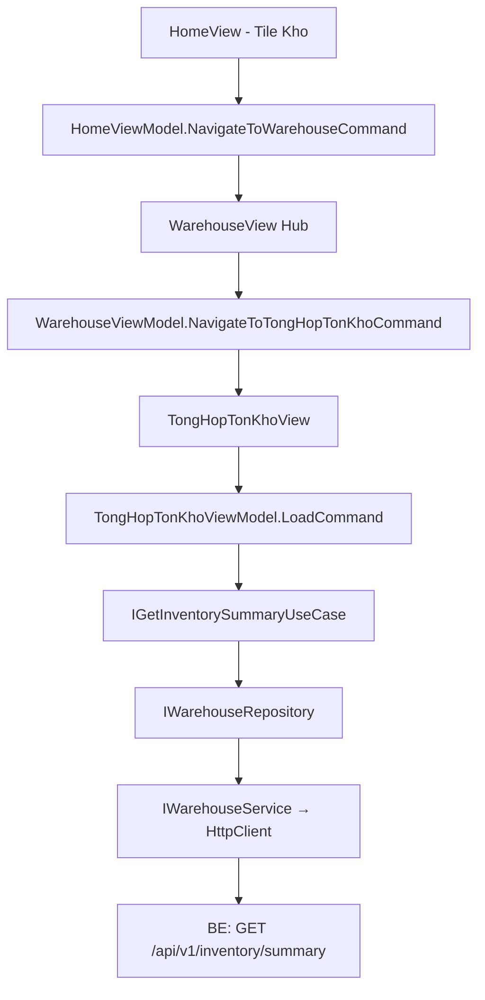

# Warehouse — Feature Document (App)

> **Jira:** — | **Branch:** `dev` | **Generated:** 2026-04-26

---

## PRD Summary

> Module quản lý kho hàng hóa trong WPF Desktop Lamour — hub điều hướng tới các nghiệp vụ kho.

- **Goal:** Cho phép nhân viên xem tổng hợp tồn kho theo kỳ và quản lý phiếu nhập/xuất kho.
- **User story:** As a Lamour warehouse manager, I want to view inventory summary by date range so that I can track stock movements (opening, imports, exports, closing) for each product.
- **Acceptance criteria:**
  - [x] Tile `🏭 Kho` tại HomeView → navigate WarehouseView (hub)
  - [x] WarehouseView hiển thị 3 tiles nghiệp vụ: Tổng hợp tồn kho, Phiếu Nhập Kho (placeholder), Phiếu Xuất Kho (placeholder)
  - [x] Tổng hợp tồn kho: date picker `Từ ngày` / `Đến ngày` + DataGrid 11 cột
  - [x] Fetch data tự động khi navigate vào màn hình (default: đầu tháng → hôm nay)
  - [x] Nút "Xem báo cáo" để load lại với date range mới
  - [ ] Phiếu Nhập Kho — chưa triển khai (placeholder mờ)
  - [ ] Phiếu Xuất Kho — chưa triển khai (placeholder mờ)

---

## Business Rules

| Rule | Description |
|------|-------------|
| Default date range | `FromDate` = ngày đầu tháng hiện tại, `ToDate` = hôm nay |
| Closing qty | `ClosingQty = OpeningQty + ImportQty - ExportQty` (hiện tại = `Product.StockQuantity`) |
| Closing value | `ClosingValue = ClosingQty × Product.CostPrice` |
| Opening/Import/Export | Hiện tại = 0 (sẽ tính từ bảng invoice khi Phiếu Nhập/Xuất triển khai) |
| Chỉ sản phẩm active | Repository filter `IsActive = true`, sort theo `Code` |
| Placeholder tiles | Phiếu Nhập Kho & Xuất Kho hiển thị `Opacity=0.4`, không click được |
| Auth required | BE endpoint `[Authorize]` — WPF gắn Bearer token từ `IAuthTokenStorage` |

---

## Architecture Overview

### Key Components

| Layer | File | Role |
|-------|------|------|
| View | `Views/WarehouseView.xaml` | Hub: 3 tile điều hướng |
| View | `Views/TongHopTonKhoView.xaml` | Date filter + DataGrid tổng hợp |
| ViewModel | `ViewModels/WarehouseViewModel.cs` | GoBack + NavigateToTongHopTonKho |
| ViewModel | `ViewModels/TongHopTonKhoViewModel.cs` | State: FromDate, ToDate, Items, LoadCommand |
| UseCase | `Domain/UseCases/GetInventorySummaryUseCase.cs` | Delegate tới repository |
| Repository | `Data/Repositories/WarehouseRepository.cs` | DTO → Domain model map |
| Service | `Data/Services/WarehouseService.cs` | HttpClient → BE `/api/v1/inventory/summary` |

### Data Flow

```
TongHopTonKhoView (Loaded event)
  → TongHopTonKhoViewModel.LoadCommand
  → IGetInventorySummaryUseCase.ExecuteAsync(fromDate, toDate)
  → IWarehouseRepository.GetSummaryAsync(fromDate, toDate)
  → IWarehouseService.GetInventorySummaryAsync(fromDate, toDate)
  → GET /api/v1/inventory/summary?from_date=YYYY-MM-DD&to_date=YYYY-MM-DD
  ← IEnumerable<InventorySummaryItemDto>
  → map → IEnumerable<InventorySummaryItem>
  → ObservableCollection<InventorySummaryItem> → DataGrid
```



---

## Key Files & Symbols

### Presentation
- [`Views/WarehouseView.xaml`](../Views/WarehouseView.xaml) — Hub: 3 Border tiles, Tổng hợp active, Nhập/Xuất `Opacity=0.4`
- [`Views/WarehouseView.xaml.cs`](../Views/WarehouseView.xaml.cs) — DataContext = `WarehouseViewModel`
- [`Views/TongHopTonKhoView.xaml`](../Views/TongHopTonKhoView.xaml) — `DatePicker` × 2 + `DataGrid` 11 cột + loading overlay + error banner
- [`Views/TongHopTonKhoView.xaml.cs`](../Views/TongHopTonKhoView.xaml.cs) — `Loaded` event → `LoadCommand.ExecuteAsync(null)`
- [`ViewModels/WarehouseViewModel.cs`](../ViewModels/WarehouseViewModel.cs) — `[RelayCommand]`: `GoBack`, `NavigateToTongHopTonKho`
- [`ViewModels/TongHopTonKhoViewModel.cs`](../ViewModels/TongHopTonKhoViewModel.cs) — `ObservableProperty`: `IsLoading`, `HasError`, `ErrorMessage`, `HasItems`, `FromDate`, `ToDate` — `ObservableCollection<InventorySummaryItem> Items`

### Domain
- [`Domain/Models/InventorySummaryItem.cs`](../Domain/Models/InventorySummaryItem.cs) — `ProductId`, `Code`, `Name`, `Unit`, `OpeningQty/Value`, `ImportQty/Value`, `ExportQty/Value`, `ClosingQty/Value`
- [`Domain/UseCases/IGetInventorySummaryUseCase.cs`](../Domain/UseCases/IGetInventorySummaryUseCase.cs) — `ExecuteAsync(DateOnly, DateOnly, CancellationToken)`
- [`Domain/UseCases/GetInventorySummaryUseCase.cs`](../Domain/UseCases/GetInventorySummaryUseCase.cs) — delegates tới `IWarehouseRepository`

### Data
- [`Data/Services/IWarehouseService.cs`](../Data/Services/IWarehouseService.cs) — `GetInventorySummaryAsync(DateOnly, DateOnly, CancellationToken)`
- [`Data/Services/WarehouseService.cs`](../Data/Services/WarehouseService.cs) — typed HttpClient, gắn Bearer token
- [`Data/Services/Dtos/InventorySummaryItemDto.cs`](../Data/Services/Dtos/InventorySummaryItemDto.cs) — snake_case JSON fields
- [`Data/Repositories/IWarehouseRepository.cs`](../Data/Repositories/IWarehouseRepository.cs) — `GetSummaryAsync`
- [`Data/Repositories/WarehouseRepository.cs`](../Data/Repositories/WarehouseRepository.cs) — map DTO → `InventorySummaryItem`

---

## API Contracts

| Method | Endpoint | Query Params | Output |
|--------|----------|-------------|--------|
| `GET` | `/api/v1/inventory/summary` | `from_date=YYYY-MM-DD&to_date=YYYY-MM-DD` | `InventorySummaryItemDto[]` |

**Response shape (per item):**
```json
{
  "product_id": 1,
  "code": "SP001",
  "name": "Kem dưỡng da",
  "unit": "Hộp",
  "opening_qty": 0,
  "opening_value": 0,
  "import_qty": 0,
  "import_value": 0,
  "export_qty": 0,
  "export_value": 0,
  "closing_qty": 150,
  "closing_value": 7500000
}
```

> **Note:** `opening_qty`, `import_qty`, `export_qty` hiện trả về `0` do chưa có bảng invoice. `closing_qty` = `Product.StockQuantity`, `closing_value` = `StockQuantity × CostPrice`.

---

## DataGrid Columns

| Header | Binding | Width |
|--------|---------|-------|
| Mã hàng | `Code` | 110 |
| Tên hàng | `Name` | `*` |
| ĐVT | `Unit` | 70 |
| Đầu kỳ SL | `OpeningQty` (N0) | 100 |
| Đầu kỳ GT | `OpeningValue` (N0) | 110 |
| Nhập SL | `ImportQty` (N0) | 90 |
| Nhập GT | `ImportValue` (N0) | 110 |
| Xuất SL | `ExportQty` (N0) | 90 |
| Xuất GT | `ExportValue` (N0) | 110 |
| Cuối kỳ SL | `ClosingQty` (N0) | 100 |
| Cuối kỳ GT | `ClosingValue` (N0) | 110 |

---

## Edge Cases & Error Handling

| Scenario | Expected Behavior | Handled? |
|----------|-----------------|----------|
| BE không chạy | Error banner với message | ✅ |
| Token hết hạn | `EnsureSuccessStatusCode` → 401 → error banner | ✅ |
| Không có sản phẩm active | Empty state icon + text | ✅ |
| OperationCanceledException | Bỏ qua silently | ✅ |
| FromDate > ToDate | BE trả danh sách rỗng | ⚠️ Chưa validate phía WPF |
| Placeholder tile bị click | Không bind command → không phản hồi | ✅ |

---

## Navigation

| Route Constant | Value | Resolves To |
|----------------|-------|-------------|
| `NavigationRoutes.Warehouse.Hub` | `"WarehouseView"` | `WarehouseView` |
| `NavigationRoutes.Warehouse.TongHopTonKho` | `"TongHopTonKhoView"` | `TongHopTonKhoView` |

Back stack: `TongHopTonKhoView` → `WarehouseView` → `HomeView`

---

## Test Coverage Notes

| Component | Test File | Coverage |
|-----------|-----------|----------|
| `TongHopTonKhoViewModel` | — | ❌ Missing |
| `GetInventorySummaryUseCase` | — | ❌ Missing |
| `WarehouseRepository` | — | ❌ Missing |

**Suggested test cases:**
- [ ] Load: data từ BE → `Items` populated, `HasItems = true`
- [ ] Load: BE error → `HasError = true`, `ErrorMessage` set
- [ ] Load: empty list → `HasItems = false`, empty state shown
- [ ] ViewModel: default `FromDate` = ngày đầu tháng, `ToDate` = hôm nay
- [ ] GoBack: `NavigationService.GoBack()` được gọi

---

## Roadmap

| Feature | Status |
|---------|--------|
| Tổng hợp tồn kho | ✅ Done |
| Phiếu Nhập Kho | 🔲 Planned |
| Phiếu Xuất Kho | 🔲 Planned |
| Opening balance từ invoice history | 🔲 Blocked by Phiếu Nhập/Xuất |

---

## Notes

- DI: `AddHttpClient<IWarehouseService, WarehouseService>` base URL `http://192.168.64.1:5282`
- Khi triển khai Phiếu Nhập Kho: cần tạo `ImportInvoice` entity trên BE → cập nhật `GetInventorySummaryUseCase` tính `opening_qty` và `import_qty` từ bảng invoice
- `AppLabel` không hỗ trợ `TextWrapping` — dùng `TextBlock` nếu cần wrap text dài

---

*Generated by `/ct-ai-document` on 2026-04-26*
